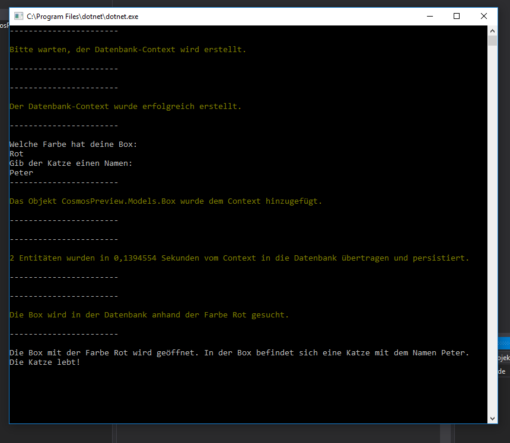

# Azure Cosmos DB

Azure Cosmos DB ist eine von Microsoft entwickelte Multi-Model Datenbank mit nativer NoSQL Unterstützung. Im Entwicklungsfokus stand die globale Verteilung und horizontale Skalierbarkeit sowie die Gewährleistung einer Hochverfügbarkeit von 99,999 Prozent.[1]

## Funktionsweise

Betrachtet man den logischen Aufbau der Datenbank, so steht an erster Stelle der Datenbank-Account. Dieser ist an eine Azure-Subcription gebunden ist. Was eine Azure-Subcription ist, kann in der Einleitung dieser Arbeit nachgelesen werden. Innerhalb des Datenbank-Accounts können mehrere Datenbanken erstellt werden. Die Datenbank managt die Benutzer, Berechtigungen und Container.

Eine Datenbank ist API-Spezifisch. Bei der Erstellung der Datenbank muss aus verschiedenen vordefinierten APIs eine API gewählt werden. Die Wahl der API hat Auswirkungen auf das in der Datenbank projiziert Datenmodell der Container und Items.[2] [3]

In Abhängigkeit der gewählten API werden die Items als Columnar, Document, Item oder Node/Edge abgelegt. Dabei liegt immer das später in diesem Kapitel beschriebene ARS Datenmodell zugrunde.

Ein Container enthält die schema-agnostischen Items, das bedeutet, dass ein genaues Schema zuvor nicht definiert werden muss. Sowie den Items liegt auch dem Container ein API-spezifisches Datenmodell zugrunde. Je nach API kann das eine Collection, Table oder ein Graph sein.[4]

### Atom Record Sequence (ARS)

Alle Datenmodelle werden intern als ein durch Microsoft eingeführtes Atom Record Sequence (ARS) basierendes Datenmodell in der Datenbank als Schlüssel-Wert-Paare gespeichert.

Atome beschreiben primitive Datentypen wie Strings, Zahlen oder boolesche Werte, aus denen sich die Records zusammensetzen. Sequences sind Arrays, die aus Atomen, Records und Sequencen bestehen. Ein Item basiert zwar auf einem ASR-Modell, wird aber wie auch der Container durch das von der gewählten API spezifizierte Modell abgelegt. [2][3]

### Indexierung

Azure Cosmos DB indiziert alle Daten, ohne das dafür zuvor ein Schema definiert werden muss. Die Datenbank projiziert jedes Item als JSON-Dokument und überführt dieses in eine dynamisch codierte Pfadstruktur. Jedes vollständige Wertepaar wird als ein Knoten des Baumes dargestellt, wobei die Blätter die tatsächlichen Daten enthalten und die Zwischenknoten die Schemainformationen. So wird in der Dokumentenhierachie hinaufgegangen und mit jedem Element aus dem Dokument verfahren. Befindet sich in dem Dokument ein Array mit Elementen, so wird für jedes einzelne Elemente ein übergeordneter Knoten erzeugt und numerisch mit dem Index benannt.[5]

Darüber hinaus können die Indexpfade an individuelle Bedürfnisse angepasst werden. So kann der Speicherbedarf gesenkt und die Schreibleistung verbessert werden.[7]

### Datenzugriff

Je nach gewählter API muss der zugriff auf die Datenbank nach den Konventionen der gewählten Schnittstelle durchgeführt werden.

### API-Schnittstellen

Azure Cosmos DB bietet die Verwendung unterschiedlicher API-Schnittstellen an. An diese API-Schnittstelle wird das zugrundeliegende Datenmodel, wie kurz zuvor in diesem Kapitel erklärt, angepasst. Auch wenn alle Datenmodell mit dem ASR Verfahren abgelegt werden, so ist ein nachträglicher Wechsel der API-Schnittstelle noch nicht möglich. Das bedeutet, dass ein für Azure Table Storage angelegter Container nicht mit der MongoDB-API abgefragt werden kann. Eventuell wird diese Funktion in einer zukünftigen Version verfügbar sein.

#### MongoDB-API

MongoDB ist eine dokumentenbasierte Datenbank, die Daten in JSON-ähnlichen Dokumenten ablegt. Besonderes Augenmerk und eine seiner Stärken ist die Hochverfügbarkeit durch verteilte Datenbanken.[8]

Bei Verwendung der MongoDB-API wird keine MongoDB innerhalb der Azure Cosmos DB angelegt. Dennoch ist ein Zugriff auf Azure Cosmos DB mit MongoDB-API mit nativen MongoDB Client-SDKs möglich, da Azure Cosmos DB das Wire Protocol nativ implementiert.

So kann die Azure Cosmos DB genutzt werden, ohne das eine Umstellung auf Client-Seite nötig wird.

#### SQL-API

Die SQL-API bietet zur Zeit den meisten Funktionsumfang. So ist das Erstellen von Triggern, benutzerdefinierten Funktionen und Stored Procedures möglich. Dabei bedient sich die SQL-Syntaxt der bereits von Microsoft bekannten Syntaxt.

Bei Wahl dieser API und der von MongoDB-API wird das vorherrschende Datenmodell auf das Dokumenten Datenmodell festgelegt.

#### Germlin-API

Azure Cosmos DB eignet sich zum Erstellen von Graphdatenbanken. Graphdaten können mit Apache TinkerPop oder Gremlin abgefragt werden.

#### Cassandra-API

Anwendungen die für den Zugriff mit der Cassandra Query Language (CQL) v4 geschrieben wurden können ohne große Änderungen am Code mit der Datenbank kommunizieren. Bei Wahl dieses API-Typen wird das Columnar Datenmodel angewandt.

#### Table-API

Azure Table Storage ist ein NoSQL-Schlüsselwertspeicher. Azure Cosmos DB ermöglicht es Anwendungen, die für Azure Table Storage entwicklet wurden, diese Daten nun für erweiterte Anforderungen in Azure Cosmos DB zu speichern.

Die Anbindung ist konform mit der von Azure Table Storage.

### Skalierung und Globaleverteilung

In Azure Cosmos DB findet eine automatische horizontale Skalierung statt. Die grundlegende Einheit dafür bildet der zuvor beschriebene Container. Dieser Container kann über mehrere logische Partiotionen partitioniert werden und wird so skaliert. Dieses Verhalten und das Verteilen der Daten kann über den Partitionsschlüssel gesteuert werden.

Die logischen Partitionen werden einer physischen Partition zugeordnet, die über ein ineternes, nicht steuerbares Verfahren auf die Computerressourcen repliziert werden.

Auf Wunsch kann die Azure Cosmos DB auf mehrere Regionen verteilt werden. Dazu werden dem Datenbank-Account Regionen zugewiesen, die sich nach Möglichkeit in der Nähe des Anweders befinden sollten. Azure übernimmt automatisch die Replikation der Daten. Über die Multihoming-APIs kommuniziert die Anwendung mit der nächstgelegenen Instanz, ohne das dafür Änderungen an der Anwendung vorgenommen werden müssen. Im Falle eines Ausfalls der lokalen Datenbankinstanz, greift ein automatisches Failover und leitet die Anfrage an die nächste Region weiter. Die Priorität der Regionen kann festgelegt werden. Das automatische Failover kann aber deaktiviert werden.

## Implementierung

In einem Beispiel soll nun das vorgestellte Entity Framework an eine Azure Cosmos DB, mit Verwendung der SQL-API angebunden werden.

Dazu wurde ein lauffähiges Projekt erstell  t. Viele Erklärungen und Informationen sind direkt als Kommentar im Code zufinden. Es ist zubeachten das es sich um einen Prototypen handelt, der gezeigte Code sollte nicht in einer Produktivumgebung verwendet werden. Das Beispiel zeigt das Schreiben eines geschachtelten Datensatzes in die Datenbank und das anschließende Abrufen eines Datensatzes mit abhängiger Entität anhand von bekannten Parametern.

 "Ausgabe der Konsole"

In der ersten Phase wird geprüft ob die Datenbank für den Context existiert und bei bedarf auf der Datenbank erstellt.

Für den Zugriff auf die Datenmodelle wurde jeweils eine Service-Klasse für Box und Cat erstellt, die den Datenzugriff abstrahiert.

Nach Initialisierung der Datenbank und des Contextes, wird der Nutzer aufgefordert eine Farbe für die Box, sowie einen Namen für die Katze zuvergeben.

Nun wird ein Box-Objekt erstellt. Dieses Box-Objekt enthält eine Cat-Objekt. Beide Objekte enthalten die zuvor übermittelten Werte.

Anschließend wird das Box-Objekt dem Context übergeben. Entity Framework hat nun begonnen das Objekt zutracken.

Mit dem nächsten Aufruf wird der Context persistiert und die Entitäten in der Datenbank angelegt.

>Das Projekt ist dieser Arbeit im Ordner CosmosPreview beigefügt. Um das Projekt auszuführen sind Visual Studio 2017, .NET Core 2.2 SDK, sowie der Azure Cosmos DB-Emulator erforderlich.

---

[1]: Microsoft Azure Cosmos DB. Abgerufen 12.01.2019 von https://azure.microsoft.com/de-de/services/cosmos-db/

[2]: Lobel, Lenni : Demystifying the Multi-Model Capabilities in Azure Cosmos DB. Abgerufen 12.01.2019 von,https://www.pass.org/Community/PASSBlog/tabid/1476/entryid/881/Demystifying-the-Multi-Model-Capabilities-in-Azure-Cosmos-DB.aspx

[3]: Shukla, Dharma : A technical overview of Azure Cosmos DB. Abgerufen 12.01.2019, von https://azure.microsoft.com/de-de/blog/a-technical-overview-of-azure-cosmos-db/

[4]: Microsoft : Working with Azure Cosmos databases, containers and items. Abgerufen 12.01.2019, von https://docs.microsoft.com/en-us/azure/cosmos-db/databases-containers-items

[5]: Microsoft : Indexing in Azure Cosmos DB. Abgerufen 08.01.2019  https://docs.microsoft.com/en-us/azure/cosmos-db/index-overview

[6]: Microsoft: Indexing policy in Azure Cosmos DB. Abgerufen 08.01.2019, von https://docs.microsoft.com/en-us/azure/cosmos-db/index-policy

[7]: Microsoft : Index paths in Azure Cosmos DB. Abgerufen 08.01.2019, von https://docs.microsoft.com/en-us/azure/cosmos-db/index-paths

[8]: MongoDB: What is MongoDBB. Abgerufen 13.01.2019, von https://www.mongodb.com/what-is-mongodb