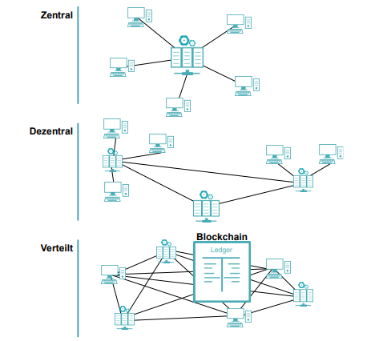

***
[<<< Inhaltsverzeichnis](README.md)
***

## 2. Grundlagen
Für ein besseres Verständnis der Blockchain Technologie, ist es notwendig zunächst einige Begriffe zu erläutern, die bei der Definition der Blockchain auftauchen und von Bedeutung sind.
### 2.1.1 Zentrale, Dezentrale und Verteilte Netzwerkstrukturen
Blockchain basiert auf dezentralen verteilten Netzwerken. Um einen Überblick darüber zu schaffen, ist in Abbildung 1 eine Abgrenzung der zentralen, dezentralen und verteilten Netzwerkstrukturen dargestellt.

|  | 
|:--:| 
| Abbildung 01: *zentrale, dezentrale und verteilte Netzwerkstrukturen* |

Bei einem zentralen System kommt eine zentrale Instanz zum Einsatz. Über diese Instanz wird jede Transaktion der Teilnehmer im Netzwerk abgesichert. Dagegen existiert in einem dezentralen System keine solche zentrale Instanz. Eine direkte Transaktion zwischen den Teilnehmern kommt nicht in jedem Fall zustande, denn es werden Hierarchieebenen vorgesehen. Anders ist es bei einem verteilten System, bei welchem die Teilnehmer in der Lage sind, direkte Interaktionen gegenseitig auszuführen, weil keine Hierarchieebenen festgelegt werden. [01]

### 2.1.2 Peer-to-Peer-Systeme
Peer-to-Peer Netze sind eine spezielle Form von verteilten Systemen. Sie werden durch die sogenannten Knoten gebildet. Knoten sind einzelne Computer, wobei die Berechnungsresscourcen (zum Beispiel Verarbeitungsleistung, Speicherkapazität, Datenbreite oder Netzbreite) für alle Teilnehmer dieses Netzwerkes offen sind. Dabei gibt es keine zentrale Instanz für das Koordinieren der Interaktionen zwischen den Mitgliedern (siehe auch Kapitel "Zentrale, Dezentrale und Verteilte Netzwerkstrukturen"). Das bedeutet, die Knoten stellen im Netz gleichwertige Rollen und Rechte zur Verfügung. Zudem werden die Ressourcen im System gleichgestellt und vom System verbraucht. Durch die Verwendung der Peer-to-Peer-Systeme sind viele Anwendungen zustande gekommen. Dazu gehören Filesharing, die Content Distribution und der Datenschutz. Die allgemeine Idee hinter diesen Anwendungen ist, dass die Computer der Teilnehmer im Peer-to-Peer Netz die Knoten bilden, die dann das verteilte System zusammenstellen. Das System wird größer und leistungsfähiger, wenn mehrere Anwender im Netz teilnehmen. [02]

### 2.1.3 Distributed Ledger Technologie (DLT)
Blockchain basiert auf der Distributed Ledger Technologie (DLT), die als ein “Verteiltes Knotenbuch” übersetzt wird. Dabei handelt es sich um eine Datenbank, in welcher die Daten verteilt gespeichert werden. Bei der DLT werden die Daten auf eine andere Weise wie die üblichen Datenbanken gespeichert. Bei den gewöhnlichen Datenbanken verläuft die Speicherung der Daten auf zentralen Servern und die Verwaltung dieser Daten obliegt einem Bevollmächtigten. Im Gegensatz dazu werden die Daten in der DLT in einer dezentralen Datenbank in einem spezifischen Format in einem Peer-to-Peer Netzwerk gespeichert. Jeder Nutzer hat Zugriff auf die Daten der Teilnehmer im Netzwerk. Hier ist zu beachten, dass es keine zentrale Instanz gibt, die zuständig für die Verwaltung der Daten ist. Im Gegensatz dazu wird die Datenverwaltung von den Distributed Ledger selbst organisiert. In der Blockchain haben alle Teilnehmer die gleichen Rechte.
Man könnte sagen, dass die Distributed Ledger Technologie ein Oberbegriff ist, der für Datenbanken mit verteilter Struktur steht. Die Blockchain (zu Deutsch ”Blockkette”) ist eine Form der Anwendung der verschiedenen Formen des Distributed Ledgers. [03]

### 2.2. Herkunft der Blockchain
Die Blockchain entstammt aus der kryptographischen Währung Bitcoin. Im November 2008 wurde ein Whitepaper mit dem Titel „Bitcoin: A Peer-to-Peer Electronic Cash System” veröffentlicht. Dieser Artikel wurde von einer unbekannten Person unter dem Pseudonym Satoshi Nakamoto publiziert. In diesem Artikel wird ein technisches Konzept für digitales Geld beschrieben. Vor dieser Veröffentlichung haben sich ebenso andere Autoren mit der digitalen Währung beschäftigt. Der Unterschied zwischen Nakamoto und seinen Vorgängern ist, dass er nach Lösung für das sogenannte Double Spending Problem suchte. Die Lösung ist die Erfindung der Blockchain. [04] Die Blockchain wurde in dem Whitepaper aufgeführt und als ein Werkzeug für dezentrale Transaktionen ohne die Mitwirkung von dritten Personen zu gebrauchen. Die Grundidee sei dabei, eine transparente dezentrale Datenbank herzustellen, die nicht gehackt oder manipuliert werden kann. [05]
Um dies deutlicher zu machen, soll das Double Spending Problem erklärt werden.

### 2.3. Double Spending Problem
Das Double Spending Problem, zu Deutsch ‘Doppel-Ausgaben-Problem’, ist mit Hilfe des folgenden Beispiels leicht verständlich: Angenommen jemand hat ein Bild auf seinem Handy. Dieses Bild kann diejenige Person auf Facebook hochladen. In diesem Fall hat die Person eine Kopie des Bildes erstellt und zwar ohne Kosten. Dieses Bild kann z.B. auch auf Instagram hochgeladen werden, ebenso ohne Kosten. Das heißt, dass das spezifische Bild auf dem Handy doppelt verwendet wurde. Da die Tat des Hochladens des Bildes keinen Einfluss auf andere Personen hat, gibt es folglich kein Interesse von irgendjemandem daran. Aus diesem Grund gibt es auch keine Überwachung der Tat, ob dieses Bild zweimal oder mehrere Male hochgeladen wird.
Des Weiteren nehmen wir an, es gäbe eine digitale Währung mit dem Namen Julian-Coin. Bob, eine zufällige Person, hätte 100 Julian-Coins zur Verfügung, die er zu einer Freundin Anna senden möchte. Das könnte er machen wie im Beispiel mit dem Bild, indem er 100 Julian-Coins kopiert und Anna ohne Kosten sendet. Doch in diesem Fall interessiert diese Tat von Bob andere, denn Geld weist eine Form von Wert und Vertrauen auf. Beispielsweise würde eine Bank darauf achten, dass für Bob nicht die Möglichkeit entsteht das Geld zu verdoppeln. Hier kommt es zum Einsatz einer zentralen Kontrollinstitution. Um das im Beispiel beschriebene Problem jedoch dezentral lösen zu können (also ohne zentrale Institution), muss eine Lösung zur Vermeidung der Doppelausgaben gefunden werden. Die Lösung dazu gab, wie bereits erwähnt, Satoshi Nakamoto mit der Blockchain. [06]
Im nächsten Kapitel soll eine Definition für Blockchain gegeben werden.

### 2.4.Definition von Blockchain
Aufgrund der Tatsache, dass Blockchain eine neue Technologie ist, wurde bisher keine einheitliche Definition des Begriffs Blockchain festgelegt. Aus den vielen Definitionen über Blockchain geht hervor, dass diese als eine verteilte Datenbank oder als ein elektronisches Register betrachtet wird. Dabei werden die Einträge einer Blockchain in Blöcken gruppiert. Mit Einträgen werden die Transaktionen, die Ereignisse oder die Datensätze gemeint. Die Blöcke sind mit Hilfe einer kryptographischen Signatur miteinander verknüpft. Das Verknüpfen, Validieren und Speichern von Blöcken in der Blockchain findet in einem Peer-to-Peer Netzwerk statt. [07]
Die Merkmale einer Blockchain machen auch die Vorteile einer Blockchain aus und diese werden im nächsten Kapitel erwähnt.
Die Funktionsweise einer Blockchain wird in den nächsten Kapiteln erläutert.
 
### 2.4.1. Vorteile einer Blockchain
Die Blockchain-Technologie bringt einige Vorteile mit sich. Vorteilhaft ist die grundlegende Eigenschaft der Dezentralisierung. Durch die Dezentralisierung gibt es keinen zentralen Verantwortlichen über das gesamte Netzwerk. Dadurch bekommen alle Teilnehmer des Netzwerkes eine Gleichberechtigung bezüglich der Daten. Da es sich um eine verteilte Datenbank handelt, ist für jedem Teilnehmer immer eine aktuelle Version der Daten vorhanden. [08]
Ein Vorteil ist die Transparenz. Da die Daten verteilt im Netz gespeichert werden, sind diese von allen Beteiligten zugänglich. Hier ist zu bemerken, dass es Unterschiede zwischen öffentlichen und privaten Blockchains gibt. Bei den öffentlichen ist keine Zugangsbeschränkung vorgesehen. Das hat als Folge, dass die Daten von jedem Teilnehmer eingelesen werden können und dadurch auch anonym sind. Bei den privaten Blockchains ist es anders, da für jeden Teilnehmer der Zugangsdaten eine Beschränkung vorliegt. [09] Dafür sind die Teilnehmer dieses Netzes bekannt und identifizierbar. Ein anderer Vorteil ist die Ausfallsicherheit. Aufgrund der verteilten Datenspeicherung ist bei einem möglichen Verlust von Daten bei einem Knoten wiederherstellbar. Das geschieht durch das Auffangen der Daten von einem anderen Rechner, so dass die Daten bei dem jeweiligen Knoten wiederhergestellt werden. [03] In diesem Punkt kommt es zum Einsatz der “single Point of Failure”. Das ist eine Datenquelle, die zur Sperrung der Datenabfragen führt, solange der Fehler nicht behoben wurde. [08] Weiterhin gibt es die Manipulationsresistenz. Eine Manipulation kann von den anderen Teilnehmern eingesehen werden, denn auf allen Knoten liegt eine identische Datenspeicherung vor und durch die Blockchain ist es möglich, den Teilnehmern Auskunft darüber zu geben. [03] Im gesamten Netzwerk werden Validierungs- und Autorisierungsmechanismen zum Einsatz gebracht. Durch sichere mathematische Verschlüsselungsverfahren sind die Daten in einer Blockchain zuverlässig und vertrauenswürdig. Die Knoten validieren jede Blockchain-Transaktion, was zur Sicherstellung der Integrität beihilft. [08]
Zu den pro-Argumenten zählt auch die Unveränderbarkeit der Daten (was ebenso in Verknüpfung mit der Manipulation Resistenz steht). In einer Blockchain können keine Änderungen bei den geschriebenen Daten stattfinden. Bei einem Änderungsversuch wird dies bemerkbar und die Teilnehmer werden informiert. [03] Schließlich sollen die direkten Transaktionen nicht außer Acht gelassen werden. Durch die nicht vorhandene Kontrollinstanz entsteht weniger Aufwand und geringere Kosten. Beispielsweise braucht eine Blockchain für eine Transaktion zehn Minuten, wobei unter Miteinbeziehung von Drittanbietern diese mehrere Tage dauern kann.

### 2.4.2. Nachteile einer Blockchain
Die Blockchain-Technologie weist einige Nachteile. Ein Nachteil ist, dass Blockchain noch nicht für jeden handhabbar ist. Das hat den Grund, dass die Transaktionen große Menge an Speicherkapazität beanspruchen. Die große Menge der Datenkapazität ist heutzutage nicht für einen Normalnutzer erträglich. Mit jedem Block vergrößert sich die Blockchain und demnach wird auch der Speicher belastet. Dadurch wird auch die Internetverbindung überfordert. Damit die Verteilung dieser großen Blockchain-Daten im Netzwerk möglich wird, wird eine haltbare Internetverbindung vorausgesetzt.
Aufgrund der fehlenden zentralen Instanz kann es zu Trennungen im Netzwerk vorkommen. Im Fall durch den Teilnehmer nicht durchgeführtem Software Updates, spaltet sich die Blockchain zu zwei nicht miteinander verbundenen Netzwerken, die dieselbe Historie haben.
Des Weiteren ist die Blockchain nicht leistungsfähiger als eine zentrale Datenbank, denn sie hat bei einer Transaktion neben den gewöhnlichen Aufgaben (wie bei den zentralen), zusätzlich noch drei:
Jede Transaktion braucht die Verifikation über eine Signatur. Dieses mathematisches Krypto Verfahren benötigt zusätzliche Leistung.
Alle Knoten müssen 	den aktuellsten Stand der Daten enthalten. Die Synchronisation eines solchen Prozesses bereitet großen Aufwand. 	
Jeder Knoten im Netzwerk prozessiert eine und dieselbe Transaktion. Das impliziert viel Aufwand für dasselbe Ergebnis. 	
Ein anderes Argument, was dagegen spricht, ist die Transparenz, die gleichzeitig auch als Vorteil gesehen wurde. Da jeder Teilnehmer Auskunft über die Transaktionshistorie (vergangene, zukünftige) in jedem Knoten hat, könnte z.B. ein Wettbewerber die Preise einsehen. Damit würde die Privatsphäre betroffen sein, denn ein Teilnehmer könnte Ein- und Ausgaben eines anderen auslesen. Schließlich darf nicht außer gelassen werden, dass die Miners (siehe auch Kapitel "Proof of Work") viel Rechenleistung in Anspruch nehmen, um eine Transaktionsvalidierung zu ermöglichen. Das heißt, dass viel Stromverbrauch dafür benötigt wird. [08]

### 2.5. Vergleich Relationalen und Blockchain-Datenbanken
Eine relationale Datenbank im World Wide Web nutzt meistens eine Client-Server Netzwerk (zentrales Netzwerk) Architektur. Die Benutzer (Clients) haben bestimmte Rechte auf die Datenverarbeitung der Datenbank. Jedoch können alle Aktionen eines Benutzers von dem Administrator kontrolliert werden. Anders ist es bei einer Blockchain, die in einem verteilten Netzwerk funktioniert und alle Nutzer bezüglich der Datenverarbeitung gleichberechtigt sind, ohne, dass eine zentrale Instanz vorliegt. [09] Aufbauend dazu, folgen zwei grundlegende Begriffe: das anonyme Vertrauen und die Integrität, die Unterschiede zwischen den beiden Datenbanktypen aufweisen. Als anonymes Vertrauen wird bezüglich der Blockchain gemeint, dass man einer unbekannten Person vertrauen kann. Hier besteht ein Widerspruch an sich, denn Vertrauen ist mit bekannten Personen oder Institutionen verbunden. Doch die Blockchain-Technologie ermöglicht, Vertrauen an unbekannte Teilnehmer zu geben. Das wird als anonymes Vertrauen bezeichnet. Ein Beispiel dafür ist, dass man im realen Leben die Identität des Geschäftspartners und die Glaubwürdigkeit (zum Beispiel Kredit) identifizieren muss. Bei den Blockchains ist die Bestimmung der Glaubwürdigkeit in einigen Fällen wegzulassen. Das wird durch Konsensus Algorithmen der verteilten Blockchain ermöglicht, die das Vertrauen anbieten, was bei den relationalen Datenbanken nicht der Fall ist. Bei den relationalen Datenbanken ist der Administrator die zentrale Instanz, der jederzeit Änderungen an den Daten vornehmen kann. Das Vertrauen wird in diesem Fall gewonnen, da man davon ausgeht, dass die Organisation, wo die Daten sich befinden, keine unerlaubte Datenänderung erlaubt. [10] Ein anderer Punkt ist, dass Blockchain derzeit einen Beweis für die Datenintegrität anbietet und versucht, den Datenmissbrauch gering zu halten. Die Speicherung der Daten und Transaktionen in einer Blockchain, ergibt eine Verkettung dieser Daten miteinander über kryptografische Hashfunktionen. Wenn eine Datenveränderung innerhalb einer Blockchain stattfindet, dann sind die kryptografischen Hashwerte nicht mehr übereinstimmend und somit weist die Blockchain keine Konsistenz mehr auf. Dieser Vorgang gilt als ein Beweis für die Garantie einer Blockchain, dass die Integrität der Daten bewiesen wird und dass keine Datenveränderung vorhanden ist. Eine Ausnahme ergibt sich „beim “Hacken” des SHA-256 kryptographischen Hash Algorithmus“ . Hier wäre die Garantie nicht mehr gegeben. Dieser Fall ist jedoch sehr unwahrscheinlich. [11] Ein anderer Unterschied ist die Geschwindigkeit. Bei den traditionellen Datenbanken ist die Schreibgeschwindigkeit der Daten schneller, als bei den Blockchain-Datenbanken. Dafür ist aber die Lesegeschwindigkeit bei den Blockchain-Datenbanken schneller. Das spielt eine besondere Rolle bei großen Daten. [12]


***

[<< Einleitung](Einleitung.md) | [Funktionsweise >>](Funktionsweise.md)

***

```

Quellenangabe:

[01] - Borgersberger et al., 2018, S.9
[02] - Drescher, 2018, S.34
[03] - Baylev et al., 2018, S. 4 f.
[04] - Unbekannt, 2016, S.2
[05] - Specht, 2018, S.219
[06] - Hosp, 2018, S. 43 f.
[07] - Cupic und Rauscher, 2017, S.3 f.
[08] - Streichert, o. J.
[09] - Bauerle, o. J.
[10] - Ploom, 2016, S.160
[11] - ebd. S.161
[12] - Dixon, S.223

Medienverweise:

Abbildung 01: zentrale, dezentrale und verteilte Netzwerkstrukture (Quelle: siehe [01])


```
***

[Quellen >>>](Quellen.md) 


***
