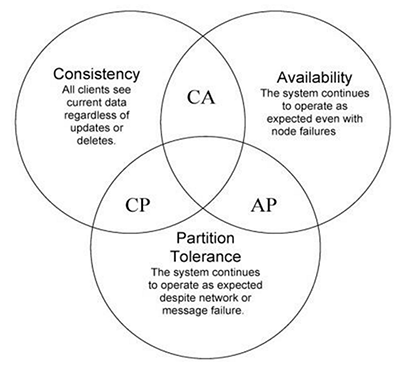

# 2. Entstehung und Definition des CAP-Theorems

Die kurz zusammengefasste Geschichte des CAP-Theorems beginnt im Jahr 1999. Eric A. Brewer und Armando Fox veröffentlichten ihre Arbeit
*Harvest, Yield, and Scalable Tolerant Systems* [1]. Die Autoren zeigen zwei Strategien auf wie in Software-Systemen pragmatisch mit den drei CAP Eigenschaften umgegangen werden kann und vermuten das zu einem beliebigen Zeitpunkt nur zwei der drei Eigenschaften erfüllt werden können. Zu diesem Zeitpunkt formulieren Brewer und Fox dies als *CAP Principle* [1].

Brewer formuliert das *CAP Principle* im Folgejahr (2000) als Hypothese [2]; also den Sachverhalt nur zwei von drei Eigenschaften zu erreichen. In 2002 beweisen Seth Gilbert und Nancy Lynch diese Hypothese in ihrer Arbeit *Brewer's Conjecture and the Feasibility of Consistent, Available, Partition-Tolerant Web Services* [3].

Der Beweis dieser Hypothese führte zur verstärkten Erforschung von System-Architekturen, welche die CAP Eigenschaften bestmöglich erfüllen. Gilbert und Lynch formulierten dies als Systeme die Daten meistens vollständig die meiste Zeit zurückliefern [3].

CAP steht für **Consistency** (Konsistenz), **Availability** (Verfügbarkeit) und **Partition-tolerance** (Partitionstoleranz). Brewer präsentierte das CAP-Theorem in Bezug auf Webservices [4], weshalb einige folgende Beispiele sich auf Server und Client wie auch Request und Response beziehen. Das Theorem ist nicht präzise definiert und weist dadurch eine Mehrdeutigkeit auf [5].

Zudem besagt das CAP-Theorem, dass es unmöglich ist alle drei Eigenschaften des Theorems mit einem verteilten Rechensystem zu erreichen. [5]

## 2.1. Das C in CAP - Consistency

Consistency \(C\) bezieht sich auf die Konsistenz der gespeicherten Daten. Die Eigenschaft beschreibt eine einheitliche Betrachtung der Daten auf allen Knoten des verteilten Systems [5]. Vereinfacht gesagt, bedeutet es, dass jeder Server die richtige Antwort auf jede Anfrage liefert. Die Bedeutung von C kann allerdings je nach Service variieren [4].

Bei Consistency handelt es sich um eine „Safety“-Eigenschaft
 (Sicherheitseigenschaft) [6]. Sie ist besonders dann wichtig, wenn es sich um Rechensysteme mit einem hohen Sicherheitsgrad handelt, wie zum Beispiel in einer Bank.

Zudem unterscheidet sich Consistency in CAP stark vom Consistency in [ACID](3_Unterschiede_zu_ACID.md). Dies wird im Abschnitt 3 näher erläutert.

## 2.2. Das A in CAP - Availability

Availability (A) besagt, dass jede Anfrage beantwortet wird, auch wenn Fehler auftreten sollten. Das gilt für Lese- und Schreiboperationen. [5]

Die Verfügbarkeit ist eine “Liveness”-Eigenschaft. In den meisten Systemen ist ein Response, der zu spät kommt, gleichbedeutend mit einem Response, der gar nicht ankommt [4]. Allerdings gilt nach der Definition von Brewer, dass eine bislang nicht angekommene Antwort zu einem späteren Zeitpunkt noch eintreffen könnte, weil es keine limitierte Wartezeit gibt. Es benötigt allerdings nur eine versagte Antwort und die Verfügbarkeit wird nicht erfüllt. [5]

Heutige verteilte Rechensysteme stellen eine hohe Verfügbarkeit mit einem fehlertoleranten System. Die Algorithmen sind so entwickelt, dass das System verfügbar ist, wenn auch nicht zu 100 Prozent, aber dafür Fehlertoleranzen aufweisen. [6]

## 2.3. Das P in CAP - Partition-tolerance

Eine Partition ist eine Trennung innerhalb des Systems, die zu komplettem Verlust in der Kommunikation zwischen betroffenen Knoten (nodes) führt. [5]

Einfacher ausgedrückt, bedeutet es, dass zum Beispiel Server in verschiedene Gruppen partitioniert sind und nicht miteinander kommunizieren können. [4]

Auch bei Partition-tolerance handelt es sich um eine “Safety”-Eigenschaft. [4]

## 2.4. Konflikte und Kompromisse

Ein verteiltes Datenbanksystem kann nicht kontinuierlich verfügbar, fortlaufend konsistent und partitionstolerant sein.

> “consistency, availability, partition tolerance: pick any two” [6]

Es können immer nur zwei Eigenschaften in einem Rechensystem erfüllt werden, also können jederzeit zwischen zwei Eigenschaften Konflikte auftreten.

**Abbildung 1:** Das CAP-Theorem [3]

Der Konflikt zwischen Consistency, Availability und Partition-tolerance ist ein Beispiel des allgemeinen Konflikts zwischen “Safety”-Eigenschaften und “Liveness”-Eigenschaften in einem unzuverlässigen System. Eine “Safety”-Eigenschaft sagt aus, dass nichts schlechtes passieren kann. Wenn ein Algorithmus zum Beispiel vorgibt konsistent zu sein, ist jede Ausführung und jede Antwort korrekt. Eine „Liveness“-Eigenschaft sagt aus, dass schlussendlich etwas Gutes passiert. Wenn eine Ausführung lang genug andauert, dann passiert etwas wünschenswertes. [4]

### 2.4.1. CA-Systeme
CA-Systeme weisen eine hohe Konsistenz und eine hohe Verfügbarkeit auf. Um allerdings eine niedrige Antwortzeit zu erhalten, sind replizierte Datenbanken nötig, wodurch die Konsistenz allerdings nicht mehr erfüllt würde. Um die Konsistenz aufrechterhalten zu können, wird das System durch nur einen Knoten kontrolliert. Wenn dieser allerdings versagt, versagt auch die Verfügbarkeit. [5]
  
### 2.4.2. AP-Systeme
AP-Systeme liefern eine hohe Verfügbarkeit und Ausfalltoleranz. Diese Systeme sind nicht immer konsistent, aber dank der Partitionierung, können sie theoretisch immer verfügbar sein. Sie werden verwendet, wenn Nutzer responsive Programme in allen Situationen benötigen. [5]

Die Partitionierung der Datenbank führt allerdings zu einer Steigerung der Anfragen. Dadurch steigt auch die Verfügbarkeit der Daten an jedem Knoten. [5]

„In a network subject to communication failures, it is impossible for any web service to implement an atomic read/write shared memory that guarantees a response to every request.“ [4]

Ein System kann also niemals zu 100 Prozent verfügbar sein.

### 2.4.3. CP-Systeme

Die Kombination von Consistency und Partition-tolerance werden nur selten in der Praxis verwendet, da eine hohe Verfügbarkeit für fast jedes System von essentieller Bedeutung ist. Ein solches System wird gerade dann eingesetzt, wenn die Sicherheit von größter Bedeutung ist. Das System ist immer konsistent und bei Störungen können Partitionen Abhilfe schaffen. [5]

***
[1] Fox, A., & Brewer, E. A. (1999). Harvest, yield, and scalable tolerant systems. In *Hot Topics in Operating Systems, 1999*. *Proceedings of the Seventh Workshop on* (pp. 174-178). IEEE.

[2] Brewer, E. A. (2000, July). Towards Robust Distributed Systems. *ACM Symposium on Principles of Distributed Computing*, Portland, Oregon

[3] Gilbert, S., & Lynch, N. (2002). Brewer's conjecture and the feasibility of consistent, available, partition-tolerant web services. *Acm Sigact News, 33*(2), 51-59.

[4] Gilbert, S., & Lynch, N. A. (2012). Perspectives on the CAP Theorem. Computer, 45(2), 30-36.

[5] Patinge, O., Karkhanis, V., & Barapatre, A. (2016). Inadequacies of CAP Theorem. _International Journal of Computer Applications,_ _151_(10), 18-20. doi:10.5120/ijca2016911921

[6] Kleppmann, M. (2015, September). A Critique of the CAP Theorem - University of Cambridge. Retrieved December 14, 2018, from https://www.cl.cam.ac.uk/research/dtg/www/files/publications/public/mk428/cap-critique.pdf

***

[<< 1. Einleitung](1_Einleitung.md) | [3. Die ACID Eigenschaften und ihre Begriffsdefinitionen im Vergleich zum CAP >>](3_Die_ACID_Eigenschaften_und_ihre_Begriffsdefinitionen_im_Vergleich_zum_CAP.md)

***
