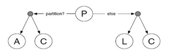

# 5 Alternativen des CAP-Theorems

Aufgrund der missverständlichen Definition ist das CAP-Theorem heute kein geeignetes Modell mehr für die Überlegungen von verteilten Rechensystemen. Die bereits erwähnten Mehrdeutigkeit aus [Abschnitt 2](2_Entstehung_und_Definition_des_CAP-Theorems.md), veranlasste die Erwägung neuer Frameworks, dessen Definition einfach zu verstehen, formal und korrekt ist. [1]

In diesem Abschnitt werden die Modelle PACELC und BASE vorgestellt, die auf dem CAP-Theorem aufbauen und dieses erweitern. 

## 5.1 PACELC

2010 schlug Daniel J. Abadi „PACELC“ (gesprochen: *„passelk“*) als Erweiterung des CAP-Theorems vor [2]. Diesen Vorschlag formulierte er 2012 erneut in seinem Artikel *„Consistency Tradeoffs in Modern Distributed Database System Design“* und erweiterte das CAP-Theorem damit um zwei technische Punkte:

1. Im CAP-Theorem ist kein Kompromiss notwendig, wenn das Netzwerk zuverlässig ist. Sowohl in AP-Systemen und CP-Systemen können Konsistenz und Verfügbarkeit die meiste Zeit parallel vorkommen [3].

2. Viele verteilte Rechensysteme opfern die Konsistenz um Latenz (Wartezeiten) zu verringern [3].

Punkt zwei stellt den Ausgangspunkt des PACELC-Theorems dar. Abadi argumentiert, dass es einen Konflikt zwischen Konsistenz und Latenz gibt. Viele Netzwerke können keine Beschränkung der Wartezeiten garantieren Somit können die gesendeten Pakete willkürlichen Verzögerungen unterworfen sein, wodurch zwar die Konsistenz bewahrt wird, aber die Latenz leidet [1]. Zudem kommt der Konflikt nur bei Systemen mit replizierten Daten vor [4]. 

> „Ignoring the consistency/latency tradeoff of replicated systems is a
> major oversight, as it is present at all times during system
> operations.“ [4]

**Abbildung 1:** PACELC-Modell, übernommen von Patinge et. al. (2016) [2]

Im CAP-Theorem wurde bereits erläutert, dass wenn es in einem System eine *Partition \(P\)* gibt, dann folgt ein Konflikt zwischen *Konsistenz \(C\)* und *Verfügbarkeit (A)*. Das PACELC-Theorem erweitert nun diese Definition um das *„else“ (E)*, denn wenn *Partition \(P\)* nicht verwendet wird, gibt es einen Konflikt zwischen *Latenz (L)* und *Konsistenz \(C\)*. Somit gibt es vier Alternativen für jedes mögliche System: *P+A  mit E+L/E+C und P+C mit E+L/E+C*. [2]

**PA/EL-Systeme:** Wenn eine *Partitionierung \(P\)* erfolgt, wird die *Verfügbarkeit (A)* über die Konsistenz gestellt. Wenn die Partitionierung fehlt *(E)*, wird *Latenz (L)* über Konsistenz gestellt. Bei diesen Systemen wird das Design simpler, da beide Konsistenzen aufgegeben werden. Umgesetzt wird dieses System zum Beispiel in den verteilten Datenbanksystemen *Dynamo* und *Cassandra*. [4]

**PA/EC-Systeme:** Bei einer *Partitionierung \(P\)* wird die *Verfügbarkeit (A)* über die Konsistenz gestellt, ansonsten *(E)* wird die *Konsistenz \(C\)* über die Latenz gestellt. Dieses System wird zum Beispiel bei *MangoDB* umgesetzt. [4]

**PC/EL-Systeme:** Diese Systeme präferieren *Konsistenz \(C\)* vor Verfügbarkeit, wenn eine *Partitionierung \(P\)* erfolgt. Ansonsten *(E)* wird *Latenz (L)* über Konsistenz gestellt. Ein Beispiel für ein solches System ist *PNUTS*. [4]

**PC/EC-Systeme:** Beim Einsatz einer *Partition \(P\)* wird bei diesem System die *Konsistenz \(C\)* vor der Verfügbarkeit bevorzugt. Wenn der Einsatz einer Partition nicht erfolgt *(E)*, wird die *Konsistenz \(C\)* über die Latenz gestellt. PC/EC-Systeme sind vollständige ACID-Systeme. Beispiele für ein solches System sind *Voldemort* und *Megastore.* [4]

|DDBS|P+A|P+C|E+L|E+C|
|--|--|--|--|--|
|Dynamo|Y| |Y| |
|Cassandra|Y| |Y| |
|MangoDB|Y| | |Y|
|Voldemort| |Y| |Y|
|Megastore|  |Y| |Y|
|PNUTS| |Y|Y| |

**Tabelle 1:** Beispiele für den Einsatz von PACELC, angepasst nach Patinge et. al. [2]

## 5.2 BASE

Eric A. Brewer gilt als Erfinder von BASE, der die Probleme bei ACID durch das CAP-Theorem erläuterte und dann mit dem BASE-Modell löste [5]. ACID und BASE werden als Gegenstücke betrachtet, da ACID häufiger in relationalen Datenbankmodellen zum Einsatz kommt und BASE speziell für NoSQL-Modelle entwickelt wurde [6]. In verteilten Datenbanken kommt es zu Problemen, wenn alle ACID-Eigenschaften erfüllt werden sollen und gleichzeitig eine hohe Verfügbarkeit erreicht werden soll [6]. BASE sollte dafür die Lösung liefern.

**BASE** steht für:

- **B**asically **A**vailable: Die Verfügbarkeit steht im Fokus und wird vom System garantiert, auch im Hinblick auf Fehler bei Knoten (node failures). Die Daten können veraltet sein, aber es wird immer eine Antwort erwartet [6].

- **S**oft State: Die Daten sind in einem konstanten Fließzustand. Während eine Antwort gegeben wird, ist die Aktualität und Konsistenz der Daten nicht garantiert [6]. 

- **E**ventual Consistency: Die Konsistenz wird der Verfügbarkeit untergeordnet und als Übergangsprozess betrachtet, der nicht dauerhaft gegeben ist [5].

Die eventuelle Konsistenz kann außerdem in 4 verschiedenen Fällen auftreten:

**Causal Consistency:** Sie ist gegeben, wenn ein neu geschriebener Datensatz kausal abhängig von einem vorherig eingetragenen Datensatz ist und danach immer der aktuelle Wert ausgelesen wird und keine ältere Version des Datenelements [5].

**Read-your-write Consistency:** Dabei handelt es sich um einen Speziallfall der Causal Consistency. Man erhält immer seinen geschriebenen Wert und keine ältere Version des Datenelements [5].

**Session Consistency:** Solange eine Session existiert, herrscht Read-your-write Consistency. Wenn diese beendet wurde, muss zunächst eine neue Session erstellt werden [5].

**Monotonic Read Consistency:** Wenn ein Datenelement bei einer Leseoperation zurückgegeben wird, kann bei einer späteren Leseoperation kein älteres Datenelement zurückgegeben werden [5].

***
[1] Kleppmann, M. (2015, September). A Critique of the CAP Theorem - University of Cambridge. Retrieved December 14, 2018, from https://www.cl.cam.ac.uk/research/dtg/www/files/publications/public/mk428/cap-critique.pdf

[2] Patinge, O., Karkhanis, V., & Barapatre, A. (2016). Inadequacies of CAP Theorem. *International Journal of Computer Applications, 151(10)*, 18-20. doi:10.5120/ijca2016911921

[3] Golab, W. (2018). Proving PACELC. *ACM SIGACT News, 49(1)*, 73-81. doi:10.1145/3197406.3197420 

[4] Abadi, D. (2012). Consistency Tradeoffs in Modern Distributed Database System Design: CAP is Only Part of the Story. *Computer, 45(2)*, 37-42. doi:10.1109/mc.2012.33 

[5] Ponomarenko, A. P. (2011). *Entwurf und Realisierung einer verteilten NoSQL-Anwendung (Bachelorarbeit)*. Abgerufen von http://edoc.sub.uni-hamburg.de/haw/volltexte/2012/1485/pdf/ap_ba.pdf

[6] Machado, K. M., Kank, R. K., Sonawane, J. S., & Maitra, S. M. (2017). A Comparative Study of ACID and BASE in Database Transaction Processing. *International Journal of Scientific & Engineering Research, 8(5)*, 116–119.
***

[<< 4.2. Amazon DynamoDB](4_2_Amazon_DynamoDB.md) | [6. Zusammenfassung >>](6_Zusammenfassung.md)

***
