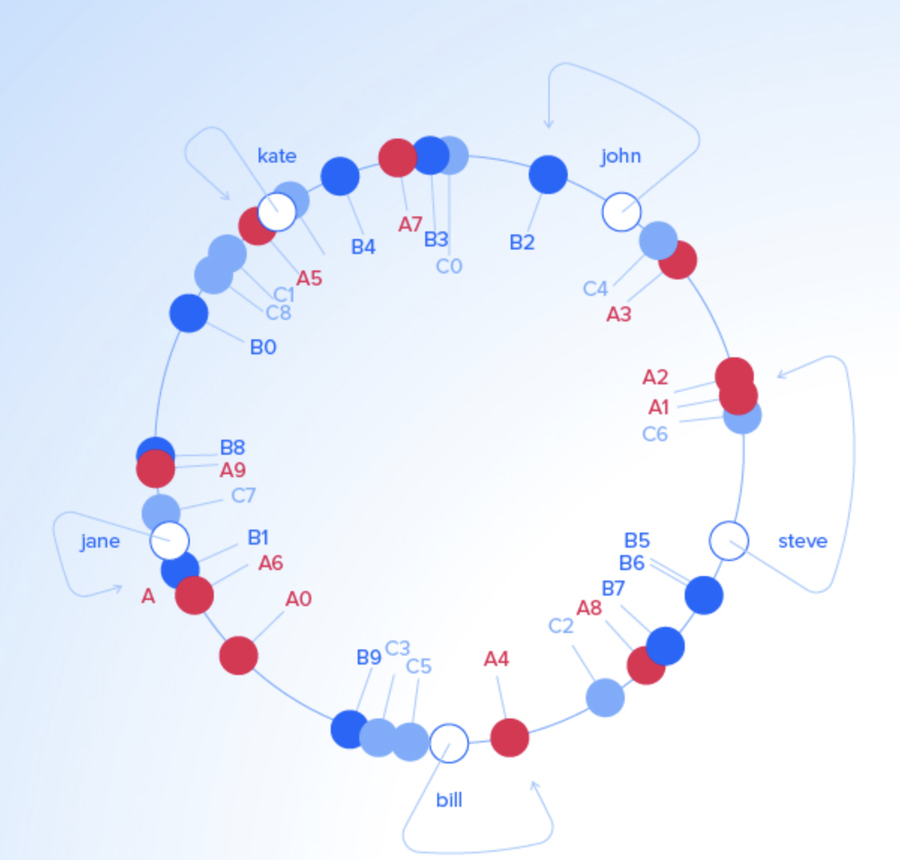

# Consistent Hashing  

## Warum  

Mit der Zeit werden immer mehr anspruchsvollere Systeme bzw. Software entwickelt und eingesetzt. Auch deren Ansprüche haben sich weiterentwickelt. Dies hat zur folge, dass immer mehr Daten gespeichert, verwaltet und angefragt werden. Solche wachsenden Lasten können mit klassischen Servern nicht  abgedeckt werden, außerdem ist der Speicher der Server begrenzt. Hier schafft das Verfahren von verteilten Netzwerk mit vielen Servern abhilfe.  

In den folgenden Abschnitt wird die Frage beantwortet: Wie verhält sich ein verteiltes Datenbanksystem?  Im Einsatz einer verteilten Datenbank sind weitere Fragen zu klären, wie welche Daten werden auf welchen Servern geschrieben? Wie können Anfragen am besten auf alle Server gleich verteilt werden?  Und Was passiert, wenn ein Server ausfällt?

## Das Verfahren  

Mittels _Distributed Hashing_ (verteilte Hashtabelle)  werden die Daten gleichmäßig auf die _Server_ (Knoten) verteilt,  dabei entspricht jeder Knoten einem Eintrag in der Hashtabelle. In einem solchen Verfahren werden die Datenobjekte mit Schlüssel auf die Server verteilt.

In der Tabelle 1.1 werden den drei Servern A, B, und C die Schlüssel zugewiesen, dabei wird von jedem Schlüssel der Hashwert berechnet und die Modulo-Operation (Anzahl der Server) durchgeführt. Das Ergebnis weist durch einen Index den entsprechenden Server an, siehe Tabelle 1.2.  

| Schlüssel |    Hash    | Hash mod 3 |
| :-------: | :--------: | :--------: |
|  "john"   | 1633428562 |     1      |
|  "bill"   | 7594634739 |     0      |
|  "jane"   | 5000799124 |     1      |
|  "kate"   | 3421657994 |     2      |  

Tabelle 1.1  

| Server A | Server B | Server C |
| :------: | :------: | :------: |
|  "bill"  |  "john"  |  "kate"  |
|          |  "jane"  |          |  

Tabelle 1.2  

## Problem des Verfahrens  

Dieses Verfahren läuft gut, bis sich die Frage stellt, was passiert, wenn während der Laufzeit ein Server ausfällt, nicht erreichbar ist oder weiterer Server hinzu kommt? 

Bei dem Verfahren müssen alle Schlüssel erneut auf die Server verteilt werden, auch wenn nur ein einziger Server hinzugefügt oder entfernt wird. So ergeben die Modulo-Operationen nach der geänderten Serveranzahl andere Ergebnisse. Daher ist das Berechnen und umverteilen der gesamten Schlüssel ein Ressourcen-aufwändiges Verfahren. Gerade bei großen Datenmengen besteht die Gefahr, dass ein Server abstürzen kann.

Im Beispiel wird der Server C entfernt, somit sind nur die zwei Server A und B erreichbar, jedoch müssen alle Schlüssel erneut berechnet  (siehe Tabelle 1.3) und verteilt werden, siehe Tabelle 1.3.  

| Schlüssel |    Hash    | Hash mod 3 |
| :-------: | :--------: | :--------: |
|  "john"   | 1633428562 |     0      |
|  "bill"   | 7594634739 |     1      |
|  "jane"   | 5000799124 |     0      |
|  "kate"   | 3421657994 |     0      |  

Tabelle 1.3  

| Server A | Server B |
| :------: | :------: |
|  "john"  |  "bill"  |
|  "jane"  |          |
|  "kate"  |          |  

Tabelle 1.4  

## Prinzip des Consistent Hashing  

Das konsistente Hashverfahren erlaubt es beliebig viele Server in das verteilte Datenbanknetz hinzuzufügen, dabei wird die Verfügbarkeit wenig eingeschränkt. Auch bei den Ausfällen müssen nicht alle Schlüssel neu verteilt werden, lediglich der “Nachbar” Knoten/Server ist für die temporäre Haltung der Daten verantwortlich 1.

“Eine konsistente Hashfunktion ist eine Hashfunktion, die die Anzahl der Neuzuordnungen minimiert. Bei dem Gebrauch einer inkonsistenten Hashfunktion werden alle Schlüssel neu auf die verfügbaren Behälter verteilt. Konsistente Hashfunktionen haben folgende Eigenschaften: Einwegberechenbarkeit, Kollisionsresistenz, Gleichverteiltheit und effiziente Berechenbarkeit” 1.  Durch die Verwendung einer guten Hashfunktion entfällt die sonst notwendige Lastverteilung durch den Administrator 2.

Um das Verfahren zu veranschaulichen, ist in der Abb. 2 ein schematischer Kreis dargestellt, in der die Schlüssel und Server markiert sind. Jeder dieser Server kriegt eine Hashregion zugeteilt und die Schlüssel werden mittels einer Hashfunktion auf die Server verteilt, siehe Tabelle 1.5.  

  
Abb. 2 Schematischer Kreis  

| Schlüssel | Hashregion | Server |
| :-------: | :--------: | :----: |
|  "john"   |     B2     |   B    |
|  "kate"   |     A5     |   A    |
|  "jane"   |     C7     |   C    |
|  "bill"   |     A4     |   A    |
|  "steve"  |     C6     |   C    |  

Tabelle 1.5 zu Abb. 2 Verteilung Schlüssel und Server.  

Im nachfolgenden Beispiel wird der Server C entfernt. Sie Schlüssel des Servers C werden auf die naheliegenden Hashregionen der Server A und B verteilt. Die Schlüssel von den Servern A und B bleiben unverändert, siehe Tabelle 1.6.  

| Schlüssel | Hashregion | Server |
| :-------: | :--------: | :----: |
|  "john"   |     B2     |   B    |
|  "kate"   |     A5     |   A    |
|  "jane"   |     B1     |   B    |
|  "bill"   |     A4     |   A    |
|  "steve"  |     A1     |   A    |  

Tabelle 1.6 zu Abb. 2 Server C wurde entfernt, Umverteilung der Schlüssel.  

Wenn ein Server hinzugefügt wird, z.B. der Server D, werden ungefähr ein drittel der Schlüssel (von Server A und B) auf dem Server D verteilt. Die restlichen Schlüssel bleiben davon unberührt, siehe Tabelle 1.7.  

| Schlüssel | Hashregion | Server |
| :-------: | :--------: | :----: |
|  "john"   |     B2     |   B    |
|  "kate"   |     A5     |   A    |
|  "jane"   |     B1     |   B    |
|  "bill"   |     A4     |   A    |
|  "steve"  |     D2     |   D    |  

Tabelle 1.7 zu Abb. 2 Server D wird hinzugefügt, Umverteilung der Schlüssel.  

## Verwendung in Firmen  

Das Verfahren Consistent Hashing wird von verschiedenen Datenbanken eingesetzt, wie zB. bei Schlüssel-Wert Datenbanken Voldemort, Redis und Membase. Bei den Spaltenorientierten Datenbanken Cassandra. Die dokumentenorientierten Datenbanken CouchDB und Riak. Auch bei den graphenbasierte Datenbanken, wie BigData und FlockDB wird konsistentes Hashing eingesetzt, obwohl graphenbasierte Datenbanken aufgrund ihrer Struktur schwierig zu partitionieren sind [Skript]. Und auch Amazons DynamoDB verwendet intern dieses Verfahren 3, wodurch DynamoDB mehr als 10 Billionen Anfragen pro Tag bearbeiten und Spitzenwerte von mehr als 20 Millionen Anfragen pro Sekunde unterstützen kann. 4. 

Wie zu sehen, setzen die Schüssel-Wert Datenbanken Voldemort, Redis und Membase nur konsistentes Hashing ein. Genauso wie die dokumentenorientierten Datenbanken CouchDB und Riak. MongoDB nutzt eine intervallbasierte Partitionierung. Die spaltenorientierten Datenbanken Hbase und Hypertable setzten intervallbasierte Partitionierung ein. Cassandra dagegen nutzt das konsistente Hashing. Graphenbasierte Datenbanken sind aufgrund ihrer Struktur schwierig zu partitionieren. Dennoch setzten die Datenbanken BigData und FlockDB das Verfahren des konsistentes Hashing ein. Neo4J, GraphDB und Sesame unterstützen keine Partitionierung. Hier erfolgt die Verteilung der Datenbanken durch Replikation.  Replikation und Konsistenz

____
1Vergleich und Evaluation zwischen modernen und traditionellen Datenbankkonzepten unter den Gesichtspunkten Skalierung, Abfragemöglichkeit und Konsistenz, Nils Petersohn, Diplomica Verlag 2011
2Datenbanktechnologie, Skript, J. S. Lie, 2011
3https://en.wikipedia.org/wiki/Consistent_hashing
4https://aws.amazon.com/de/dynamodb/