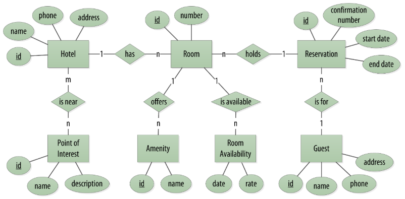
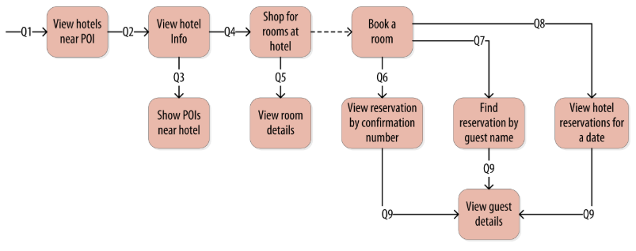
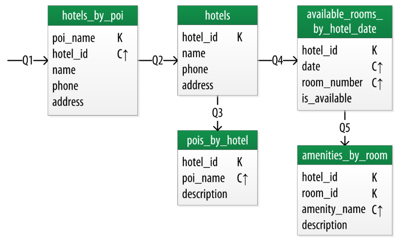

# 4.1 E-Commerce Beispiel

Das folgende Beispiel beschreibt die Anwendungsdomäne von Hotelreservierungen. Eine detaillierte Beschreibung des Beispiels kann in [#2016] nachgelesen werden. 

Als Ergebnis der Anforderungsanalyse und der Beschreibung der Use-Cases wurde das in Abbildung 9 dargestellte ER-Diagramm erstellt. Dieser Schritt ist sowohl bei relationalen Datenbanksystemen, als auch bei spaltenorientierten Datenbanken gleich. 

In spaltenorientierten Datenbanken wird die Datenmodellierung mit dem Abfrage-Modell fortgesetzt. Hierzu werden die Abfragen an die Datenbank modelliert. Eines der Hauptziele der Datenmodellierung sollte die Minimierung der gesuchten Partitionen sein, um eine Abfrage zu erfüllen.

*Abbildung 9: ER-Modell, Abbildung aus [2016]*

Folgende Abfragen sollte die Anwendung verstehen.

* Q1. Finden Sie Hotels in der Nähe einer bestimmten Sehenswürdigkeit.

* Q2. Finden Sie Informationen zu einem bestimmten Hotel, wie Name und Ort.

* Q3. Finden Sie Sehenswürdigkeiten in der Nähe eines Hotels.

* Q4. Finden Sie ein verfügbares Hotelzimmer in einem bestimmten Zeitraum.

* Q5. Finden Sie den Preis und die Ausstattung für ein Hotelzimmer.

Aus den Abfragen wird nun ein Workflow Diagramm erstellt. In einer guten Modellierung kann das Ergebnis einer Abfrage als Input einer folgenden Abfrage dienen. Daraus ergibt sich das in Abbildung 10 dargestellte Workflow-Diagramm. 

*Abbildung 10: Workflow, Abbildung aus [2016]*

Das Diagramm beschreibt beispielhaft folgenden Workflow. Das Ergebnis der Abfrage Q1 enthält unter anderem die Partitionsschlüssel der Hotels, die benötigt werden, um Abfrage Q2 zu erstellen. Es ist wichtig daran zu denken, dass Datensätze nur über den Partitionsschlüssel angesprochen werden können. 

Nachdem alle Abfragen erstellt wurden, können die Tabellen erstellt werden. Es ist darauf zu achten, dass Tabellen in spaltenorientierten Datenbanken mit Column Families gleichzusetzen sind. Für jede Abfrage muss eine Tabelle erstellt werden. Für diesen Teil der Modellierung dienen sogenannte Chebotko-Diagramme (siehe Abbildung 11).

*Abbildung 11: Chebotko Diagramm, Abbildung aus [2016]*

Der Workflow beginnt mit der ersten Frage Q1 „ Finden Sie Hotels in der Nähe einer bestimmten Sehenswürdigkeit“. Daraus kann der Tabellenname abgeleitet werden (hotels_by_poi). Als Input der Suche Q1 sollte der Name der Sehenswürdigkeit verwendet werden. Demzufolge ist der Name der Sehenswürdigkeit Teil des Primärschlüssels (im Diagramm mit K gekennzeichnet). Das Ergebnis der Abfrage liefert in der Regel mehr als ein Hotel. Um sicherzustellen das für jedes Hotel eine eigene Partition vorhanden ist, muss es Teil des Primärschlüssels sein (im Diagramm mit C gekennzeichnet).

Nach dem beschriebenen Muster können alle Tabellen erstellt werden. Besonders das Bestimmen des Primärschlüssels ist nicht trivial. Hier sollte auf eine gute Modellierung geachtet werden, da dies große Auswirkungen auf die Performance haben kann. Die Erstellung der Tabellen ist die zeit intensivste Teilaufgabe im Modellierungsprozess. Nach Abschluss dieses Prozesses kann mit der physischen Datenmodellierung fortgefahren werden, sprich die Tabellen werden in die Datenbank geschrieben. 

---

[<< 4 Fallbeispiel Datenmodellierung](beispiel_4.md) | [4.2 Zeitreihen -  Wetterstation Beispiel>>](beispiel_4_2.md)

---
