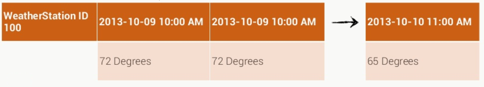

# 4.2 Zeitreihen - Wetterstation Beispiel

Eine der häufigsten Anwendungen spaltenorientierter Datenbanken ist die Aufzeichnung von Zeitreihendaten. Hier sind sie relationalen Datenbanken überlegen. Die Speicherung der Daten in Spalten lässt die Zeile nach rechts wachsen. Es sind bis zu 2 Milliarden Spalten in einer Zeile möglich. Ein weiterer Vorteil ist die Tatsache, dass nur Speicherplatz verbraucht wird, wenn Daten geschrieben werden. In relationalen Systemen würde ein NULL-Wert gespeichert werden, der Speicherplatz verbraucht.

Mit dem Einzug des IOT (Internet of Things) wurden spaltenorientierte Datenbanken sehr populär. Viele Sensoren liefern ständig Werte. Diese Werte sind abzuspeichern. 

Als kleines Beispiel soll die Modellierung einer Datenbank von Wetterstationen dienen. Eine Abfrage der Datenbank könnte lauten „Finde alle abgespeicherten Temperaturen der Wetterstation X“. Eine weitere Anfrage wäre „Finde alle Temperaturen eines bestimmten Tages“. Das daraus resultierende Modell zeigt Abbildung 12.

*Abbildung 12: Datenmodell von Wetterstationen*

Der Partitionsschlüssel ist demnach aus einer ID der Wetterstation oder aus dem eindeutigen Namen der Wetterstation zu bilden. Der Datensatz setzt sich aus den Spalten zusammen. Der Spaltenschlüssel beschreibt den Tag an dem der Wert aufgenommen wurde. Somit sind sehr schnelle Lese- und Schreib- Operationen möglich.

---

[<< 4.1 E-Commerce Beispiel](beispiel_4_1.md) | [5 Fazit >>](fazit_5.md)

---
