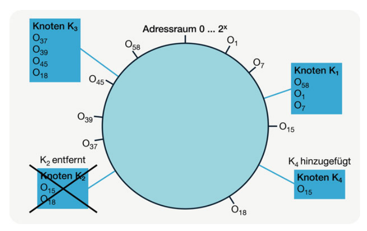

# 2.2 Consistend Hashing

Consistent Hashing wird verwendet, um zu einem Objekt in einem verteilten System möglichst schnell einen Speicherort, bei NoSQL-Datenbanken einen Server, zu finden. Dafür werden Hash- bzw. Streuwertfunktionen verwendet. Nach [#Edlich2011] definiert eine Streuwertfunktion eine Vorschrift, die einen Wert x aus einer großen Quellmenge auf einen Hashwert v = h(x) aus einer deutlich kleineren Wertemenge abbildet. Hashing-Verfahren haben den Vorteil, dass sie in konstanter Zeit O(1) ein Ergebnis liefern. In Abbildung 1 wird das Consistend Hashing Verfahren schematisch dargestellt.

*Abbildung 1: Consistent Hashing, Abbildung aus [#Meier2016]*

Ein weiteres Ziel beim Consistend Hashing ist die Gleichverteilung der zu speichernden Objekte innerhalb des in Abbildung 1 dargestellten Ringes. Der Ring wird als Adressraum von 0 bis 2^{x} Schlüsselwerten zusammengefasst. Danach wird eine Hashfunktion gewählt, die die Netzwerkadressen der Knoten auf Speicheradressen abbildet und im Ring einträgt. Die Schlüssel der zu speichernden Objekte werden mithilfe der Hashfunktion zu Adressen transformiert und auf dem Ring eingetragen.

So werden die Objekte O1, O7 und O58 aus Abbildung 1 dem Knoten K1 zugeordnet. Dabei erfolgt die Zuweisung im Uhrzeigersinn. Demnach werden die Objekte O15 und O18 auf Knoten K2 gespeichert. Die Stärke von Consistent Hashing zeigt sich beim Entfernen und Hinzufügen von Knoten, denn die Änderungen haben nur Auswirkungen auf die Objekte in unmittelbarer Nähe zu den veränderten Knoten im Ring. Abbildung 2 zeigt ein solches Szenario.

Wie in Abbildung 2 zu sehen, wird Knoten K2 entfernt und Knoten K4 hinzugefügt. Diese Änderung wirkt sich nur auf die Objekte O15 und O18 aus. Der Speicherort für O15 ist jetzt Knoten 4, da er im Uhrzeigersinn der nächstgelegende Knoten ist. Objekt O18 wird auf Knoten K3 aus dem selben Grund gespeichert.

*Abbildung 2: Consistent Hashing, Abbildung aus [#Meier2016]*

Für viele große Internet Unternehmen sind Verfügbarkeit und schnelle Reaktionszeiten zu priorisieren. Mit dem Consistent Hashing Verfahren haben sie ein Werkzeug zur Hand, um schnell auf Stoßzeiten zu reagieren. Werden viele Anfragen erwartet, so wird die Zahl der Knoten, also der Server im Ring, erhöht. In Zeiten geringer Anfragen kann die Anzahl der Knoten verringert werden. So kann flexibel reagiert und Kosten gespart werden. 

Ein wichtiger Unterschied zu relationalen Datenbanksystemen ist die Linearität der Performance bei Hinzunahme von Knoten. In relationalen Datenbanksystemen wird die Performance an einem bestimmten Punkt, durch Hinzunahme von Servern, nicht mehr gesteigert. Dieser Punkt ist relativ schnell erreicht. NoSQL Datenbanken nach BASE können bis ins unendliche skaliert werden.

---

[<< 2.1 CAP-Theorem und BASE-Modell](grundlagen_2_1.md) | [2.3 Replikation >>](grundlagen_2_3.md)

---
