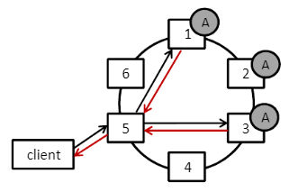

# 2.3 Replikation

Im Abschnitt 2.2 -Consistend Hashing- wurde beschrieben wie die Daten möglichst gleich-verteilt im Ring gespeichert werden. Der Ausfall von Knoten im Ring würde allerdings bedeuten, dass die Daten verloren wären. Es ist demnach wichtig die Daten zu replizieren. 

Abbildung 3 zeigt die Replikationsstrategie bei Cassandra, einer populären NoSQL Column Store Datenbank. Die Anzahl der Replikate richtet sich dabei nach dem Replikationsfaktor N, der bei Cassandra vom Nutzer bestimmt wird. In Abbildung 3 wird ein Replikationsfaktor N=3 verwendet. Der Datensatz A ist damit auf drei Knoten verteilt und die Robustheit des Systems ist sichergestellt. Die Replikate werden dabei, wie in Abbildung 3 zu sehen, auf die folgenden Knoten (hier Knoten 2 und 3) im Uhrzeigersinn geschrieben. Eine noch größere Robustheit des Gesamtsystems kann dadurch erreicht werden, dass die Replikate in verschiedenen Datacentern gespeichert werden.

*Abbildung 3: Replikationsstrategie, Abbildung aus [#conf/qest/OsmanP14]*

In Abbildung 3 wird ferner gezeigt, wie ein Request eines Clients bei Cassandra abläuft. In der Regel werden die Anfragen der Clients über einen Load-Balancer verteilt. Nach [#conf/qest/OsmanP14] werden folgende Schritte ausgeführt.

1. Request, mit Schlüssel für Datensatz A, wird von Knoten 5 empfangen. Knoten 5 wird zum Koordinator-Knoten.

2. Der Datensatz befindet sich auf den Knoten 1, 2 und 3. Der Wert des Konsistenzlevels beträgt 2. Folglich wird vom Koordinatorknoten ein Read-Request an zwei der drei Knoten (hier 1 und 3) gesendet.

3. Der Koordinatenknoten (Knoten 5) vergleicht die Werte beider Knoten (1 und 3) und liefert den aktuellen aus.

4. Die Aktualisierung der Werte kann mit dem weiter oben genannten Verfahren „Data Versioning“ bzw. „Version Evolution“ erfolgen. Eine Beschreibung dieser Technik findet sich in [#DBLP:conf/sosp/DeCandiaHJKLPSVV07].

5. Falls Knoten 1 und 3 unterschiedliche Werte enthielten, ist nach dem Read-Request der Datensatz auf Knoten 1 und 3 in einem konsistenten Zustand. 

---

[<< 2.2 Consistend Hashing](grundlagen_2_2.md) | [3 Datenmodellierung >>](modellierung_3.md)

---
