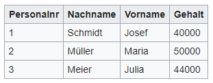
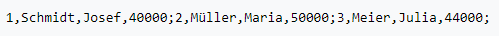
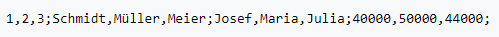
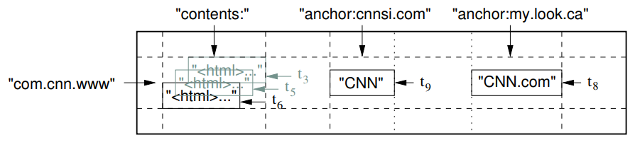
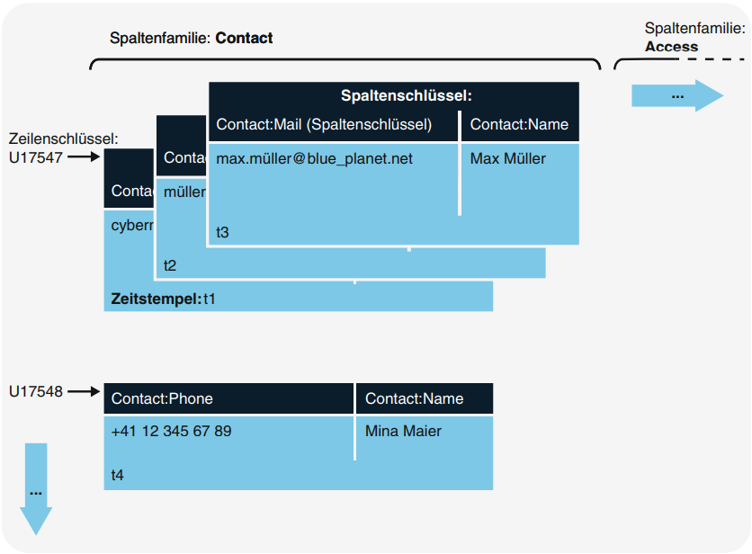

# 3.1 Datenmodell spaltenorientierter Datenbanken

Anhand eines Beispiels soll das Datenmodell von spaltenorientierten Datenbanken erläutert werden. Dabei gibt es einen entscheidenden Unterschied zu zeilenorientierten Datenbanken, wie beispielsweise MySQL. Die Art der Datenspeicherung auf dem persistenten Medium (Festplatte) ist bei beiden Datenmodellen (zeilenorientiert und spaltenorientiert) unterschiedlich. Als Beispiel soll die in Abbildung 4 gezeigte Tabelle dienen. Die Tabelle beschreibt den Verdienst einzelner Personen. 

*Abbildung 4: Einfache Tabelle, Abbildung aus [Wikipedia]*

In zeilenorientierten Datenbanken werden alle Tupel einer Tabelle, wie in Abbildung 5 gezeigt, nacheinander abgespeichert. Zeilenorientierte Systeme sind effizient, wenn alle Spalten einer Zeile benötigt werden. Die Daten liegen auf dem Speichermedium hintereinander und können sequentiell gelesen werden. Die gleiche Operation auf spaltenorientierten Systemen ist ineffizient, da viele Sprünge auf dem Speichermedium verursacht werden.

*Abbildung 5: Speicherung von Zeilen, Abbildung aus [Wikipedia]*

In spaltenorientierten Datenbanken werden die Einträge der Spalten, wie in Abbildung 6 zu sehen ist, hintereinander gespeichert. Diese Systeme arbeiten sehr effizient bei der Bildung von Aggregaten, beispielsweise bei der Berechnung der Summe aller Gehälter. Diese Operation, ausgeführt auf zeilenorientierten Systemen, ist ineffizient, da erst alle Zeilen (mit allen Spalten), also alle Daten, eingelesen werden müssen. Bei großen Datenbeständen kann diese Operation sehr lange dauern.

*Abbildung 6: Speicherung von Spalten, Abbildung aus [Wikipedia]*

Wichtige Vertreter von spaltenorientierten Datenbanken sind BigTable von Google und Cassandra (Apache Foundation). Genauer gesagt zählen diese Datenbanken zur Gruppe der Column Family Stores. In den weiteren Ausführungen zum Datenmodell, wird speziell auf die beiden genannten Vertreter eingegangen. Abbildung 7 zeigt das Datenmodell von BigTable. Auf die Datensätze kann nur über den sogenannten Row-Key zugegriffen werden. Er ist vergleichbar mit dem Primärschlüssel von relationalen Systemen. Eine Abfrage von Werten, wie bei relationalen Systemen, ist nicht möglich. Der Row-Key in Abbildung 7 setzt sich aus der URL (in umgekehrter Reihenfolge) zusammen ("com.cnn.www").

*Abbildung 7: Datenmodell Column Store, Abbildung aus [chang2006bigtable]*

Column families, in Abbildung 7, bilden „contents:“ und „anchor:“. Unter der column family „contents:“ wird der Inhalt der Seite in drei zeitlich verschiedenen Versionen (t3, t5 und t6) abgespeichert. In der column family „anchor:“ erfolgt eine weitere Unterteilung in column keys. Die Ausdrücke, aus Abbildung 7, „anchor:cnnsi.com“ und „anchor:my.look.ca“ gehören zur column family „anchor:“, wobei die Column Keys aus „my.look.ca“ und „cnnsi.com“ gebildet werden. Die Werte sind „CNN“ und „CNN.com“.Die Reihe aus Abbildung 7 speichert folglich Verlinkungen auf die Seite „www.cnn.com“. 

Dieses Beispiel sollte dem Leser bewusst machen, dass riesige Datensätze hinter einer Zeile stecken können. Was auch deutlich wird ist die Tatsache, dass die „Tabelle“ nicht wie bei relationalen Systemen nach unten (vertikal) gefüllt wird, sondern nach rechts (horizontal). Eine Zeile kann bei spaltenorientierten Systemen bis zu 2 Milliarden Spalten enthalten.

Das Beispiel zeigt auch, dass die Spalten dynamisch nach rechts wachsen und pro Zeile unterschiedlich viele Spalten existieren können. In relationalen Systemen ist dies nicht möglich. Hier muss, trotzdem eine Spalte keinen Wert enthält, Speicher allokiert werden. Was bei großen Datenbeständen nicht unerheblich sein kann.

Dem aufmerksamen Leser sollte aufgefallen sein, dass spaltenorientierte Systeme nichts anderes als verschachtelte Hash Maps sind. Auch bei steigenden, riesigen Datenmengen bleibt die Suchkomplexität gleich, da nur über den Row-Key die Zugriffe erfolgen. Relationale Systeme werden bei großen, steigenden Datenmengen immer langsamer. 

Folgende Liste beschreibt wichtige Begriffe anhand des Datenmodells der Datenbank Cassandra. Viele Begriffe wurden bereits weiter oben verwendet. Die folgende Liste kann als Zusammenfassung betrachtet werden. Abbildung 8 zeigt die verwendeten Begriffe in einem Beispiel.

1. Der Keyspace ist die oberste Ebene der Datenstruktur. In relationalen Systemen gleichzusetzen mit der Datenbank.

2. In einem Keyspace werden Column Families angelegt. Column Families besitzen kein vorgegebenes Schema, so dass das Wissen zur Interpretation der Daten auf Applikationsebene verbleibt. Daten innerhalb einer Column Family haben den gleichen Typ, denn es wird davon ausgegangen, dass sie zusammen gelesen werden (siehe [#Meier2016]). 

3. Eine Row ist eine über Schlüssel eindeutig identifizierbare Einheit von Daten.

4. Super Columns sind Columns dessen Werte wieder Columns sind. Sie ermöglichen die Verschachtelung komplexer Datenstrukturen.

5. Column ist die kleinste Informationseinheit. Sie besteht aus Schlüssel-Wert Paaren. In Cassandra aus Name, Wert und Zeitstempel.

*Abbildung 8: Beispiel Datenmodell, Abbildung aus [Meier2016]*

---

[<< 3 Datenmodellierung](modellierung_3.md) | [3.2 RDBMS im Vergleich zu spaltenorientierten Datenbanken >>](modellierung_3_2.md)

---
