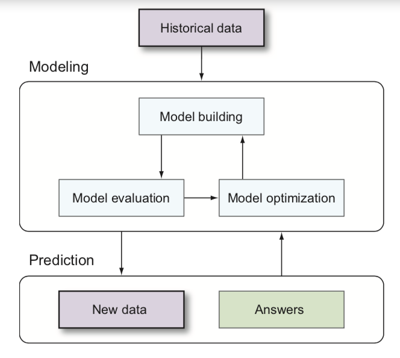

***

# Einführung in ML

Machine Learning beschreibt die Wissenschaft, bei der Computer dazu programmiert werden so wie Menschen zu lernen und handeln. Dabei wird der Lernprozess im Laufe der Zeit autonom verbessert, indem Beispieldaten oder bisherige Erfahrungen hinzugeführt werden <a href="">[1]</a>.
Analogien zwischen menschlichen Lernen und Machine Learning führen zu der offensichtlichen Frage, wo der Unteschied zwischen Machine Learning und Künstlicher Intelligenz besteht. Dabei gibt es keinen klaren Konsens, aber Machine Learning ist auf jeden Fall eine Form der künstlichen Intelligenz und KI ist darüber hinaus ein umfangreiches Thema, welches Robotik, Sprachverarbeitung und Computer Vision Systeme umfasst <a href="">[2]</a>.

Praktische Anwendungsfälle bei denen ML zum Einsatz kommt unterteilen sich in vier verschiedene Problemgebiete. Dazu zählt die Klassifikation, also die Bestimmung einer diskreten Klasse basierend auf den Eingabedaten. Konkrete Anwendungsfälle sind Spamfilter, Betrugserkennung, Medikamentenwirksamkeit und der Erkennung von Herstellungsfehlern. Außerdem gibt es die Regression, bei der eine Vorhersage des tatsächlichen Outputs basierend auf der Grundlage der Inputdaten. Anwendungsfälle für die Regression sind Börsenprognosen, Risikomanagement, Angebotsoptimierung und Wetterprognose. Darüber hinaus zählt Recommendation zu den Problemgebieten. Hier findet eine Voraussage über die Bevorzugten Alternativen von Benutzern statt. Zu den Anwendungsfällen zählen Produktempfehlungen, Online-Dating und Stellenvermittlung. Das letzte Problemgebit ist die Imputation, bei der eine Ableitung von fehlenden Werten der Eingebaten vorgenommen wird. Dazu zählen unvollständige Patientenakten, fehlende Kundendaten und Zensusdaten. <a href="">[2]</a>

Traditionell wurden Probleme oder Aufgaben definiert, bei denen ein definierter Input erwartet wurde, der einen ebenfalls definierten Output erzeugt und durch Programmierer gelöst werden musste. Bei Machine Learning werden anhand von Trainingsdaten und des gewünschten Outputs automatisch Regeln zur Unterscheidung durch den Machine Learning-Algorithmus abgeleitet. Das Ergebnis ist ein Modell, welches prädikativ oder beschreibend sein kann, um Erkenntnise aus Daten zu gewinnen <a href="">[3]</a>.
Für die Erstellung eines mathematischen Modells werden für Machine Learning Theorien der Statistik verwendet, damit aus einer Stichprobe Schlussfolgerungen gezogen werden können. In der Regel besteht das maschinelle Lernen aus zwei Phasen. In der Trainings- oder Lernphase wird ein Modell basierend auf zuvor beobachten Daten erlernt. In der Anwendungs- oder Prediction-Phase wird das Modell auf neue Daten angewendet. Die Fähigkeit, neue Daten, die sich von den Trainingsdaten unterscheiden, korrekt zu verarbeiten, wird als Generalisierung bezeichnet, was ein grundlegendes Ziel des Machine Learning ist. <a href="">[4]</a>

Genauer besteht der ML Workflow aus fünf Komponenten. Dazu zählen `data preparation`, `model building`, `evaluation`, `optimization` und `predictions` wie Abbildung 1 zu sehen.

    
    
Abbildung 1: Workflow eines Machine Learning Systems <a href="">[2]</a>

Die Abfolge dieser Komponenten hat eine implizite Ordnung, aber die meisten ML Anwendungen erfordern, dass jeder Schritt in einem iterativen Prozess mehrfach durchlaufen wird <a href="">[2]</a>.

Dieser Workflow

Supervised Learning

Unsupervised Learning

Semi-supervised learning

Reinforcement learning

---
[1] http://robotics.stanford.edu/~nilsson/MLBOOK.pdf

[2] 16 mb PDF

[3] PDF ML meets Databases

[4] https://books.google.de/books?id=NP5bBAAAQBAJ&pg=PA1&hl=de&source=gbs_toc_r&cad=2#v=onepage&q&f=false

[5] https://emerj.com/ai-glossary-terms/what-is-machine-learning/

<!--

| Begriff               | Definition |
|-----------------------|------------------------------------|
| instance or example   | A single object, observation, transaction, or record.
| target or label       | The numerical or categorical (label) attribute of interest. This is the variable to be predicted for each new instance.
| features              | The input attributes that are used to predict the target. These also may be numerical or categorical.|
| model                 | A mathematical object describing the relationship between the features and the target. |
| training data         | The set of instances with a known target to be used to fit an ML model.|
| recall                | Using a model to predict a target or label. |

------

1.2.3 Five advantages to machine learning

- Accurate—ML uses data to discover the optimal decision-making engine for your problem. As you collect more data, the accuracy can increase automatically.
- Automated—As answers are validated or discarded, the ML model can learn new patterns automatically. This allows users to embed ML directly into an automated workflow.
- Fast—ML can generate answers in a matter of milliseconds as new data streams in, allowing systems to react in real time.
- Customizable—Many data-driven problems can be addressed with machine learn- ing. ML models are custom built from your own data, and can be configured to optimize whatever metric drives your business.
- Scalable—As your business grows, ML easily scales to handle increased data rates. Some ML algorithms can scale to handle large amounts of data on many machines in the cloud.

-->

[< Einleitung](03_introduction.md)	|	[Einteilung der ML-Lerntypen >](05_ml_learningTypes.md)
