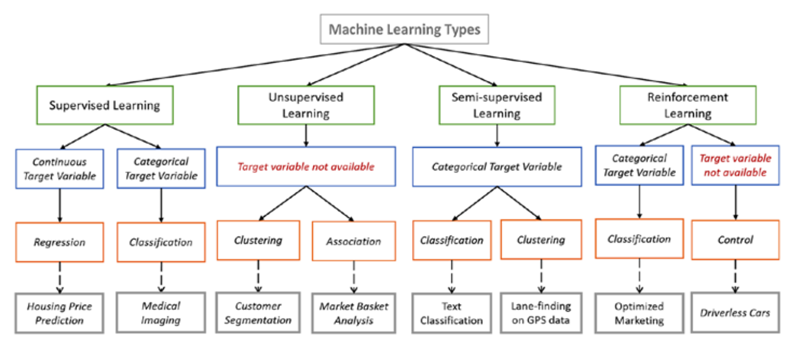

## ML Einteilung der ML-Lerntypen

### Typeinteilung

    Überwachtes Lernen
    Unüberwachtes Lernen
    Teilüberwachtes Lernen
    Bestärkendes Lernen

[501] beschreibt im Artikel "Types of Machine Learning Algorithms You Should Know" eine zusammenfassende Übersicht der verschiedenen ML-Typen. In Summe ergibt sich im Folgenden der gemeinschaftliche Überblick aus den Stimmen [501], [502] und [503] zum Thema ML im aktuellen Fokus.

#### Überwachtes Lernen (Supervised Learning)

Das überwachte Lernen (_eng. Supervised Learning_) hat strikte Vorgaben in Form von markierten Trainingsdaten (Label) mit positiven und/oder negativen Beispielen, aus denen Modelle erstellt werden. Als Anwendungsgebiete stehen etwa die Klassifizierung (Classification) und die Regression zur Verfügung. Dabei ist die Regression eine kontinuierliche Wertermittlung gemessen an Schwellwerten und die Klassifizierung eine Einteilung bzw. Abgrenzung in Kategorien. Das Supervised Learning bieten sich an, wenn eine Erwartung an die Ergebnisse vorhanden ist und sehr genaue Vorhersagen für zukünftige Modellanwendungen abzusehen sind.

#### Unüberwachtes Lernen (Unsupervised Learning)

Das unüberwachte Lernen (_eng. Unsupervised Learning_) kommt ohne Traingsdaten aus und versucht durch seine Algorithmen verborgene Segmente, Metadaten oder Strukturen zu erkennen. Als Anwendungsgebiete steht etwa das bilden von Segmenten (Clustering) und die Assoziationsanalyse (Assocation) zur Verfügung. Dabei ist die Segmentierung ein Erkennen von Ähnlichkeiten und die Assoziation eine Abbildung und Reduktion auf gemeinsame Abhängigkeiten, Parameter oder Eigenschaften.

#### Teilüberwachtes Lernen (Semi-Supervised Learning)

Das teilüberwachte (_eng. Semi-Supervised Learning_) ist eine Mischung des Supervised Learning und Unsupervised Learning. Die Traingsdaten bestehen teils aus markierten (Label) und überwiegend aus nicht markierten Daten. Folglich weist das System einen geringen Anteil an Vorgaben auf, um anschließend durch die unmarkierten Daten weiter zu lernen. Dies bietet sich an, wenn eine sehr große Menge an unmarkierten Daten vorhanden ist. Die Qualität kann deutlich verbessert werden, wenn eine Erweiterung der markierten Daten zyklisch vorgenommen wird.

#### Bestärkendes Lernen (Reinforcement Learning)

Das Bestärkende Lernen (_eng. Reinforcement Learning_) wird in Form von "Belohnungen" oder "Bestrafungen" als Verstärkung im Lernprozess ausgeübt. Dabei existieren positive und negative Faktoren, sowohl für die Belohnung als auch für die Bestrafungstaktik. Der Algorithmus lernt durch diese Reaktionen, welche Vorgehensweisen funktionieren und welche nicht zum Erfolg führen oder nicht geeignet sind. Dabei führt der Algorithmus mittels Versuch und Irrtum (Trail and Error) alle möglichen Schritte passend zu seinem gegebenen Regelwerk und seinen gelernten Verstärkungen aus. Das Reinforcement Learning besteht aus folgenden Hauptkomponenten:

- Lernender Agent
  - Zustandsbehaftet
- Interaktive Umgebung
  - Agenten aggieren mit Agenten
- Mögliche Aktionen
  - Regelwerk
- "Gedächtnis"
  - Zielführende Aktionen

Der Startpunkt für einen Agenten und dessen Aktionen ist meist das Kleinste vom Ganzen. Als Ziel steht die Ermittlung der besten Strategien zur Aufgabenerfüllung im Ganzen oder im größtmöglichem Teil des Ganzen.

### Häufige Darstellungen von Clustering vs. Klassifikation

Der Bericht vom März 2018 ["MASCHINELLES LERNEN – KOMPETENZEN, ANWENDUNGEN UND FORSCHUNGSBEDARF"][603] zeigt auf:

_"Beim Clustering werden Gruppen von ähnlichen Daten gefunden. Dabei steht noch gar nicht fest, welche Merkmale genau diese Ähnlichkeiten und Unterschiede ausmachen. In einer Menge von Emails können sich zum Beispiel zwei Cluster herausbilden, die ein Experte anschließend als »Spam« und »Wichtig« erkennt."_

_"Bei einer Klassifikation steht dagegen schon im Vorfeld fest, in welche Gruppen ein Objekt eingeordnet werden kann. Hier geht es darum, die Merkmale herauszufinden, die für die Zuordnung am signifikantesten sind. Im Fall der Emails unterscheiden sich Spam und wichtige Emails zum Beispiel in den Absendern und den verwendeten Wörtern."_

---

[501] Fumo, David: Types of Machine Learning Algorithms You Should Know

[502] Li, Hui: Maschinelles Lernen

[503] Frauenhofer Gesellschaft: Maschinelles Lernen

---

[< Einführung](04_ml.md) | [Modelle und Algorithmen >](06_ml_modelsAlgo.md)
