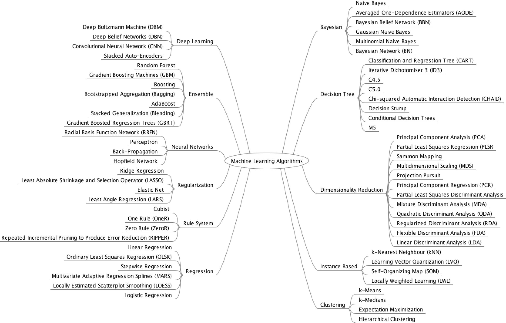

## ML Modelle und Algorithmen

### Modelle und Modelldaten

_"Ein Modell ist eine Abstraktion der Wirklichkeit."_

Beim Machine Learning erstellt der Algorithmus ein Modell, das Beispieldaten generalisiert. 
Das Modell kann anschließend auf neue unbekannte Daten angewendet werden kann.

**Klassische Modelle**

* Regeln
* Programme
* Funktionen

**Basis-ML-Modelltypen**

* Binäres Klassifizierungsmodell
* Mehrklassen-Klassifizierungsmodell
* Regressionsmodell

**Modelldaten**

* Dateiformate (CSV,XML,Text)
* REST (API/Endpoint)
* Artifakte erzeugt aus Traingsdaten

**Probleme**

* überangepasst (overfit)
* zu wenig angepasst (underfit)
* Diskriminierung

### Algorithmen

**Agorithmentypen**

* Logistische Regression
* Rekurrente Neuronale Netze (RNN)
* Faltungsnetze (CNN)
* Gradient Boosted Machines
* Stützvektormaschinen
* Ensemble-Methoden
* Bayessche Inferenzen
* Neuronale Netze
* Random Forests
* Entscheidungsbäume
* Sonstige

<!-- [][610] -->

### Lerntypen und Algorithmen

#### Supervised Learning Algorithmen
    Nearest Neighbor
    Naive Bayes
    Decision Trees
    Linear Regression
    Support Vector Machines (SVM)
    Neural Networks

#### Unsupervised Learning Algorithmen
    k-means clustering, Association Rules

#### Semi-Supervised Learning Algorithmen
    k-Nearest-Neighbor

#### Reinforcement Learning Algorithmen
    Q-Learning
    Temporal Difference (TD)
    Deep Adversarial Networks

[610]:https://www.quora.com/What-are-different-models-in-machine-learning
[612]:https://machinelearningmastery.com/a-tour-of-machine-learning-algorithms/
[613]:https://www.bigdata.fraunhofer.de/content/dam/bigdata/de/documents/Publikationen/BMBF_Fraunhofer_ML-Ergebnisbericht_Gesamt.pdf
