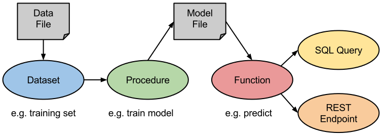
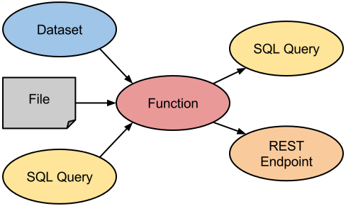
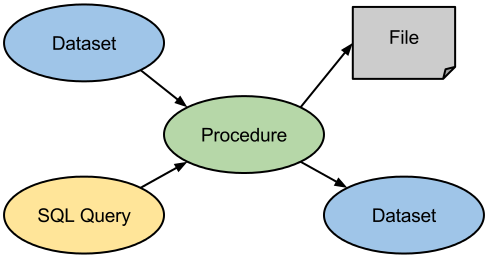
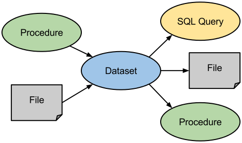
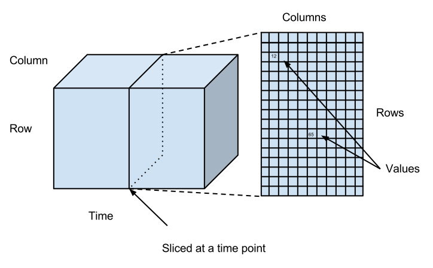

## MLDB Merkmale

In MLDB werden ML-Modelle mithilfe von Funktionen angewendet, die durch die Ausgabe von Prozeduren, die über Datensätze mit Trainingsdaten laufen, parametrisiert werden. Interessant ist, dass Funktionen auch für SQL-Abfragen und als REST-Endpunkte zur Verfügung stehen.[1201]

### Funktionen

Funktionen (_eng. "functions"_) sind benannte, wiederverwendbare Programme, die zum Implementieren von Streaming-Berechnungen verwendet werden, die Argumente akzeptieren und Funktionswerte zurückgeben können. Funktionen werden verwendet, um:

- SQL-Ausdrücke einzukapseln.

- ML-Modelle anzuwenden, die durch die Ausgabe einer Trainingsprozedur parametrisiert werden.

Alle MLDB-Funktionen sind automatisch als REST-Endpunkte (_eng. "REST Endpoints"_) verfügbar, mit denen ML-Modelle in einem Streaming-Prozess angewendet werden können. Darüber hinaus können Funktionen innerhalb von SQL-Abfragen (_eng. "SQL queries"_) aufgerufen werden, um ML-Modelle auf Daten in einem Batch-Prozess anzuwenden. MLDB stellt eine Reihe von integrierten Funktionsarten für verschiedene Anwendungsfälle zur Verfügung.[1201] Beispielsweise können Funktionen der integrierten Art `classifier` erzeugt werden, um einen trainierten Klassifikator auf neue Daten anzuwenden[1202].

### Prozeduren

Prozeduren (_eng. "procedures"_) sind benannte, wiederverwendbare Programme, die verwendet werden, um lange laufende Batch-Operationen ohne Rückgabewerte zu implementieren. Prozeduren laufen im Allgemeinen über Datensätze und können über SQL-Ausdrücke konfiguriert werden. Die Ausgaben einer Prozedur können Datensätze und Dateien enthalten. Prozeduren werden verwendet um:

- Daten zu transformieren oder zu bereinigen.

- ML-Modelle zu trainieren.

- ML-Modelle im Batch-Modus anzuwenden.

MLDB stellt eine Reihe von integrierten Prozedurtypen für verschiedene Anwendungsfälle zur Verfügung.[1201] Beispielsweise können Prozeduren der integrierten Art `classifier.train` erzeugt werden, um einen überwachten Klassifikator (_eng. "supervised classifier"_) zu trainieren[1203].

### Datensätze

Datensätze (_eng. "datasets"_) verkörpern schemalose, nur anhängende (_eng. "append-only"_) benannte Mengen von Datenpunkten, wobei jeder Datenpunkt als Tupel (Zeile, Spalte, Zeitstempel, Wert) dargestellt werden kann.[1204] Datensätze können Milliarden von Datenpunkten enthalten, die in Millionen von Zeilen mit Millionen von Spalten angeordnet sind. Datensätze können aus Dateien geladen oder in Dateien persistiert werden. Zusätzlich können Datensätze als Eingabeparameter für Prozeduren dienen und von diesen erstellt werden. Ferner ist die Abfrage von Datensätzen über SQL-Abfragen möglich.[1201] Datensätze können als dreidimensionale Matrizen betrachtet werden, wobei die Zeile, die Spalte und der Zeitstempel die Dimensionen verkörpern. Folglich wird pro Zeitstempel eine bestimmte Version der Daten persistiert. Die folgende Abbildung zeigt wie Datensätze innerhalb von MLDB strukturiert sind:[1204]

### Zuordnung von SQL zu HTTP

Die folgende Tabelle beschreibt die Zuordnung von SQL-Kommandos zu HTTP-Methoden, die im Rahmen von MLDB eine Rolle spielen:[1102]

| **SQL-Kommando** | **HTTP-Methode** |
| ---------------- | ---------------- |
| CREATE           | PUT              |
| DROP             | DELETE           |
| INSERT           | POST             |
| SELECT           | GET              |

------

[1201] MLDB Overview

[1202] Intro to Functions

[1203] Intro to Procedures

[1204] Intro to Datasets

[1201] MLDB Overview

[1204] Intro to Datasets

[1102] BIG 2016: The Machine Learning Database

------

[< MLDB Einführung](11_mldb_intro.md) | [Anwendung von MLDB >](13_mldb_example.md)
