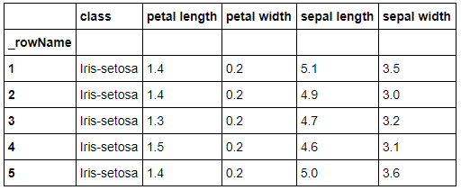
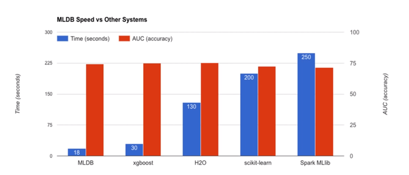
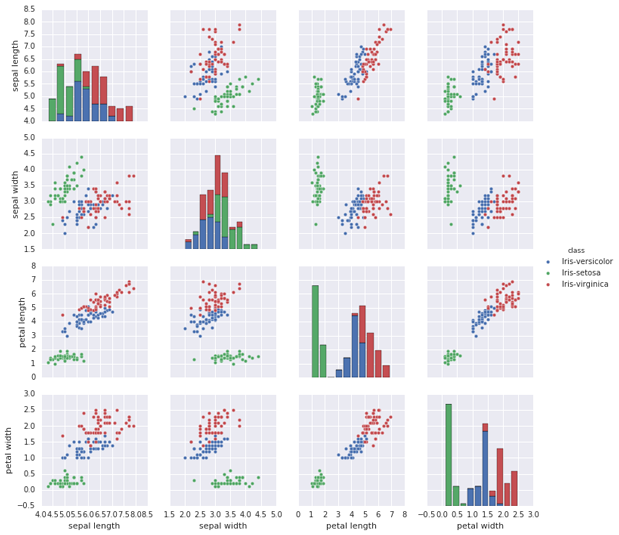
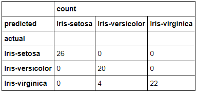
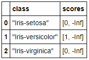

## Anwendung von MLDB

Die lokale Installation und Ausführung von MLDB ist möglich. Nichtsdestotrotz muss hierbei beachtet werden, dass das Bauen mittels der Quelldateien je nach Performance der Maschine dauern kann. Laut den Angaben der Macher von MLDB soll eine 32-Kern-Maschine mit 244 GB RAM etwa 5 Minuten für das Bauen brauchen[1301]. Da diese Hardware nicht gegeben ist, wird im Rahmen dieses Abschnittes auf die integrierte Juptyer Notebook-Schnittstelle zurückgegriffen. Das Jupyter Notebook ist eine Open-Source-Webanwendung, mit der Dokumente erstellt und freigeben werden können, die Live-Code, Gleichungen, Visualisierungen und narrativen Text enthalten[1302]. Nützliche Pakete wie Numpy, Pandas oder Matplotlib stehen von vornherein zur Verfügung. Außerdem ist die hauseigene `pymldb`-Bibliothek bereits vorinstalliert, wodurch das Arbeiten mit der REST-API vereinfacht wird.[1303]

Im folgenden soll geprüft werden, ob MLDB den im Abschnitt ["Anforderungen an ein DBMS für ML"](09_dbml_requirements.md) beschriebenen Anforderungen an eine ML-Datenbank erfüllen. Hierfür werden alle Anforderungen sukzessiv mit Beispielen geprüft. Die Möglichkeit besteht, dass bestimmte Beispiele aufeinander aufbauen. Man wird darauf hingewiesen, dass die gezeigten Beispiele in Zukunft gegebenen falls nicht mehr aktuell sind.

Wie zuvor beschrieben, erfolgen die Interaktionen mit MLDB über eine REST-API. Diese Interaktionen werden durch die `pymldb`-Bibliothek abstrahiert und stehen im  Jupyter Notebook zur Verfügung. Bevor HTTP-Anfragen gesendet werden können, muss zuvor eine Verbindung zur REST-API erzeugt werden. Dies geschieht mittels der Klasse `Connection`. Aus diesem Grund müssen sämtliche Beispiele mit diesen Anweisungen starten:

```python
from pymldb import Connection
mldb = Connection()
```

Damit die Beispiele so kurz wie möglich sind, wird auf die Anzeige der beiden Anweisungen verzichtet. Dementsprechend kann davon ausgegangen werden, dass bei allen gezeigten Beispielen eine Verbindung schon existiert.

### Import

MLDB verfügt über fünf Prozeduren, die das Importieren von Datensätzen ermöglichen. Alle zur Verfügung stehenden Prozeduren werden in der folgenden Tabelle kurz beschrieben:

| Prozedur              | Beschreibung                                                                                                                                                              |
| --------------------- | ------------------------------------------------------------------------------------------------------------------------------------------------------------------------- |
| `import.git`          | Diese Prozedur ermöglicht das Importieren von Commit-Metadaten aus einem lokalen Git-Repository[1304].                                                                    |
| `import.json`         | Diese Prozedur ermöglicht das Importieren einer Textdatei, die pro Zeile eine JSON enthält[1305].                                                                         |
| `import.sentiwordnet` | Diese Prozedur ermöglicht das Laden von Wörtern und Ausdrücken aus der lexikalischen Ressource SentiWordNet in die MLDB[1306].                                            |
| `import.text`         | Mit dieser Prozedur werden Daten aus Textdateien importiert, wobei jede Zeile in der Datei einer Zeile im Datensatz entspricht. Geeignet für Dateien im CSV-Format.[1307] |
| `import.word2vec`     | Diese Prozedur ermöglicht das Laden von Wörtern und Ausdrücken aus dem Word2Vec-Tool in die MLDB[1308].                                                                   |

Im folgenen wird nun mithilfe der Prozedur `import.text` der [Iris-Datensatz](https://archive.ics.uci.edu/ml/machine-learning-databases/iris/iris.data) aus dem [Machine Learning Repository](https://archive.ics.uci.edu/ml/index.php) der UCI importiert. Der Datensatz steht im CSV-Format zur Verfügung und enthält drei Klassen mit jeweils 50 Instanzen, wobei sich jede Klasse auf einen Irispflanzen-Typ bezieht. Mithilfe von Parametern, die [hier](https://docs.mldb.ai/doc/#builtin/procedures/importtextprocedure.md.html) näher beschrieben werden, kann das Importieren spezifiziert werden. Erwähnenswert ist, dass intern eine `PUT`-Anfrage an den REST-Endpunkt `/v1/procedures/{procedureName}` gesendet wird (siehe Zeile 1). Folglich dient die Anfrage ursprünglich nur der Erzeugung der Prozedur. Damit der Datensatz im Anschluss importiert und über eine SQL-Abfrage ausgespielt werden kann, muss der Parameter `runOnCreation` auf `True` gesetzt werden (siehe Zeile 7). Dank des Parameters wird die Prozedur direkt nach der Erzeugung ausgeführt. Nachdem der Datensatz erfolgreich importiert wurde, ist die Anzeige der Daten über eine SQL-Abfrage möglich (siehe Zeile 10).

```python
mldb.put("/v1/procedures/import_iris", {
    "type":"import.text",
    "params": {
        "dataFileUrl":"https://archive.ics.uci.edu/ml/machine-learning-databases/iris/iris.data",
        "headers": [ "sepal length", "sepal width", "petal length", "petal width", "class" ],
        "outputDataset": "iris",
        "runOnCreation": True
    }
})
mldb.query("SELECT * FROM iris LIMIT 5")
```



#### Datenaufruf via Schnittstellen

MLDB implementiert eine Abfragesprache basierend auf der SQL-Auswahlsyntax. Dies wird sowohl zur effizienten Auswertung von Ausdrücken als auch zur Angabe von Abfragen verwendet.[1309] Wie schon im vorigen Beispiel beschrieben, kann die Funktion `query()`, die in der `pymldb`-Bibliothek implementiert ist, verwendet werden, um Abfragen auszuführen und Datensätze abzurufen. Zu beachten ist, dass dieselbe Abfrage auch nativ über HTTP ausgeführt werden kann. Aus diesem Grund sind Interaktionen mit MLDB mithilfe anderer Programmiersprachen denkbar. Das folgende Beispiel zeigt den Vergleich zwischen den Arten SQL-Abfragen zu definieren:

```
// In Python mittels pymldb-Bibliothek und query()-Funktion
mldb.query("SELECT * FROM iris LIMIT 5")

// In Python mittels pymldb-Bibliothek und HTTP get()-Funktion
mldb.get("/v1/query", q="SELECT * FROM iris LIMIT 5", format="table")

// Native HTTP-Anfrage
GET http://localhost/v1/query?q=SELECT+%2A+FROM+iris+LIMIT+5&format=table
```

#### Dataset

MLDB arbeitet mit Daten über Datensätze, die auf drei verschiedene Arten erstellt und aufgefüllt werden können[1310]:

1. Erstellung eines veränderbaren Datensatzes und zeilenweises Einfügen von Daten über REST.
2. Erstellung eines Datensatzes mittels einer vorhandenen Datei.
3. Erstellung eines Datensatzes mittels einer Prozedur.

Da die letzten beiden Möglichkeiten schon im Abschnitt ["Import"](#import) beschrieben sind, konzentriert sich das folgende Beispiel auf die selbstständige Erstellung eines Datensatzes. Hierfür wird zu Beginn ein leerer veränderbarer Datensatz mit dem Namen `example` erzeugt (siehe Zeile 1). Die Eigenschaft, dass der Datensatz veränderbar ist, bestimmt der mitgegebene Typ `sparse.mutable`. MLDB stellt einige Typen von Datensätzen zur Verfügung, die [hier](https://docs.mldb.ai/doc/#builtin/datasets/Datasets.md.html) nachlesbar sind. Als nächstes wird eine neue Zeile in den Datensatz hinzugefügt, der aus zwei neuen Spalten besteht. Wie schon im Abschnitt ["MLDB Merkmale"](13_mldb_features.md) beschrieben, weisen Datensätze in MLDB kein Schema auf. Aus diesem Grund können dynamisch neue Reihen und Spalten hinzugefügt werden (siehe Zeile 9-20). Bevor der Datensatz ausgespielt werden kann (siehe Zeile 22), müssen alle vorigen Änderungen bestätigt werden (siehe Zeile 21).

```python
mldb.put("/v1/datasets/example", { "type":"sparse.mutable" })
mldb.post("/v1/datasets/example/rows", {
    "rowName": "first row",
    "columns": [
        ["first column", 1, 0],
        ["second column", 2, 0]
    ]
})
mldb.post("/v1/datasets/example/rows", {
    "rowName": "first row",
    "columns": [
        ["third column", 3, 0]
    ]
})
mldb.post("/v1/datasets/example/rows", {
    "rowName": "second row",
    "columns": [
        ["forth column", 4, 0]
    ]
})
mldb.post("/v1/datasets/example/commit")
mldb.query("SELECT * FROM example")
```


#### Klassische Bearbeitung

Alle in der MLDB-Datenbank verfügbaren Datensätze können über SQL-Klauseln abgerufen und bearbeitet werden. Folgende SQL-Klauseln sind in MLDB implementiert:[1309]

* **SELECT**: Gibt die Spalten im Ausgabedatensatz an.
* **NAMED**: Gibt den Namen der Zeilen im Ausgabedatensatz an.
* **FROM**: Gibt die Datensätze an, aus denen ausgewählt werden soll.
* **WHEN**: Gibt an, welche Werte basierend auf ihrem Zeitstempel in das Ausgabedatensatz eingefügt werden sollen.
* **WHERE**: Gibt an, welche Zeilen in der Eingabe zum Ausgabedatensatz beitragen.
* **GROUP BY**: Gibt an, wie die Ausgabe für Aggregatfunktionen gruppiert wird.
* **HAVING**: Gibt die auszuwählenden Gruppen an.
* **ORDER BY**: Gibt die Reihenfolge für die Ausgabe der Ergebnisse an.
* **LIMIT**: Gibt die Anzahl der Ausgabezeilen an.
* **OFFSET**: Gibt an, wie viele Ausgabezeilen übersprungen werden sollen.

### ML-Algorithmus anwenden

In MLDB werden ML-Algorithmen in Form von Prozeduren angewendet. So kann bespielsweise im Rahmen der Prozedurart `classifier.train` definiert werden, welcher Algorithmus für das Training eines Klassifikators (_eng. classifier_) verwendet werden soll. Welche Arten von Algorithmen MLDB insgesamt anbietet kann [hier](https://docs.mldb.ai/doc/#builtin/ClassifierConf.md.html) nachgelesen werden. Im Abschnitt ["Modell"](#modell) wird aufgezeigt, wie ein Klassifizierugsmodell mithilfe eines Entscheidungsbaums trainiert werden kann.

#### Performance

Das GitHub-Projekt [benchm-ml](https://github.com/szilard/benchm-ml) vom Nutzer [szilard](https://github.com/szilard) versucht einen minimalen Benchmark für Skalierbarkeit, Geschwindigkeit und Genauigkeit von häufig verwendeten Implementierungen einiger maschineller Lernalgorithmen darzustellen. Unter den getesteten Tools findet man auch MLDB wiede (siehe [hier](https://github.com/szilard/benchm-ml/blob/master/z-other-tools/9a-datacratic.py)). Im Rahmen des Benchmarks wird die benötigte Zeit und resultierende Genauigkeit der Tools bei der Ausführung eines Random Forests mit einem Datensatz von einer Million Zeilen auf einem Knoten vergleichen. Die Tests wurden auf einer Amazon EC2 c3.8xlarge-Instanz (32 Kerne, 60 GB RAM) durchgeführt[1311]. MLDB konnte im Rahmen des Tests eine Genauigkeit von ca. 74 Prozent in 18 Sekunden erreichen. Wie die folgende Abbildung zeigt, schneidet MLDB verglichen zu anderen getesteten Tools besser ab.[1201]



#### Aufruf via Schnittstellen

Wie im vorigen Abschnitt beschrieben werden ML-Algorithmen in Form von Prozeduren angewendet und folglich ist der Aufruf via Schnittstellen gegeben. Eine automatische Ausführung bzw. Definition von Prozeduren nach einer anderen Aktion ist nicht implementiert. Der Anwender könnte hierfür ein Skript schreiben, das nach einer bestimmten Aktion eine definierte Prozedur erzeugt und ausführt.

#### Prozeduren

Wie im Abschnitt ["MLDB Merkmale"](#12_mldb_features.md) beschrieben, können in MLDB unterschiedliche Arten von Prozeduren definiert werden. Für ein konkretes Beispiel einer Prozeduranwendung kann entweder der Abschnitt ["Import"](#import) oder ["Modell"](#modell) dienen.

#### Auto-Verallgemeinerung

In MLDB ist eine automatische Verallgemeinerung nach dem Importieren eines Datensatzes nicht möglich.

#### Auto-Zusammenfassung

In MLDB ist eine automatische Zusammenfassung standardmäßig nicht möglich. Damit die Zusammenfassung eines Datensatzes ausgespielt werden kann, müssen auf externe Bibliotheken zugegriffen werden. Das folgende Beispiel zeigt wie eine Zusammenfassung des importierten Iris-Datensatzes mithilfe der Bibliothek `seaborn` erzeugt werden kann.

```python
%matplotlib inline
import seaborn as sns
sns.pairplot(mldb.query("select * from iris"), hue = "class", size = 2.5)
```



#### Auto-Charakterisierung

In MLDB ist eine automatische Charakterisierung nach dem Importieren eines Datensatzes nicht möglich. Nichtsdestotrotz kann eine Prozedur des Typs `kmeans.train` verwendet werden, um ein k-Means-Cluster zu trainieren. Der Anwender wäre in der Lage ein Python-Skript zu definieren, das nach einem Import das Clustering automatisch ausführt. Die Prozedur speichert das Ergebnismodell in einem Ausgabedatensatz und speichert die Clusterbezeichnungen für den Eingabedatensatz in einem separaten Ausgabedatensatz.[1312] Das folgende Beispiel zeigt wie ein unüberwachtes (_eng. unsupervised_) k-Means-Modell mithilfe des importierten Iris-Datensatzes trainiert und verwendet werden kann, um jede Zeile in der Eingabe einem Cluster im Ausgabedatensatz zuzuweisen. Wichtig ist, dass der Iris-Datensatz ohne den Klassen geladen wird, da die Klassen theoretisch mit dem Clustering ermittelt werden sollen (siehe Zeile 4).

```python
mldb.put("/v1/procedures/iris_train_kmeans", {
    "type" : "kmeans.train",
    "params" : {
        "trainingData" : "select * EXCLUDING(class) from iris",
        "outputDataset" : "iris_clusters",
        "numClusters" : 3,
        "metric": "euclidean",
        "runOnCreation": True
    }
})
```

### Modell

Wie im Abschnitt ["MLDB Merkmale"](13_mldb_features.md) beschrieben, werden ML-Modelle mittels Prozeduren erzeugt bzw. trainiert. Im folgenden Beispiel soll mithilfe einer Prozedur der Art `classifier.train` demonstriert werden, wie ein Klassifizierungsmodel erzeugt werden kann. Als Algorithmus wird ein Entscheidungsbaum (_eng. "decision tree"_) verwendet (siehe Zeile 11) und ein Teil des im Abschnitt ["Import"](#import) importierten Iris-Datensatzes wird genutzt, um diesen zu trainieren. Die Aufgabe des Entscheidungsbaumes besteht darin, neue Iris-Messungen einer der drei Iris-Klassen zuzuweisen. Die Ausgabe dieser Prozedur ist eine Funktion, der den Entscheidungsbaum darstellt, die über REST oder SQL aufgerufen werden kann. In diesem Beispiel wird davon ausgegangen, dass der Iris-Datensatz schon importiert wurde und unter der ID `iris` aufrufbar ist. Mittels einer PUT-Anfrage an den Endpunkt `/v1/procedures/` wird eine neue Prozedur der Art `classifier.train` und dem Namen `iris_train_classifier` erzeugt (siehe Zeile 1). Die notwendigen Trainingsdaten werden als Parameter in Form einer SQL-Abfrage der Prozedur zur verfügung gestellt. Die SQL-Abfrage muss die folgenden zwei Spalten enthalten:[1313]

1. `features`: Ein Zeilenausdruck zum Identifizieren der Merkmale, mit denen trainiert werden soll.
2. `label`: Ein Ausdruck zum Identifizieren der Beschriftungen der Zeile. Der Wert muss mit dem des Klassifizierermodus übereinstimmen (in diesem Fall `class`, siehe Zeile 5).

Insgesamt wird die Hälfte des Iris-Datensatzes als Trainingsdaten verwendet (siehe Zeile 9). Die resultierende Funktion wird nach der erfolgreichen Erzeugung des Modells unter dem Namen `iris_classify` zur Verfügung stehen (siehe Zeile 14).

```python
mldb.put("/v1/procedures/iris_train_classifier", {
    "type" : "classifier.train",
    "params" : {
        "trainingData" : """
            select {* EXCLUDING(class)} as features, class as label from iris where rowHash() % 2 = 0
        """,
        "algorithm": "dt",
        "modelFileUrl": "file://models/iris.cls",
        "mode": "categorical",
        "functionName": "iris_classify",
        "runOnCreation": True
    }
})
```

Nachdem das Modell erfolgreich erstellt wurde, kann mittels der Prozedurart `classifier.test` getestet werden, wie präzise das Model klassifiziert. Hierfür wird die Funktion bzw. das Modell (siehe Zeile 7-9) auf die andere Hälfte (siehe Zeile 12) der Daten des Iris-Datensatzes angewendet. Die Prozedur erzeugt eine Konfusionsmatrix, die nähere Informationen über die Performance des Modells wiedergibt. Jede Zeile der Konfusionsmatrix repräsentiert die Instanzen in einer vorhergesagten Klasse, während jede Spalte die Instanzen in einer tatsächlichen Klasse darstellt (oder umgekehrt). Da die Konfusionsmatrix im JSON-Format vorliegt, wird die Darstellung in eine visuelle Tabelle umgewandelt (siehe Zeile 17). Laut der Konfusionsmatrix wurden nur vier Iris-Daten der Klasse `Iris-virginica` vom Modell fehlerhaft als `Iris-versicolor` klassifiziert. Das entspricht eine Genauigkeit von ca. 95% bei insgesamt 75 getesteten Daten.

```python
response = mldb.put("/v1/procedures/iris_test_classifier", {
    "type" : "classifier.test",
    "params" : {
        "testingData" : """
            select iris_classify({ features: {* EXCLUDING(class)} }) as score, class as label
                from iris where rowHash() % 2 != 0
        """,
        "mode": "categorical",
        "runOnCreation": True
    }
})
import pandas as pd
pd.DataFrame(response.json()["status"]["firstRun"]["status"])
  .pivot_table(index="actual", columns="predicted", fill_value=0)
```



### Funktionen

Wie schon zuvor im Abschnitt ["MLDB Merkmale"](12_mldb_features.md) beschrieben, bietet MLDB die Möglichkeit an ML-Funktionen zu definieren und über SQL-Abfragen bzw. über die REST-API auf Datensätze anzuwenden. Wie dies konkret funktioniert, wird im folgenden Beispiel anhand der soeben erstellten `iris_classify`-Funktion näher erläutert.

#### Funktionsaufruf via Schnittstellen

Die `iris_classify`-Funktion wird über einen REST-API-Endpunkt aufgerufen, um eine noch nie zuvor gesehene Menge von Iris-Messungen zu klassifizieren. Nach dem Aufruf der Funktion kann in der unteren Tabelle nachgelesen werden, dass es sich bei den Messungen laut der Klassifizierungsfunktion um eine `Iris-versicolor` handelt.

```python
response = mldb.get("/v1/functions/iris_classify/application", input={
    "features":{
        "petal length": 4.1,
        "petal width": 3.2,
        "sepal length": 2.3,
        "sepal width": 1.4
    }
})
import pandas as pd
pd.DataFrame(response.json()["output"]["scores"], [0, 1, 2], ["class", "scores"])
```



#### Batchbetrieb

Wie schon im Abschnitt ["MLDB Merkmale"](12_mldb_features.md) beschrieben, werden Prozeduren verwendet, um ML-Modelle im Batch-Modus anzuwenden. Aus diesem Grund ist ein Batchbetrieb implizit möglich.

### Export

MLDB ermöglicht den Export eines Ergebnisses einer SQL-Abfrage. Als resultierendes Exportformat wird nur CSV angeboten. Der Export wird mittels der Prozedurart `export.csv` zur Verfügung gestellt[1314]. Das folgende Beispiel beschreibt, wie der Export der im Abschnitt "[Import](#import)" importierten Iris-Daten durchgeführt werden kann. Hierfür werden alle Daten, die die Klasse "Iris-setosa" aufweisen durch eine SQL-Abfrage ausgewählt (siehe Zeile 5) und als CSV-Datei exportiert (siehe Zeile 7).

```python {class="line-numbers"}
mldb.put("/v1/procedures/export_iris_classifier_result", {
    "type" : "export.csv",
    "params" : {
        "exportData" : """
            select * from iris where class = 'Iris-setosa'
        """,
        "dataFileUrl": "file://./iris.csv",
        "runOnCreation": True
    }
})
```

Abschließend kann die exportierte CSV-Datei auf Dateiebene näher inspiziert werden:

```csv
sepal length,sepal width,petal length,petal width,class
4.9,3.1,1.5,0.1,Iris-setosa
5.1,3.7,1.5,0.4,Iris-setosa
5.7,4.4,1.5,0.4,Iris-setosa
4.5,2.3,1.3,0.3,Iris-setosa
...
```

---

[1201] MLDB Overview

[1301] Building and running the MLDB Community Edition Docker image

[1302] The Jupyter Notebook

[1303] Notebooks and pymldb

[1304] Git importer procedure

[1305] JSON Import Procedure

[1306] SentiWordNet Importer Procedure

[1307] Importing Text

[1308] Word2Vec importer procedure

[1309] SQL implementation in MLDB

[1310] Loading Data Tutorial

[1311] Simple/limited/incomplete benchmark for scalability, speed and accuracy of machine learning libraries for classification

[1312] K-Means Training Procedure

[1313] Classifier Training Procedure

[1314] CSV Export Procedure

---

[< MLDB Merkmale](12_mldb_features.md) | [Fazit >](14_conclusion.md)
