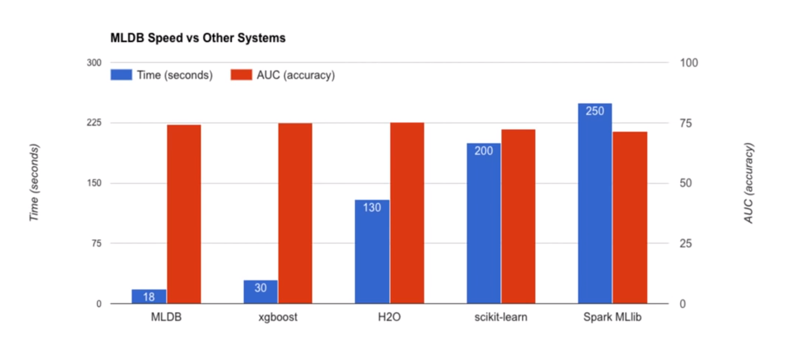

## Praktisches Beispiel

Die lokale Installation und Ausführung von MLDB ist möglich. Nichtsdestotrotz muss hierbei beachtet werden, dass das Bauen mittels der Quelldateien je nach Performance der Maschine dauern kann. Laut eigener Angaben soll eine 32-Kern-Maschine mit 244 GB RAM etwa 5 Minuten für das Bauen brauchen<sup>[11](#11)</sup>. Da diese Hardware nicht gegeben ist, wird im Rahmen dieses Abschnittes auf die integrierte Juptyer Notebook-Schnittstelle zurückgegriffen. Das Jupyter Notebook ist eine Open-Source-Webanwendung, mit der Dokumente erstellt und freigeben werden können, die Live-Code, Gleichungen, Visualisierungen und narrativen Text enthalten<sup>[11](#11)</sup>. Nützliche Pakete wie Numpy, Pandas oder Matplotlib stehen von vornherein zur Verfügung. Außerdem ist die hauseigene `pymldb`-Bibliothek bereits vorinstalliert, wodurch das Arbeiten mit der REST-API vereinfacht wird.<sup>[11](#11)</sup>

Im folgenden soll geprüft werden, ob MLDB den im Abschnitt [_Anforderungen an ein DBMS für ML_](09_dbml_requirements.md) beschriebenen Anforderungen an eine ML-Datenbank genügen. Hierfür werden alle Anforderungen sukzessiv mit Beispielen geprüft. Die Möglichkeit besteht, dass bestimmte Beispiele aufeinander aufbauen. Man wird darauf hingewiesen, dass die gezeigten Beispiele in Zukunft gegebenen falls nicht mehr aktuell sind.

Wie zuvor beschrieben, erfolgen die Interaktionen mit MLDB über eine REST-API. Diese Interaktionen werden durch die `pymldb`-Bibliothek abstrahiert und stehen im  Jupyter Notebook zur Verfügung. Bevor HTTP-Anfragen gesendet werden können, muss zuvor eine Verbindung zur REST-API erzeugt werden. Dies geschieht mittels der Klasse Connection. Aus diesem Grund müssen sämtliche Beispiele mit diesen Anweisungen starten:

```python
from pymldb import Connection
mldb = Connection()
```

Damit die Beispiele so kurz wie möglich sind, wird auf die Anzeige der beiden Anweisungen verzichtet. Dementsprechend kann davon ausgegangen werden, dass bei allen gezeigten Beispielen eine Verbindung schon existiert.

### Import

MLDB verfügt über fünf Prozeduren, die das Importieren von Datensätzen ermöglichen. Alle zur Verfügung stehenden Prozeduren werden in der folgenden Tabelle kurz beschrieben:

| Prozedur              | Beschreibung                                                                                                                                                                            |
| --------------------- | --------------------------------------------------------------------------------------------------------------------------------------------------------------------------------------- |
| `import.git`          | Diese Prozedur ermöglicht das Importieren von Commit-Metadaten aus einem lokalen Git-Repository<sup>[11](#11)</sup> .                                                                   |
| `import.json`         | Diese Prozedur ermöglicht das Importieren einer Textdatei, die pro Zeile eine JSON enthält<sup>[11](#11)</sup> .                                                                        |
| `import.sentiwordnet` | Diese Prozedur ermöglicht das Laden von Wörtern und Ausdrücken aus der lexikalischen Ressource SentiWordNet in die MLDB<sup>[11](#11)</sup>.                                            |
| `import.text`         | Mit dieser Prozedur werden Daten aus Textdateien importiert, wobei jede Zeile in der Datei einer Zeile im Datensatz entspricht. Geeignet für Dateien im CSV-Format.<sup>[11](#11)</sup> |
| `import.word2vec`     | Diese Prozedur ermöglicht das Laden von Wörtern und Ausdrücken aus dem Word2Vec-Tool in die MLDB<sup>[11](#11)</sup>.                                                                   |

Im folgenen wird nun mithilfe der Prozedur `import.text` der [Iris-Datensatz](https://archive.ics.uci.edu/ml/machine-learning-databases/iris/iris.data) aus dem [Machine Learning Repository](https://archive.ics.uci.edu/ml/index.php) der UCI importiert. Der Datensatz steht im CSV-Format zur Verfügung und enthält drei Klassen mit jeweils 50 Instanzen, wobei sich jede Klasse auf einen Irispflanzen-Typ bezieht. Mithilfe von Parametern, die [hier](https://docs.mldb.ai/doc/#builtin/procedures/importtextprocedure.md.html) näher beschrieben werden, kann das Importieren spezifiziert werden. Erwähnenswert ist, dass intern eine `PUT`-Anfrage an den REST-Endpunkt `/v1/procedures/{procedureName}` gesendet wird. Folglich dient die Anfrage ursprünglich nur der Erzeugung der Prozedur. Damit der Datensatz im Anschluss importiert und über eine SQL-Abfrage ausgespielt werden kann, muss der Parameter `runOnCreation` auf `True` gesetzt werden. Dank des Parameters wird die Prozedur direkt nach der Erzeugung ausgeführt. Nach dem der Datensatz erfolgreich importiert wurde, ist die Anzeige der Daten über eine SQL-Abfrage möglich (siehe Zeile 10).

```python
mldb.put('/v1/procedures/import_iris', {
    "type":"import.text",
    "params": {
        "dataFileUrl":"https://archive.ics.uci.edu/ml/machine-learning-databases/iris/iris.data",
        "headers": [ "sepal length", "sepal width", "petal length", "petal width", "class" ],
        "outputDataset": "iris",
        "runOnCreation": True
    }
})
mldb.query("SELECT * FROM iris LIMIT 5")
```


#### Datenaufruf via Schnittstellen (REST, QL)

MLDB implementiert eine Abfragesprache basierend auf der SQL-Auswahlsyntax. Dies wird sowohl zur effizienten Auswertung von Ausdrücken als auch zur Angabe von Abfragen verwendet.<sup>[11](#11)</sup> Wie schon im vorigen Beispiel beschrieben, kann die Funktion `query()`, die in der `pymldb`-Bibliothek implementiert ist, verwendet werden, um Abfragen auszuführen und Datensätze abzurufen. Zu beachten ist, dass dieselbe Abfrage auch nativ über HTTP ausgeführt werden kann. Aus diesem Grund sind Interaktionen mit MLDB mithilfe anderer Programmiersprachen denkbar. Das folgende Beispiel zeigt den Vergleich zwischen den Arten SQL-Abfragen zu definieren:

```python
// In Python mittels pymldb-Bibliothek und query()-Funktion
mldb.query("SELECT * FROM iris LIMIT 5")

// In Python mittels pymldb-Bibliothek und HTTP get()-Funktion
mldb.get('/v1/query', q="SELECT * FROM iris LIMIT 5", format="table")

// Native HTTP-Anfrage
GET http://localhost/v1/query?q=SELECT+%2A+FROM+iris+LIMIT+5&format=table
```

TODO auch sql clauses

#### Dataset (CSV, Erstellung, Vorlagen)

MLDB arbeitet mit Daten über Datensätze, die auf drei verschiedene Arten erstellt und aufgefüllt werden können<sup>[11](#11)</sup>:

1. Erstellung eines veränderbaren Datensatzes und zeilenweises Einfügen von Daten über REST.
2. Erstellung eines Datensatzes mittels einer vorhandenen Datei.
3. Erstellung eines Datensatzes mittels einer Prozedur.

Da die letzten beiden Möglichkeiten schon im Abschnitt ["Import"](#import) beschrieben sind, konzentriert sich das folgende Beispiel auf die selbstständige Erstellung eines Datensatzes. Hierfür wird zu Beginn ein leerer veränderbarer Datensatz mit dem Namen `example` erzeugt (siehe Zeile 1). Die Eigenschaft, dass der Datensatz veränderbar ist, bestimmt der mitgegebene Typ `sparse.mutable`. MLDB stellt einige Typen von Datensätzen zur Verfügung, die [hier](https://docs.mldb.ai/doc/#builtin/datasets/Datasets.md.html) nachlesbar sind. Als nächstes wird eine neue Zeile in den Datensatz hinzugefügt, der aus zwei neuen Spalten besteht. Wie schon im Abschnitt ["MLDB Merkmale"](13_mldb_features.md) beschrieben, weisen Datensätze in MLDB kein Schema auf. Aus diesem Grund können dynamisch neue Reihen und Spalten hinzugefügt werden (siehe Zeile 9-20). Bevor der Datensatz ausgespielt werden kann (siehe Zeile 22), müssen alle vorigen Änderungen bestätigt werden (siehe Zeile 21).

```python
mldb.put('/v1/datasets/example', { "type":"sparse.mutable" })
mldb.post('/v1/datasets/example/rows', {
    "rowName": "first row",
    "columns": [
        ["first column", 1, 0],
        ["second column", 2, 0]
    ]
})
mldb.post('/v1/datasets/example/rows', {
    "rowName": "first row",
    "columns": [
        ["third column", 3, 0]
    ]
})
mldb.post('/v1/datasets/example/rows', {
    "rowName": "second row",
    "columns": [
        ["forth column", 4, 0]
    ]
})
mldb.post("/v1/datasets/example/commit")
mldb.query("SELECT * FROM example")
```


#### Klassische Bearbeitung (Filter, Rules)

### ML Algorithmus anwenden

#### Performance

Das GitHub-Projekt [benchm-ml](https://github.com/szilard/benchm-ml) vom Nutzer [szilard](https://github.com/szilard) versucht einen minimalen Benchmark für Skalierbarkeit, Geschwindigkeit und Genauigkeit von häufig verwendeten Implementierungen einiger maschineller Lernalgorithmen darzustellen. Unter den getesteten Tools findet man auch MLDB wiede (siehe [hier](https://github.com/szilard/benchm-ml/blob/master/z-other-tools/9a-datacratic.py)). Im Rahmen des Benchmarks wird die benötigte Zeit und resultierende Genauigkeit der Tools bei der Ausführung eines Random Forests mit einem Datensatz von einer Million Zeilen auf einem Knoten vergleichen. Die Tests wurden auf einer Amazon EC2 c3.8xlarge-Instanz (32 Kerne, 60 GB RAM) durchgeführt<sup>[11](#11)</sup>. MLDB konnte im Rahmen des Tests eine Genauigkeit von ca. 74% in 18 Sekunden erreichen. Wie die folgende Abbildung zeigt, schneidet MLDB vergleichen zu anderen getesteten Tools besser ab.<sup>[11](#11)</sup>



#### Aufruf via Schnittstellen (REST, QL)

#### Prozeduren

#### Auto-Verallgemeinerung

#### Auto-Zusammenfassung

#### Auto-Charakterisierung

### Modell (Ändern, Sichern)

### Funktionen

#### Funktionsaufruf via Schnittstellen (REST, QL)

#### Batchbetrieb

### Export (REST, QL)


## Fazit

---

<a name="11"><sup>11</sup></a> _Building and running the MLDB Community Edition Docker image_ (2019). URL: [https://github.com/mldbai/mldb/blob/master/Building.md](https://github.com/mldbai/mldb/blob/master/Building.md) (besucht am 11.01.2019).

<a name="11"><sup>11</sup></a> _The Jupyter Notebook_ (2019). URL: [https://jupyter.org/](https://jupyter.org/) (besucht am 11.01.2019).

<a name="11"><sup>11</sup></a> _Notebooks and pymldb_ (2019). URL: [https://docs.mldb.ai/doc/#builtin/Notebooks.md.html](https://docs.mldb.ai/doc/#builtin/Notebooks.md.html) (besucht am 11.01.2019).

<a name="11"><sup>11</sup></a> _Git importer procedure_ (2019). URL: [https://docs.mldb.ai/doc/#builtin/procedures/GitImporter.md.html](https://docs.mldb.ai/doc/#builtin/procedures/GitImporter.md.html) (besucht am 12.01.2019).

<a name="11"><sup>11</sup></a> _JSON Import Procedure_ (2019). URL: [https://docs.mldb.ai/doc/#builtin/procedures/JSONImporter.md.html](https://docs.mldb.ai/doc/#builtin/procedures/JSONImporter.md.html) (besucht am 12.01.2019).

<a name="11"><sup>11</sup></a> _SentiWordNet Importer Procedure_ (2019). URL: [https://docs.mldb.ai/doc/#builtin/procedures/SentiWordNetImporter.md.html](https://docs.mldb.ai/doc/#builtin/procedures/SentiWordNetImporter.md.html) (besucht am 12.01.2019).

<a name="11"><sup>11</sup></a> _Importing Text_ (2019). URL: [https://docs.mldb.ai/doc/#builtin/procedures/importtextprocedure.md.html](https://docs.mldb.ai/doc/#builtin/procedures/importtextprocedure.md.html) (besucht am 12.01.2019).

<a name="11"><sup>11</sup></a> _Word2Vec importer procedure_ (2019). URL: [https://docs.mldb.ai/doc/#builtin/procedures/Word2VecImporter.md.html](https://docs.mldb.ai/doc/#builtin/procedures/Word2VecImporter.md.html) (besucht am 12.01.2019).

<a name="11"><sup>11</sup></a> _SQL implementation in MLDB_ (2019). URL: [https://docs.mldb.ai/doc/#builtin/sql/Sql.md.html](https://docs.mldb.ai/doc/#builtin/sql/Sql.md.html) (besucht am 12.01.2019).

<a name="11"><sup>11</sup></a> _Loading Data Tutorial_ (2019). URL: [https://docs.mldb.ai/ipy/notebooks/_tutorials/_latest/Loading%20Data%20Tutorial.html](https://docs.mldb.ai/ipy/notebooks/_tutorials/_latest/Loading%20Data%20Tutorial.html) (besucht am 12.01.2019).

<a name="11"><sup>11</sup></a> _SQL implementation in MLDB_ (2019). URL: [https://docs.mldb.ai/doc/#builtin/sql/Sql.md.html](https://docs.mldb.ai/doc/#builtin/sql/Sql.md.html) (besucht am 12.01.2019).

<a name="11"><sup>11</sup></a> _Mutable Sparse Matrix Dataset_ (2019). URL: [https://docs.mldb.ai/doc/#builtin/datasets/MutableSparseMatrixDataset.md.html](https://docs.mldb.ai/doc/#builtin/datasets/MutableSparseMatrixDataset.md.html) (besucht am 12.01.2019).

...

<a name="11"><sup>11</sup></a> _Simple/limited/incomplete benchmark for scalability, speed and accuracy of machine learning libraries for classification_ (2019). URL: [https://github.com/szilard/benchm-ml](https://github.com/szilard/benchm-ml) (besucht am 12.01.2019).

<a name="11"><sup>11</sup></a> _BIG 2016: The Machine Learning Database_ (2019). URL: [https://www.youtube.com/watch?v=D2qWqBgsqIU&t=1230](https://www.youtube.com/watch?v=D2qWqBgsqIU&t=1230) (besucht am 12.01.2019).

---

[< MLDB Merkmale](13_mldb_features.md) | [Conclusion >](15_conclusion.md)
