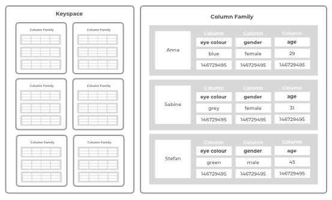
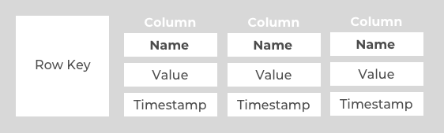

***

[<< zurück](02_toc.md)

***

# 4. Funktionsweise

In diesem Kapitel wird die Funktionsweise von spaltenorientierten Datenbanken erklärt. Dabei wird auf das Datenmodell, die technische Aspekte, die Methoden der Kompression und der Performance eingegangen.


# 4.1 Datenmodell

Das Datenmodell basiert auf dem Schema des Keyspace. Ein Keyspace beinhaltet alle Column Families, wie in der Abbildung 1. zu sehen ist. Die Menge an Keyspaces bildet das spaltenorientierte Datenbanksystem. Ein Keyspace lässt sich mit einer Tabelle in einer relationalen Datenbank vergleichen.

Eine Column Family besteht wiederum aus mehreren Zeilen. Je nach System wird dieses Konstrukt aus mehreren Zeilen anders benannt. Bei Googles Bigtable werden diese als Tablets bezeichnet. 


   
Abbildung 1: Keyspace und Column Family  </br>


Eine Zeile in einer Column Familie hat eine große Menge Spalten haben. Die Anzahl der Spalten kann bei sehr großen Systemen bis zu einer Million oder darüber gehen. [BVA18] Diese Spalten müssen nicht alle gleich zu anderen Zeilen sein oder die gleiche Anzahl haben. Jede Spalte enthält einen Namen, einen Wert (Value) und einem Zeitstempel. Eine Zeile wird mit einem Key identifiziert und anhand des Keys mithilfe eines Sortierers sortiert. Die Zeilen werden in einer lexikalischen Reihenfolge der Zeilenschlüssel sortiert. Dies ermöglicht eine effizientere Suche nach einer bestimmten Information. Die Abbildung 2. visualisiert den Aufbau einer Zeile in einem Keyspace. [DB18] [CDG06]

  
Abbildung 2: Aufbau einer Zeile   </br>


Da Bigtable speziell für Google optimiert worden ist, kann man von Colum Families als Webtablets sprechen, die eine große Menge von Webseiten zusammenfassen. In diesen Webtables würde dann der Row Key (Zeilenschlüssel) die URL sein und die unterschiedlichen Eigenschaften und Aspekte werden in Spalten aufgeteilt. Der Inhalt der Webseiten sind dann die Values, auch Contents genannt. Der Zeitstempel zeigt den Zeitpunkt des Aufrufs an. Anders als zu anderen Datenbankensystem wie Cassandra kann jede Spalte mehrere Versionen einer Information enthalten, die durch den Zeitstempel identifiziert werden kann. [CDG06]


***

[<< Grundlagen und Begriffe](05_basics.md) | [Technischen Aspekte >>](06-2_technical_aspects.md)

***

```
Quellenangabe:

- [BVA18] http://baun-vorlesungen.appspot.com/SEM12/Dokumente/CLCP_SEM_SS2012_WideColumnStores_Ausarbeitung.pdf, S.4, abgerufen. 25.12.2018
- [DB18] https://database.guide/what-is-a-column-store-database/, abgerufen 25.12.2018
- [CDG06] F. Chang et al., Bigtable: A Distributed Storage System for Structured Data, 2006, S. 2

```
***