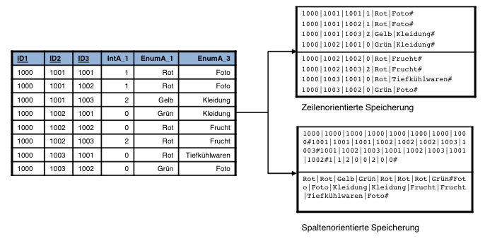

***

[<< zurück](02_toc.md)

***

# 4.3 Spaltenorientierte Speicherung

Die meisten relationalen Datenbanken speichern die Daten zeilenorientiert. Dieser klassischer Ansatz der Speicherung ist für die Abfrage einzelner bestimmten Suchanfragen und Datensätze optimal. Dies ist sehr vorteilhaft für eine schnelle Durchführung von Verarbeitungsvorgängen und wird sehr gern in der Online Transaktionsverarbeitungs, im englischen Online-Transaction Processing (OLTP), genutzt. Um große Datenmengen analysieren zu können setzt man auf jedoch auf OLAP (Online Analytics Processing). Diese Art von Analyse besteht aus komplexen Abfragen und ermöglicht statistische Berechnungen. Dafür eignet sich die spaltenorientierte Struktur ideal. Dies ist ein weiterer Grund für den Einsatz von spaltenorientierten Datenbanken, wenn man mit vielen Datensätze arbeiten möchte. [TE18]

Die Abbildung 3. soll die beiden unterschiedlichen Methoden der Speicherung verdeutlichen. Bei der zielorientierten Speicherung muss man jede Zeile ganz durchgehen, um zum nächsten Datensatz (Zeile) zu gelangen. Bei der spaltenorientierten Datenbank werden die Daten spaltenweise zusammengefasst. Dadurch befinden sich sehr ähnliche Werte nah beieinander. Dementsprechend lassen Abfragen schneller und mit weniger Attributen ausführen. Diese physikalische Nähe der Werte bietet auch eine gute Grundlage für unterschiedliche Kompressionstechniken. 


   
Abbildung 3: Zeilen und spaltenorientierte Speicherung [He12]


***

[<< Technische Aspekte](06-2_technical_aspects.md) | [Kompressionstechniken >>](06-4_compression.md)

***

```
Quellenangabe:

- [TE18]    https://www.tecchannel.de/a/bi-methoden-teil-1-ad-hoc-analysen-mit-olap,1751285,2, abgerufen: 30.12.2018

Medienverweise:
- [He12]    Olaf Herden. Spaltenbasierte Datenbanken - Ein Konzept zur Handhabung großer Datenmenge, 2012, S. 3
```
***
