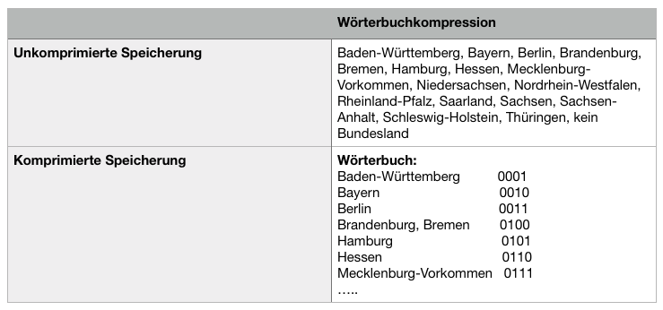
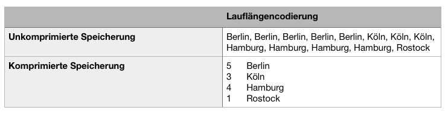
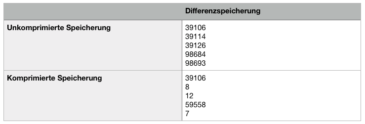

***

[<< zurück](02_toc.md)

***

# 4.4 Kompressionstechniken

Wie im Kapitel 4.3 beschrieben eignet die Struktur von spaltenorientierten Datenbanken gut für Kompression. Die Kompression wird immer wichtiger in der heutigen Informatik. Bei der Kompression muss besonders darauf geachtet werden, dass keine Daten beim Kompressionsvorgang und der Dekompression verloren gehen. Es dürfen nur verlustfreie Kompressionstechniken eingesetzt werden. Die Vorteile von Kompression ist die Reduzierung des Speicherplatzes und somit die Erhöhung des Datendurchsatzes, die Netto-Datenmenge pro Spalte, damit mehr Daten im Datenbankpuffer Platz haben. 

In diesem Kapitel werden wir ein paar dieser Kompressionstechniken vorstellen.


## 4.4.1 Wörterbuchkompression

Die Wörterbuchkompression ist auch unter dem englischen Namen Dictionary Encoding bekannt. Bei diesem Verfahren werden Wörtern oder Volltext kurz binäre Codes zugewiesen. Statt der Wörter werde die Codes in die Datenbank gespeichert. Für die Übersetzung der Code zurück in die Textform wird eine Art Wörterbuchdatei erstellt. Dieses Verfahren eignet sich sehr gut bei langen und mehrfach vorkommenden Werten bzw. Wörtern. Die Abbildung 4. zeigt ein Beispiel einer Wörterbuchkompression bei der Speicherung von deutschen, meist sehr langen Bundesländernamen. [He12] [MG15]

   
Abbildung 4: Beispiel einer Wörterbuchkompression

## 4.4.2 Lauflängencodierung  

Die Lauflängencodierung, im englischen Run Length Encoding, ist ein häufiges Verfahren bei Werten die mit weniger Zeichen oder Länger und häufiger Nennung des gleichen Wertes. Durch eine Sortierung werden die gleichen Werte in eine Reihenfolge gebracht. Statt die gesamte Sequenz wird nur ein Datensatz mit der aufeinanderfolgender Häufigkeit ihrer Wiederholung (Anzahl des gleichen Datensatzes) gespeichert. Ein Beispiel solcher Codierung ist in der Abbildung 5. zu sehen. [He12] [MG15]


   


Abbildung 5: Beispiel einer Lauflängencodierung   


## 4.4.3. Differenzspeicherung

Bei Sequenzen von steigender oder fallenden ganzahligen Werte kann die Differenzspeicherung zum Einsatz kommen. Bei diesem Verfahren werden statt den Werten die Differenz vom Vorgänger abgespeichert. Damit die Differenz klein bleibt kann man die Spaltenwerte vorab sortieren. Ein guter Einsatz dieser Technik ist bei der Abspeicherung von Postleitzahlen, wie in der Abbildung 6. zusehen. [He12] [MG15]


    
Abbildung 6: Beispiel einer Differenzspeicherung   


Jeder dieser Verfahren hat ihre speziellen Einsatzgebiete und Vorteile. Bei allen dieser Techniken gibt es jeweils einen Kompressionsfaktor (KF), die als Quotient aus unkomprimierten und komprimierten Speicherung ausgegeben wird. Der Kehrwert des Kompressionsfaktoren von 1 subtrahiert, ergibt den eingesparten Speicherplatz in Prozent. Die Tabelle 1. zeigt den Komressionfaktor und die Speicherplatzersparnis aus den oben gezeigten Beispiele der drei Kompressionstechniken. [He12]


|                            | Wörterbuchkompression           | Lauflängencodierung | Differenzspeicherung     |
|----------------------------|---------------------------------|---------------------|--------------------------|
| Unkomprimierte Speicherung | 17 Einträge, 230 Zeichen á Byte | 77 Zeichen          | 5 Integer-Werte á 5 Byte |
| Komprimierte Speicherung   | Pro Eintrag 3 Bit               | 28 Zeichen          | 14 Byte-Werte            |
| Kompressionsfaktor         | KF = 23,3                       | KF = 2,75           | KF = 1,78                |
| Speicherplattersparnis     | 98 %                            | 64 %                | 44%                      |

Tabelle 1: Kompressionsfaktor und Speicherplatzersparnis (mit den Beispielen)


***

[<< Spaltenorientierte Speicherung ](06-3_storage.md) | [Performance >>](06-5_performance.md)

***

```
Quellenangabe:

- [He12]  Olaf Herden. Spaltenbasierte Datenbanken - Ein Konzept zur Handhabung großer Datenmenge, 2012, S. 3
- [MG15]  Marcel Gladbach, Spaltenorientierte Datenbanken, Hochschule für Technik, Wirtschaft und Kultur Leipzig, Paper, 2015

```
***