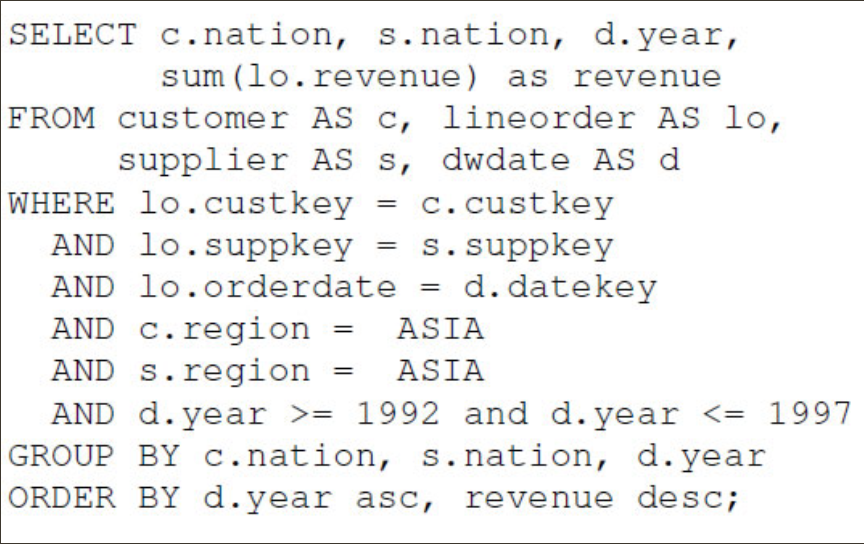
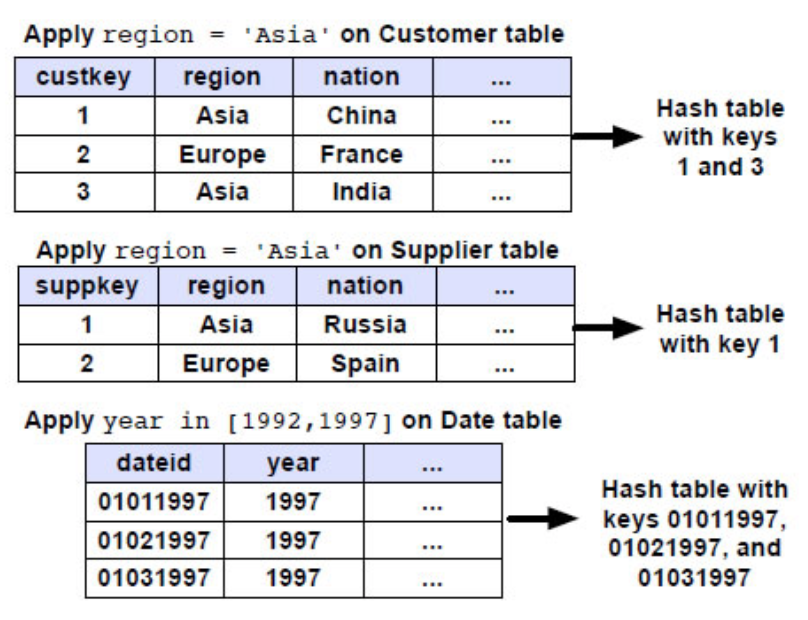

***

[<< zurück](02_toc.md)

***

# 4.5 Performance

Die verschiedenen Kompressionstechniken sind ein Bestandteil der Methoden, um das Leistungspotenzial bei spaltenorientierten Datenbanken erhöhen bzw. zu verbessern. In diesem Kapitel werden weitere Optimierungstechniken vorgestellt.

## 4.5.1 Block Iteration

Bei traditionellen zeilenbasierten Datenbanksystemen muss für die Verarbeitung eines Datensatzes (Tupel) ca. 1-2 Funktionsaufrufe getätigt werden. Die spaltenorientierte Datenbanken jedoch senden blockweise Attribute oder Werte in einem einzelnen Funktionsaufruf an einen Operator. Besitzen die Werte bzw. Attribute sogar eine feste Breite, dann ist keine Attributextraktion erforderlich und die Attribute-Blöcke können direkt als Array iterativ durchlaufen werden. Dies minimiert den Overhead pro Tupel. Des Weiteren entsteht eine Verbesserung von Optimierungs-und Parallelisierungsmöglichkeiten für Prozessoren. [DSN08] [MG15]

## 4.5.2 Late Materialization

Materialization bei Datenbanken bedeutet die Ansicht von Ergebnissen einer Datenbanksuche für den User. Die Daten werden meist in einer Tabelle angezeigt bzw. zusammengefasst, wo einzelne Tupeln (in Zeilen) zusammensetzt werden. Es gibt zwei Arten von Materialization: Early und Late Materialization. Bei der Early Materialization werden die Daten spaltenweise gespeichert. Jedoch erfolgt die Verarbeitung von Tupel-Operationen zeilenbasiert, wie bei Row Stores. 
Bei spaltenorientierten Datenbanken hat es sich gezeigt, dass man eine Leistungsoptimierung hat, wenn man so spät wie möglich die Materialisierung der Ergebnisse durchführt und so lange wie möglich die Attribute in Spalten hält, damit man die zahlreichen Vorteile der Verarbeitung in Spalten so lange wie möglich nutzen kann. Deshalb wird für eine bessere Performance bei den spaltenorientierten Datenbanken die Late Materialization angewandt. Je selektiver die Abfragen und die Daten sind, desto höher kann die Leistungssteigerung durch die späte Materialisierung sein. [DSN08] [MG15]


## 4.5.3 Invisible Join

Ein recht neues Verfahren, vorgestellt von Daniel J. Abadi et. al [DSN08], arbeitet mit einem alternativen Vorgehen für Join-Abfragen bei spaltenorientieren Datenbanen. Dieses Verfahren eignet sich sehr gut im Bereich des Data Warehouses. 

Möchte man zum Beispiel den Gesamtumsatz von Kunden aus, die jeweils ein Produkt von asiatischen Lieferanten zwischen den Jahren 1992 und 1997 gekauft haben, herausfiltern und diese nach der Nationalität, der Lieferanten und des Transaktionsjahrs sortieren, dann  kann die Abfrage sehr komplex werden. Es wird mit mehreren Joins- und WHERE-Klauseln gearbeitet. Die Abbildung 7. zeigt ein Beispiel so einer Abfrage.


 
Abbildung 7: Beispiel einer Datenbankabfrage [DSN08]   


Invisible Join kann zu dieser traditionellen Abfragetechnik eine Alternative darstellen. Das Verfahren arbeitet in drei Phasen. Als Erstes wird mit den jeweiligen Filterattributen Hash-Tabellen aus jeder Dimensionstabelle erstellt, um eine Liste von Schlüsseln (Keys) zu extrahieren. Die nächste Abbildung 8. zeigt mit einigen Beispieldaten die erste Phase. [MG15][DSN08]

    
Abbildung 8: Beispiel der ersten Phase von Invisible Join [DSN08]    


In der zweiten Phase wird die Hash-Tabelle verwendet, um die Positionen von Datensätzen bzw. Attributen in einer sogenannten Faktentabelle (Fact Table) zu ermitteln. In der Faktentabelle wird eine Fremdschlüsselspalte (foreign key) angelegt, die eine Liste aller Positionen anzeigt, die den gesuchten Attributen entsprechen. 
Daraufhin erfolgt eine Überprüfung der Fremdschlüssel gehen die Hash-Tabellen und eine “satisfying bitmap” wird für die Faktentabelle erstellt. Nachdem dieser Prozess für alle Dimensionstabellen durchgeführt worden ist, werden die einzelnen Bitmaps mit einer AND-Verknüpfung zu einer eindeutigen Liste von Faktentabellenschlüssel  zusammengeführt. [DSN08]

    
Abbildung 9: Beispiel der zweiten Phase von Invisible Join [DSN08]   


In der letzten Phase werden die Fremdschlüssel und die Hash-Tabellen verwendet, um die gesuchten Spaltenwerte zu extrahieren. Durch die Selektivität der gesamten Query, wird die Anzahl der extrahierten Werte minimiert. Das Nachschlagen der Hash-Tabellen ist extrem schnell, da die Schlüssel der Dimensionstabelle ab1 sortiert und somit eine  zusammenhängende Liste von Identifikatoren ergibt.[DSN08]
 

      
Abbildung 10: Beispiel der dritte Phase von Invisible Join [DSN08]


***

[<< Kompressionstechniken](06-4_compression.md) | [Row Store vs Column Store >>](07-1_row-colum-store.md)

***

```
Quellenangabe:

- [DSN08] Daniel J. Abadi, Samuel R. Madden, and Nabil Hachem. Columnstores vs. rowstores: How different are they really?, 2008.
- [MG15]  Marcel Gladbach, Spaltenorientierte Datenbanken, Hochschule für Technik, Wirtschaft und Kultur Leipzig, Paper, 2015

```
***