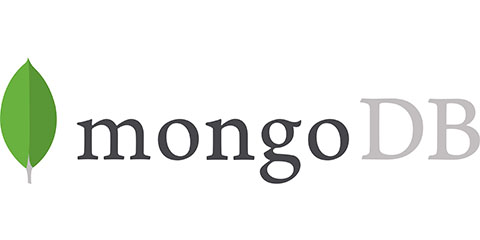
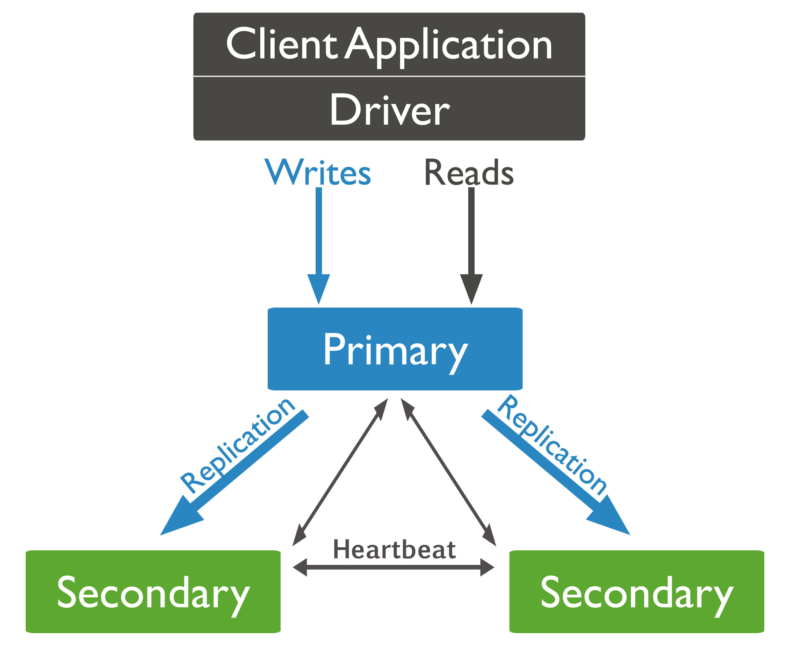

## 6.2 MongoDB


### 6.2.1 Beschreibung
MongoDB gehört zu den beliebtesten NoSQL-Vertretern. Der Name 'Mongo' wurde abgeleitet von 'humongous', was so viel bedeutet wie gigantisch. MongoDB ist eine skalierbare, hochperformante, schemafreie und dokumentenorientierte Open-Source-Datenbank, die durch ihre Features im Vergleich zu anderen NoSQL-Datenbanken besticht. Zudem stellt sie das Bindeglied zwischen klassischen relationalen Datenbanken und Key/Value-Stores her. Dokumente werden im im BSON-Format verwaltet. Eine integrierte Query Language ermöglicht einfache Abfragen, Replikationen und Sharding. Replikationen und Sharding ermöglichen die Verwendung vieler nicht so leistungsstarker Rechner. Zudem kann eine Vielzahl bekannter Programmiersprachen angebunden werden. Umfangreiche Abfragemöglichkeiten mit guter Skalierbarkeit und Performance gekoppelt schaffen eine Konkurrenz zu den klassischen RDMBS (Relational Database Management System). MongoDB kann in virtuellen Umgebungen, bei Cloud Computing und in den gängigen Betriebssystemen Linux, Mac OS und Windows eingesetzt werden. Das Datenbanksystem verfügt zudem über einen kommerziellen Support. [1,2]

MongoDB zeichnet sich vor allem durch ein flexibles Datenbank Schema, welches dynamisch angepasst werden kann, aus. Die Daten werden in JSON-ähnlichen Dokumenten gespeichert, wodurch die Felder in den einzelnen Dokumenten variieren und die Datenstrukturen sich über die Dauer verändern. Durch Ad-hoc-Abfragen, Indizierung und Echtzeitaggregation wird der Zugriff und die Analyse der Daten vereinfacht. [3] 
Ein großes Manko von MongoDB stellt die Sicherheit beim Zugriff dar, da dieser beispielsweise durch die Einstellung von IP-Tables gesteuert wird. Aus diesem Grund sind Transaktionen und Query-Operationen im Gegensatz zu einem RDBMS nicht im vollen Umfang möglich. [1]

### 6.2.2 Datenbankaufbau

MongoDB hält die Dokumente temporär im Speicher und übermittelt sie im BSON-Format an den Client Driver. Der Client Driver muss dazu zwingend mit dem BSON-Format umgehen können. Anders als bei relationalen Datenbanken gliedert sich die Struktur der Daten in MongoDB in beliebig viele Collections, in denen sich wiederum beliebig viele Dokumente befinden. Ein Beispiel hierfür sieht wie folgt aus:

| Datenbankname: lectures  				|
|-------------------------------------------------------|
| Collection tutors   |
| ```{_id:1, name:"Maier"} {_id:2, name:"Müller"} ``` |
| Colection lectures 						 |
| ```{_id:1; turor_id:1,  lecture:"Quantencomputer"} {_id:1; turor_id:1,  lecture:"Mathematik 1"}``` |

#### 6.2.2.1 Datenbank
Mehrere Datenbanken nebeneinander sind beim MongoDB Server zulässig. Jede dieser Datenbanken wird einzeln behandelt und kann spezifisch gestaltet werden. Die Bestandteile einer Datenbank sind Datafiles, in welchen die Dokumente im BSON-Format vorliegen (Datenbankname.0, Datenbankname.1") und Namespace-Files ("Datenbankname.ns"). Eine Liste von Collections und Metadaten ist innerhalb der Namespace-Files zu finden. [2]

#### 6.2.2.2 Collection
Collections lassen sich mit den Tabellen eines RDBMS vergleichen. Jedoch werden sie anders als die Tabellen erst erstellt, sobald sie benötigt werden. Erst wenn ein Dokument in eine neue Collection eingefügt wird, findet die Erstellung statt. Eine Collection sollte mit einem einzelnen Buchstaben oder einem Unterstich beginnen. Das "$"-Zeichen sowie "system." sind bereits als Präfix für die Abfrageoperatoren sowie als Namespace-Präfix für die Metainformationen der jeweiligen Datenbank reserviert und dürfen deshalb nicht in der Benamung von Collections verwendet werden. [2]  

Eine spezielle Form der Collections ist die **Capped Collection**, da diese in ihrer Größe beschränkt werden kann. Hierbei wird nach dem First-In-First-Out-Prinzip gearbeitet. Der Zeitpunkt, zu dem erstmalig etwas zum Dokument hinzugefügt wurde, bestimmt das Alter. Ist die vordefinierte Größe einer Capped-Collection erreicht, wird nach dem Einfügen neuer Daten das älteste Dokument automatisch gelöscht. Capped Collection bringen zwei Beschränkungen mit sich:

* nur bei unveränderter Größe können bestehende Dokumente verändert werden 
* bestehende Dokumente können nicht gelöscht werden

Aufgrund der hohen Performance beim Einfügen neuer Dokumente eignen sich Capped Collection vor allem für Anwendungszwecke mit einer hohen Insert-Rate. [1]

#### 6.2.2.3 Dokumente

Die einzelnen Dokumente stellen die Analogie zu den Tupeln (Row) der relationalen Datenbanken dar. Die Anzahl an Feldern (Key) mit einem Wert (Value) ist beliebig. Anders als bei Tupeln gibt es keine vordefinierte Reihenfolge mit fest definierten Datentypen, sondern es werden assoziative Arrays verwendet. Wie auch in anderen Sprachen kann man innerhalb von MongoDB Objekte in Arrays und Objekte verschachteln. Die Key in diesen Arrays sind Zeichenketten. Wie auch für die Collections gibt es Konventionen für die Benennung. So darf weder ein "." enthalten sein, noch das Zeichen "$" am Anfang eines Schlüssels stehen. Abgespeichert und übertragen werden Dokumente im BSON-Format. [1,2]

MongoDB unterstützt die folgenden Datentypen:

* Standard Datentypen: Integer, Float, String, Array, Boolean
* Date
* Embedded-Doc
* DBRef
* ObjectId

#### 6.2.2.4 Referenzen
Anders als bei SQL-Datenbanken bietet MongoDB keine JOIN-Abfragen an. Somit kommt das Prinzip der Foreign Keys, die aus relationalen Datenbanken bekannt sind, nicht zum Einsatz. Die Daten sollten möglichst alle in einem Dokument abgebildet werden. Aus diesem Grund wird die Referenzierung von Dokumenten untereinander eingesetzt. [4] MongoDB bietet drei Arten der Referenzierung. Zum einen EmbeddedDoc (serverseitiges referenzieren), bei denen ein Dokument auf ein anderes einzelnes Dokument verweist. Des Weiteren können mehrere Dokumente durch ObjectID auf ein Dokument in der gleichen Collection verweisen. Die dritte Möglichkeit stellen DBRef (Clientseitiges referenzieren) dar. Hierbei verweisen mehrere Dokumente auf ein Dokument in einer anderen Collection. Dadurch vermeidet DBRef doppelte Datensätze. [2]

### 6.2.3 Skalierung
Die automatische, horizontale Skalierung von MongoDB macht es möglich, dass mit nur einem Server gestartet und dieser über die Zeit hinweg zu einem Cluster ausgeweitet werden kann. Die Architektur der horizontalen Skalierung wird bei MongoDB mit dem gängigen Begriff Sharding bezeichnet. Diese Architektur ist dabei stark an die Architektur von Googles BigTable und damit auch HBase angelehnt. Es wird nach dem Master-N-Slaves-Prinzip gearbeitet. Auf der Ebene der Collections werden die Daten horizontal verteilt. Eine Collection erfordert eine Kombination von einem oder mehreren Schlüsseln, den sog. Sharding-Keys. Diese werden dann für die Aufteilung der Daten verwendet und die Dokumente werden anhand dieser geordnet und gespeichert. Die Schlüsselkombinationen ermöglichen es, dass nah beieinanderliegende Dokumente auf einem Server gespeichert werden. Bei der Administration muss lediglich darauf geachtet werden, dass eine geeignete Schlüsselkombination für das Sharding festgelegt wird.
Collections werden in Pakete mit konfigurierbarer maximaler Größe, sogenannte Chunks aufgeteilt. Chunks sind Bestandteile einer bestimmten Collection, wobei für sie ein bestimmter Abschnitt der Schlüsselkombination definiert ist. Erreicht ein Chunk die maximale Größe, dann erfolgt automatisch eine Aufteilung.
Die Speicherung der Chunks erfolgt auf Servern, den sog. Shards. Diese wiederum bestehen aus einer oder mehreren Datenbanken. Die Verteilung der Chunks auf die Shards erfolgt automatisch. Dabei wird versucht, für eine gleichmäßige Verteilung auf die Shards zu sorgen, damit alle ungefähr die gleiche Größe besitzen. Enthält ein Shard zu viele Chunks, so werden diese automatisch auf andere Shards verteilt.
Die allgemeinen Informationen über die Verteilung der Chunks innerhalb der Shards liegen auf sogenannten Config-Servern. Diese sind für die Verwaltung der Metadaten eines Clusters zuständig und enthalten eine Verteilungsübersicht der Chunks. Mittels mehrerer Routing-Server geschieht das Routing von Client-Anfragen an die jeweiligen Shards. [1]

### 6.2.4 Replikation

Replizieren bedeutet, dass Daten nicht nur auf einem, sondern auf mehreren Rechnern gespeichert werden. Ein Replikat ist eine Gruppe von mongod Instanzen, welche denselben Datensatz verwalten. Ein Replikat-Set enthält mehrere datenführende Knoten und optional einen Arbiter-Knoten. Architektonisch gleicht der Replikationsmechanismus dem des Master-N-Slaves-Prinzips. Aus den datenführenden Knoten wird nur ein Element als primärer Knoten festgelegt, während die anderen als sekundäre Knoten betrachtet werden. [5] 

Ein Replikatsatz kann nur eine primäre Instanz haben, die in der Lage ist, Schreibvorgänge durchzuführen. Der Primary Knoten zeichnet alle Änderungen an seinen Datensätzen in seinem Betriebslog oplog auf. Secondaries replizieren das oplog des Primary und wenden dann die Operationen auf ihre Datensätze an. Wenn ein Primary nicht verfügbar ist, wählt der Secondary eigenständig einen neuen Primary.

 [5]

Dem Replikat kann zusäztliche eine Mongod-Instanz hinzugefügt werden, die als Arbiter gesetzt ist. Arbiter haben jedoch keinen eigenen Datensatz. Der Zweck eines Arbiter ist es, in einem Replika Set eine Mindestanzahl aufrecht zu erhalten, indem auf Heartbeats (Pings) und Election Requests von anderen Replika Set Elementen geantwortet wird.

Da sie keinen Datensatz speichern, stellen Arbiter eine gute Möglichkeit dar, durch die Mindesanzahl des Replikatsatzes Ressourcen zu sparen, im Gegensatz zu einem voll funktionsfähigen Replikatmitglied mit einem vollständigen Datensatz. Besteht das Replikat-Set aus einer geraden Anzahl von Elementen, so wird ein Arbiter hinzugefügt, um bei der Wahl des Primary eine Mehrheit zu erzielen. Beim Einsatz von Arbiter wird keine spezielle Hardware benötigt.

Ein Arbiter wird immer ein Arbiter sein. Primary hingegehen können zu Secondaries werden und diese wiederum zu Primaries. [5]

### 6.2.5 Sicherheit
Im Zuge der Sicherheit von MongoDB Datenbanken gibt es drei Möglichkeiten.

1. **Anfragen nur über localhost zulassen**

	Grundsätzlich horcht MongoDB auf alle verfügbaren Interfaces. Es besteht jedoch die Möglichkeit, nur Anfragen zuzulassen, die auf dem localhost (127.0.0.1) ankommen. Damit wird sichergestellt, dass sich nur der lokale Rechner mit MongoDB verbinden kann und kein anderes externes System.

2. **Erstellen von IP-Tables**

	Möchte man Zugriff auch von außerhalb zulassen, kann der Zugriff auch über IP-Tables eingestellt werden, falls keine komplette Freigabe stattfinden soll.
IP-Tables entfernen alle vordefinierten Regeln, somit auch den Standardport von MongoDB (27017) und Zugriff über das REST-Interface. Damit ein Zugriff auf den MongoDB Server möglich ist, werden den IP-Tables der Reihe nach IP-Adressen zugeschrieben und somit freigeschaltet.

3. **Internes Authentifizierungssystem**

	Die Autorisierung erfolgt über Benutzername und Passwort oder über ein Zertifikat, wobei diese in der Standard Edition nicht verschlüsselt sind.
Des Weiteren besteht die Möglichkeit, Benutzern bestimmte vordefinierte Rollen zuzuteilen, oder selbst Rollen zu definieren, welche die Zugriffsrechte festlegen.
Jedoch kann die Kommunikation von Client und Server über OpenSSL mit SSL/TLS Verschlüsselung abgesichert werden.
Mit der Enterprise Edition ist eine Verschlüsselung der gesamten Datenbank möglich. [2]

### 6.2.6 Bewertung
Zunächst sollte geprüft werden, ob MongoDB für die Aufgabe geeignet sein könnte. Wenn die zu verwendenden Datenstruktur Arrays dem JSON-Stil ähneln, dann ist MongoDB ein sehr gute, wenn nicht vielleicht die beste Wahl.
Auf der Performance Ebene besticht MongoDB durch das binäre Datenformat BSON und die Nutzung von Memory-Mapped-Files für das Caching der Daten. Daher kann der Arbeitsspeicher effizient genutzt werden. [1]
Handelt es sich um große Datenpakete, ist MongoDB auch hier in der Lage diese Aufgabe zu bewältigen, da es einen unkomplizierten Sharding-Mechanismus zur horizontalen Skalierung der Daten benutzt.
Ein weiteres Plus besteht in der Möglichkeit, Abfragen dynamisch formulieren zu können. Dies unterscheidet MongoDB von einer Vielzahl anderer NoSQL Datenbanken und ermöglicht fortgeschrittene Abfragen.
Es stellt jedoch keinen gleichwertigen Ersatz zu SQL Abfragen dar. Mit der Unterstützung von Map/Reduce-Algorithmen wird nicht nur der Einstieg bei der Datenabfrage erleichtert, sondern ermöglicht zudem auch komplexere Abfragen [4], was sich wiederum bei anderen System wie CouchDB umständlicher gestaltet.
Dies ist auch durchaus darauf zurückzuführen, dass MongoDB auf der bewährten Drei-Schichten-Anwendung (Frontend-Backend-Datenbank) bei der Datenhaltung beruht, die sich an der vertrauten Art, der Programmierung von Datenbanken in PHP, orientiert.
Sollte man bei der Nutzung von MongoDB auf Schwierigkeiten stoßen, bietet eine große Community ausreichend Möglichkeiten, um eine Lösung des Problem zu finden.

---
[1] Edlich, S. (2011). NoSQL. München: Hanser. <br>
[2] Datenbanken Online Lexikon | Datenbanken / MongoDB. (o.D.). Abgerufen 16. November, 2018, von http://wikis.gm.fh-koeln.de/wiki_db/index.php?n=Datenbanken.MongoDB <br>
[3] What Is MongoDB? (o.D.). Abgerufen 18. November, 2018, von https://www.mongodb.com/de/what-is-mongodb <br>
[4] Kurowski, O. (2012). NoSQL Einführung. Frankfurt am Main: entwickler.press. <br>
[5] Replication — MongoDB Manual. (o.D.). Abgerufen 17. November, 2018, von https://docs.mongodb.com/manual/replication/

---

[< Couch DB](09_CouchDB.md)		|   [Literaturverzeichnis >](11_references.md)
