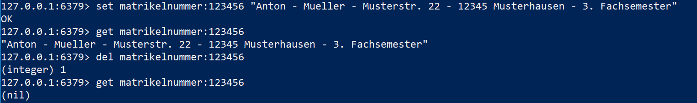
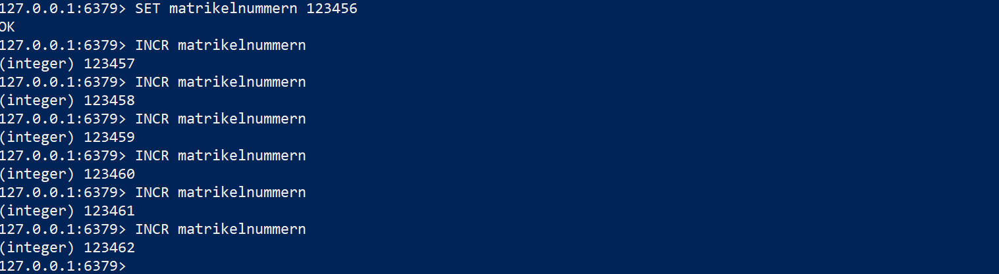
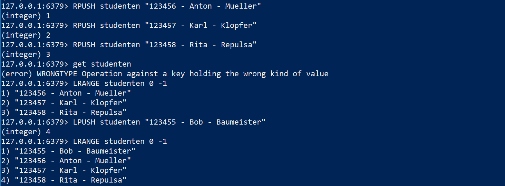
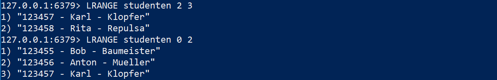
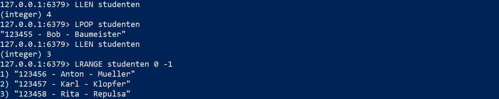

# 5. Funktionsweise von KV-Stores
***
[Einleitung](1_Einleitung.md) - [Was ist NoSQL?](2_NoSql.md) - [Key Value Stores im Detail](3_KV_Detail.md) - [Key Value Store Datenbanken](4_KV_Datenbanken.md) - **[Funktionsweise von KV-Stores](5_KV_Abfragen.md)**
***

In diesem Kapitel wird die Funktionsweise von KV-Stores genauer dargestellt. Die Beispiele werden unter Verwendung von Redis gezeigt. Hierbei handelt es sich um eine Einführung.
Beginnen wir nun mit dem Beispiel aus [Key Value Stores im Detail](3_KV_Detail.md). Die Tabelle hat einen möglichen Eintrag in einen KV-Store gezeigt.

| Matrikelnummer (Schlüssel / Key)              | Student (Wert / Value)
| ----------------- | ------------------------------ |
|  123456    | Anton-Müller-Musterstr. 22-12345 Musterhausen-3. Fachsemester-...|

Nun sollen die Werte in die Redis Datenbank eingepflegt werden. Dies geschieht mit dem "set" Befehl.

Die Eingabe 'set matrikelnummer:123456 "Anton - Mueller - Musterstr. 22 - 12345 Musterhausen - 3. Fachsemester"' wird mit einem "Ok" bestätigt. Als nächstes kann der Wert mit dem Schlüssel und dem Befehl "get" ausgelesen werden. Als Rückgabe dazu wird der soeben gespeicherte Wert angezeigt.
Als nchstes wird der Eintrag mit dem Befehl "del" in Verbindung mit dem Schlüssel gelöscht. Hier wird für eine erfolgriche Lösch-Operation eine 1 zurückgegeben und für einen nicht erfolgten Löschvorgang eine 0.
Abschließend wird der Wert erneut mit dem bekannten Schlüssel abgefragt und wird entsprechend nicht mehr gefunden.

Eine weitere Möglichkeit ist das automatische Hochzählen von Werten. Als Beispiel wird hier die Matrikelnummer "123456" genommen und mit dem INCR Befehl immer weiter hochgezählt.

Nach mehrmaliger Eingabe von "INCR matrikelnummern" wird der Wert hinter dem Schlüssel "matrikelnummern" bis auf "123462" hochgezählt.
Der Vorteil an INCR ist, dass der Wert immer nur von einem Client hochgezählt werden kann und das nicht in der Anwendung geschieht, wodurch falsche Werte entstehen können.

Werte können auch zeitlich begrenzt gespeichert werden. Dies kann mit dem Befehl "EXPIRE key seconds" gesteuert werden. Mit dem Befehl "TTL key" kann die verbleibende Zeit abgefragt werden.

Abschließend soll nun noch ein weiterer Datentyp betrachtet werden. Als Beispiel dazu wird eine Liste erstellt und mit folgenden Befehlen bearbeitet:
- RPUSH -> Wert an das Ende der Liste setzen
- LPUSH -> Wert an den Anfang der Liste setzen
- LLEN -> Länge der Liste abfragen
- LPOP -> ersten Wert aus der Liste entfernen
- RPOP -> letzten Wert der Liste entfernen
- LRANGE -> Unterabfrage über den Index der Werte aus der Liste ggf. in einem bestimmten Bereich

Die nachfolgende Abbildung zeigt, wie mit RPUSH zuerst drei Werte immer an das Ende einer Liste geschrieben werden. Wie bisher gezeigt kann die Liste allerdings nicht mit "get key" abgefragt werden und man erhält eine Fehlermeldung. Hierfür muss der Befehl "LRANGE" verwendet werden. Um alle Einträge zu sehen, muss der Befehl "LRANGE studenten 0 -1" ausgeführt werden. Danach werden alle drei Einträge aus der Liste angezeigt.

Mit "LPUSH" wird dann im Anschluss ein Wert an den ANfang der Liste gesetzt und danach wird die Liste erneut ausgeben. Wie zu sehen ist, wurde nun an den Anfang der Liste der Wert "123455 - Bob - Baumeister" geschrieben.
In der nächsten Abbildung werden noch zwei weitere Beispiele für die Abfrage der Liste über den Index gezeigt.

Mit "LRANGE studenten 2 3" erhält man zum Beispiel die Einträge an dritter und vierter Stelle in der Liste.

Mit dem Befehl "LLEN" kann nun die Länge der Liste abgefragt werden. Als Antwort darauf erhält man die Anzahl der Einträge.

Löschen wir nun den ersten Eintrag aus der Liste ("123455 - Bob - Baumeister") und fragen erneut die Länge der Liste ab, ist zu sehen, dass die Zahl entsprechend verringert worden ist. Zur Sicherheit wird zum Schluss der Inhalt der Liste mit "LRANGE" ausgegeben. Der Eintrag ist wie gewünscht aus der Liste entfernt worden.

Auch für "Sets" gibt es eigene Befehle. nachfolgend dazu eine kleine Übersicht mit kurzer Erläuterung:
- SADD -> für einem Set einen Wert hinzu
- SREM -> entfernt einen Wert aus einem Set
- SISMEMBER -> Prüft, ob ein Wert in einem Set enthalten ist
- SMEMBERS -> Gibt eine Liste aller Inhalte des Sets zurück
- SUNION -> Kombiniert mehrere Sets miteinander und gibt den Inhalt der zusammengefügten Sets zurück

So hat jeder Datentyp, wie zum Beispiel die sortierten Sets oder Hashes, seine eigenen Befehle zum Speichern, Abfragen und löschen von Werten und ganzen Key-Value Paaren.

***
[<< Key Value Store Datenbanken](4_KV_Datenbanken.md)
