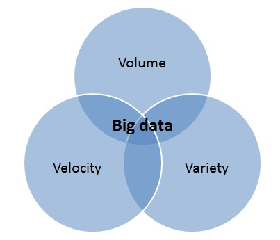

# 1. Einleitung

Da sich die Anforderungen im Big-Data-Bereich stetig verändern, müssen Datenbanken in der Lage sein, sowohl kleinere Datenmengen in Echtzeit als auch große Datenmengen zuverlässig verarbeiten zu können. Dabei müssen die Systeme aber auch skalierbar sein und hohe Verfügbarkeit und Fehlertoleranz aufweisen.  

Vor allem in Bereichen mit kontinuierlichem Datenstrom, zu finden unter Anderem in den Bereichen Internet of Things, eCommerce und Online Advertising, ist eine derartige Verarbeitung notwendig. Hier werden genaue und umfassende Views von großen Datenmengen in kürzester Zeit benötigt, um den Anforderungen der Endnutzer gerecht zu werden. [**[SuSh16]**](7_Literaturverzeichnis.md)  [**[Wart16]**](7_Literaturverzeichnis.md)  

  
Abbildung 1: Die drei Vs des Big-Data-Problems [**[BiDa17]**](7_Literaturverzeichnis.md)  

Zur Betrachtung des Big-Data-Problems spielen die drei Vs eine wichtige Rolle.

- Volume bezieht sich auf die großen Datenmengen, die jährlich immer stärker an Volumen zunehmen.  
- Velocity beschreibt die Geschwindigkeit der Daten, die sowohl in Echtzeit als auch stoßweise in Batches eingehen können.  
- Und Variety bezeichnet die Vielfalt der Daten, die heutzutage in Form von Text, Bildern oder Videos vorkommen. [**[BiDa17]**](7_Literaturverzeichnis.md)

Da klassische Datenbanken auf diese Anforderungen nicht flexibel genug reagieren, hat der Softwareentwickler Nathan Marz im Jahr 2012 die Lambda-Architektur entwickelt. Dabei handelt es sich mehr um eine Spezifikation, die einen allgemeinen Ansatz für den Systementwurf im Big-Data-Bereich liefert. Sie gibt keine bestimmte Technologie vor und hat das Ziel, Batch- und Echtzeit-Views zu kombinieren und die Ergebnisse mit geringer Latenz zurückzugeben. [**[SuSh16]**](7_Literaturverzeichnis.md)

Die Bezeichnung stammt vom Lambda-Kalkül aus der funktionalen Programmierung. Ein wesentliches Merkmal dieser sind die "immutable data", also unveränderliche Daten, welche in der Lambda-Architektur die Grundlage bilden. Dabei ist sie so aufgebaut, dass sie generisch, skalierbar und tolerant gegenüber Hardwareausfällen und menschlichen Fehlern sein soll. Sie findet Verwendung in Big-Data-Systemen, wo es erforderlich ist, die Latenz bei Aktualisierungsvorgängen möglichst gering zu halten. [**[HaBi17]**](7_Literaturverzeichnis.md) [**[Soul14]**](7_Literaturverzeichnis.md)

------------

[☜ README](README.md)
   |   [2. Grundlagen ☞](2_Grundlagen.md)