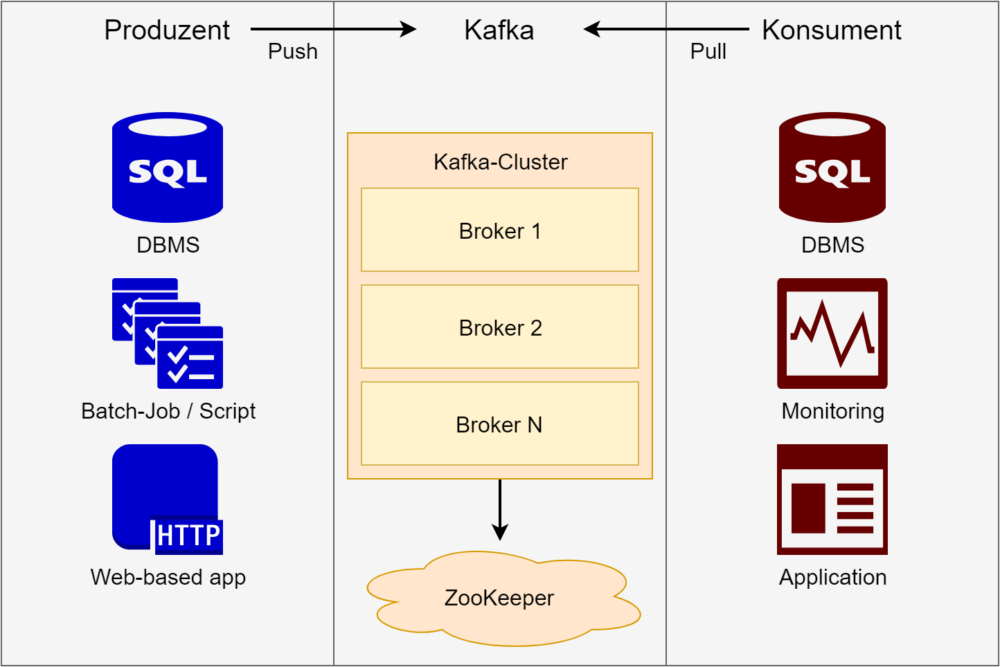

# Architektur von Apache Kafka
Das Gesamtsystem, welches als Apache Kafka zusammengefasst werden kann, umfasst - wie eingangs bereits erwähnt - mehrere Komponenten, die separat betrachtet werden müssen.

*Abbildung 1.* Darstellung der Kafka-Architektur (Boncea, 2016, modifiziert)

Wie Abbildung 1 entnommen werden kann, lässt sich grundlegend eine Unterteilung in Produzent, Kafka als solches und Konsument vornehmen (Boncea, 2016). Die Komponente "Kafka" wiederum kann hinsichtlich des Clusters mit ``n`` Brokern und ZooKeeper spezifiziert werden. Für die Rolle des Produzenten bzw. Konsumenten sind in der Abbildung exemplarische Systeme bzw. Tools dargelegt.

## Produzent
Ein Produzent verfügt über Informationen, welche mithilfe von Apache Kafka übermittelt werden sollen (Narkhede et al., 2017, S. 6). Diese Informationen werden Bhole, Chapte und Karve (2018, S. 2) zufolge vom Produzenten als Message aufbereitet bzw. Nachrichten werden kreiert. Eine erstellte Message wird innerhalb einer Partition in einem Topic an den Broker übertragen (Bhole et al., 2018, S. 2). Hierbei besteht den Autoren nach die Möglichkeit, dass, je nach Szenario, mehrere Produzenten zu Topics in frei wählbarer Anzahl Messages in Partitionen senden können. Insbesondere bei Messages mit geringer Größe ist es möglich, eine Optimierung von Produzenten für hohen Durchsatz oder geringe Latenzzeiten vorzunehmen, was durch die Einstellung parallelen oder seriellen Sendens ergänzt wird.

Für den Prozess der Übertragung sind vorab zwei Aufgaben durch den Produzenten zu absolvieren. Da Apache Kafka mit Byte-Arrays arbeitet, erfolgt vorab die Serialisierung durch den Produzenten, sodass die Message in ein entsprechendes Byte-Array umgewandelt wird  (Bejeck & Narkhede, 2018, S. 42 f.; Narkhede et al., 2017, S. 44). Weiterhin wird durch den Produzenten die Definition einer Partition für die Speicherung der Nachricht umgesetzt. Sobald Kafka Messages verarbeitet hat, kann der Produzent Feedback entgegennehmen. Dies ist in Form einer Bestätigung des Erhalts von Messages bzw. durch Rückgabe des Offsets im Rahmen der Speicherung der Nachricht möglich (Bejeck & Narkhede, 2018, S. 44 f.).

## Broker
In Apache Kafka stellt der Broker eine zentrale Software-Komponente innerhalb der Kommunikation zwischen Systemen oder Programmen dar (Bejeck & Narkhede, 2018, S. 26). Um mit dem Broker zu kommunizieren, kommen sogenannte "Messages" (siehe auch [Kapitel 4](04_daten_organisation_uebertragung.md)) zum Einsatz, welche vom Broker verwaltet werden (Narkhede et al., 2017, S. 7). Aktionen, welche unter dem Begriff "Verwaltung" zusammengefasst sind, sind insbesondere die

- Speicherung
- Replikation
- Auslieferung
- Löschung

von Messages. Ein Broker ist zustandslos, weswegen für die Wartung bzw. Aufrechterhaltung von Brokern bzw. Broker-Clustern Apache ZooKeeper zum Einsatz kommt (Bhole et al., 2018, S. 2).

Eine essentielle Voraussetzung für die Nutzung von Apache Kafka bzw. die Verwendung des Brokers ist die Installation eines Java SDKs mit einer kompatiblen Version (Narkhede et al., 2017, S. 17). Eine entsprechende Installation von Kafka sowie dem Java SDK ist daher für eine ausfallsichere Umgebung im Rahmen des "Kafka Clusters" auf mehreren (physikalischen) Systemen erforderlich.

Innerhalb eines Clusters benötigt jeder Broker eine eindeutige Broker-ID (Narkhede et al., 2017, S. 22). Während es für Testumgebungen ausreichend sein kann, diese durch den initialen Start automatisiert generieren zu lassen, ist dies für den Produktivbetrieb abzuraten. Für die Möglichkeit der Provisionierung in einer produktiven Umgebung sollte daher in der Konfigurationsdatei ``broker.properties`` die Einstellung ``broker.id.generation.enable = false`` gesetzt und für ``broker.id = `` ein numerischer Wert gewählt werden (Apache Software Foundation, 2017b, A Production Server Config).

### Backup & Restore
In Bezug auf das Backup der Konfiguration eines Brokers muss eine differenzierte Betrachtung der statischen sowie dynamischen Konfiguration erfolgen. Beide Arten der Konfiguration werden in Apache ZooKeeper gespeichert (Confluent, 2019b). Für die dynamische Konfiguration gilt, dass diese laufzeitabhängig ist, während die statische Konfiguration für jeden Broker in einer Konfigurationsdatei gespeichert wird, deren Sicherung ausreichend ist. Ein hoch gewählter Replikationsfaktor bietet Sicherheit (Apache Software Foundation, 2017b, Guarantees), macht die Sicherung der Konfigurationsdatei jedoch nicht obsolet. Gängige Verfahrensweisen für die Offsite-Sicherung bestehen in der Verwendung der "Connect API" von Apache Kafka (Apache Software Foundation, 2017b, Connect API) und der Spiegelung in ein anderes Rechenzentrum bzw. einen Brandabschnitt, was mithilfe von Kafka MirrorMaker realisiert werden kann und das empfohlene Vorgehen darstellt (Apache Software Foundation, 2017b, Mirroring data between clusters; Alle, 2018, Backup and restore). Der Restore eines Brokers kann vollzogen werden, indem die zugehörige Konfigurationsdatei zum neuen Broker übertragen wird. Dadurch wird erzielt, dass der Broker passend provisioniert wird und sich analog zum zuvor ausgefallenen Broker verhält. Das weitere Vorgehen schließt die Aufnahme der Verbindung des Brokers zu ZooKeeper ein, woraufhin in ZooKeeper gespeicherte Informationen bzw. Metadaten zum Cluster an den Broker übermittelt werden können (Confluent, 2019b) und die Daten anderer Broker wiederhergestellt werden.

Für Anwendungs- bzw. Nutzdaten gilt, dass Topics in Speichersysteme, beispielsweise in Cloud-Speicher, über einen Dump bzw. Snapshot eines Volumes gesichert werden können (Alle, 2018, Backup and restore). Der Restore kann realisiert werden, indem Topics neu erstellt werden und die Daten aus dem zuvor genutzten Sicherungsziel eingespielt werden. Dies bietet die Möglichkeit, die Wiederherstellung "Point-in-time" erfolgen zu lassen, wobei Konsumenten von Beginn des Topics an lesen müssen.

## Apache ZooKeeper
Apache ZooKeeper stellt ein Projekt der Apache Software Foundation dar, welches für Apache Kafka zwingend erforderlich ist. Es kommt hierbei für die Speicherung statischer sowie dynamischer Konfigurationen zum Einsatz, wird für die atomare Anfragen-Synchronisierung bei verteilten Systemen genutzt und verwendet darüber hinaus ein Quorum  (Narkhede et al., 2017, S. 18 f.). ZooKeeper ist ein Service für die Koordination verteilter Applikationen und ermöglicht die Synchronisierung über ein Cluster (Shree et al., 2017, S. 2). Analog zu Apache Kafka sollten auch für ZooKeeper mehrere, auf physikalischer Ebene getrennte, Instanzen zum Einsatz kommen. Während es angeraten wird, drei oder fünf Instanzen zu betreiben, ist es im Allgemeinen möglich, eine ungerade Anzahl der Instanzen einzusetzen. Mehrfach vorhandene ZooKeeper-Instanzen bieten den essentiellen Mehrwert, Produzenten und Konsumenten über neue oder ausgefallene Broker benachrichtigen zu können, wenn eine Instanz ebenfalls ausfallen sollte (Bhole et al., 2018, S. 2).

## Konsument
Ein Konsument fragt vom Broker ggf. neue Messages zu einem bzw. mehreren Topics ab, welcher das vorab durch den Produzenten serialisierte Byte-Array überträgt  (Narkhede et al., 2017, S. 6). Gemäß den Autoren (S. 88 ff.) erfolgt seitens des Konsumenten die Deserialisierung des Byte-Arrays zu einer entsprechenden Objekt-Struktur. Hierbei sind unterschiedliche Konstellationen zwischen Broker und Konsument(en) möglich. Während ein Konsument vom Broker eine Message abfragen kann, ist es ebenso möglich, dass diverse Konsumenten zeitgleich vom Broker Messages zu unterschiedlichen Topics empfangen (Bhole et al., 2018, S. 2). Empfangen und verarbeiten mehrere Konsumenten Messages eines Topics zeitgleich, so lassen sich die Konsumenten in einer Konsumentengruppe zusammenfassen  (Narkhede et al., 2017, S. 63 ff.). Charakteristisch für die Konsumentengruppe ist daher, dass Kafka auf Ausfälle von Konsumenten selbstständig reagiert, um Konsumenten zuzuweisen und Lasten umzuverteilen.

Aufgrund der seitens des Konsumenten regelmäßig erfolgenden Speicherung der Offsets zuletzt empfangener Messages in einem Topic (fünf Sekunden in der Standard-Einstellung) ist es möglich, im Fall des Ausfalls eines Konsumenten an diesem Punkt mit einem Ersatzkonsumenten fortzufahren  (Narkhede et al., 2017, S. 75 ff.). Daraus resultiert eine vereinfachte Möglichkeit der Wiederherstellung bei Ausfall eines Konsumenten und bietet die Möglichkeit, die erneut zu sendende Datenmenge auf die Daten der maximal fünf letzten Sekunden zu beschränken.

## APIs
Für die Kommunikation zwischen Produzent(en), Kafka bzw. Broker(n) und Konsument(en) stellt Apache Kafka vier Application Programming Interfaces zur Verfügung.

Shree et al. (2017, S. 3) beschreiben die "Producer API" als Schnittstelle, in welcher ein Datenstrom in mehr als ein Topic von Apache Kafka herausgegeben bzw. übergeben wird. Ferner bietet die "Consumer API" die Möglichkeit, Datenströme zu verarbeiten sowie eine beliebige Anzahl Topics zu abonnieren. Mithilfe der "Connector API" werden laut den Autoren Topics, unter Zuhilfenahme der Produzenten sowie Konsumenten, mit Anwendungen oder Datensystemen in Verbindung gebracht, sodass durch Konnektoren sämtliche Änderungen in Systemen erfasst werden können. Die vierte API "Streams API" findet Verwendung, um Input-Streams zu verarbeiten und den Output-Stream für beliebig viele Output-Topics zu erzeugen.

---

| [<< Grundlagen](02_grundlagen.md) | Architektur von Apache Kafka | [Organisation und Übertragung von Daten >>](04_daten_organisation_uebertragung.md) |
|-----------------------------------|------------------------------|------------------------------------------------------------------------------------|
