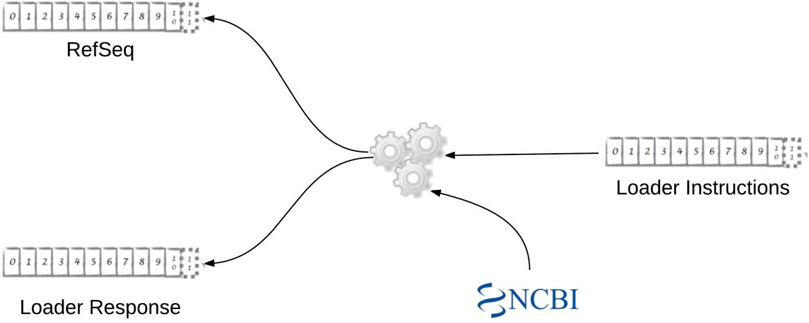

# Beispielanwendung von Apache Kafka in der Bioinformatik (Lawlor, Lynch, Mac Aogáin & Walsh, 2018)

Um nun noch eine weitere und komplexere Anwendungsmöglichkeit von Apache Kafka zu erläutern, wird im Folgenden ein Anwendungsfall von Lawlor et al. (2018) dargestellt. Das Paper befasst sich damit, wie man Apache Kafka im Gen-Forschungsfeld als bioinformatische Datenablage verwenden kann.

## Hintergründe
Die Forschung im Bereich Bioinformatik ist laut den Autoren Lawlor et al. (2018, S. 1) „[…] immer häufiger abhängig von großangelegten Datensätzen, die sowohl aus privaten als auch öffentlichen Repositories stammen.“ In der hier als Beispiel verwendeten bioinformatischen Datenbank Reference Sequence (RefSeq)des National Center for Biotechnology Information (NCBI) werden Daten zur Genomannotation, Genidentifizierung und -charakterisierung, Mutations- und Polymorphismusananlyse, von Expressionsstudien und vergleichenden Analysen gesammelt (National Center for Biotechnology Information, 2017).
Da diese bioinformatischen Datenbanken häufig schwer zu handhaben sind, sei es dadurch, dass es bei der RefSeq nur eine Suchmöglichkeit via des Basic Local Alignment Search Tools (BLAST) gibt oder riesige Datenmengen, die umständlich heruntergeladen werden müssen („Download der Datenbank-Dateien, die durch BLAST genutzt werden sowie Download der zugrunde liegenden fasta-Dateien, die zur Erstellung der Datenbank verwendet werden“). „[Durch] diese Struktur“, ist laut Lawlor et al. (2018, S. 2), „die Nützlichkeit der Daten [begrenzt], insbesondere durch die Verhinderung der Parallelisierung.“ Die Autoren zeigen dazu auf, dass zum Beispiel die Parallelisierung limitiert ist, wenn „jede Sequenz in einer Gruppe von fasta-Dateien verarbeitet“ werden soll. Denn dann ist diese Parallelisierung „von der Anzahl der Dateien abhängig, welche von Anfang bis Ende eines Prozesses oder Threads gelesen werden müssen“.

Um parallele Datenübertragung zu gewährleisten, schlagen die Autoren einige Eigenschaften zum Aufbau einer solchen Struktur vor (Lawlor et al., 2018, S. 2):
- Verteilung: die Daten sollten auf mehrere Maschinen verteilt werden, sodass die parallelen Daten beispielsweise nicht von Hardware-Engpässen abhängig sind.
- Zuverlässigkeit: verteilte Systeme sind meist zuverlässiger als nicht verteilte Systeme, wodurch Ausfallzeiten minimiert werden können.
- Streaming: wenn die Nutzer Streams verwenden können, müssen diese nicht warten, bis alle Daten heruntergeladen sind, bevor sie mit der Datenverarbeitung starten. Die Autoren nennen in diesem Zusammenhang ein anschauliches Beispiel, nämlich Netflix. Sie beschreiben, dass es im Gegensatz zu früher, als ein Film komplett heruntergeladen werden musste, bevor man ihn ansehen konnte, nun bei Netflix 90 Minuten dauert, um einen 90-Minuten-Film ansehen zu können.

An dieser Stelle verweisen die Autoren auf Apache Kafka. Wie in [Kapitel 4](04_daten_organisation_uebertragung.md) bereits beschrieben, ist dieses als Message Broker und nicht als Datenbank zu verstehen. Dabei werden gemäß Lawlor et al. (2018, S. 2) durch ein Zwischenprogramm asynchron oder synchron Informationseinheiten zu einem Programm übertragen. In früherer Forschung wurde Apache Kafka bereits als geeignet für bioinformatische Anwendungen eingestuft. Es stellen sich in diesem Zusammenhang folgende Vorteile heraus:
- Verteilte Daten, an die nur neue Daten angehängt und die nicht überschrieben werden
- Kafka Topics können so konfiguriert werden, dass sie niemals ablaufen, sodass sie immer wieder ausgelesen werden können
- Topics werden in einem zusammenhängenden Speicherplatz gespeichert, das bringt Geschwindigkeitsvorteile mit sich
- Ein Topic kann von mehreren kooperierenden Lesern parallel durchlaufen werden

Die genauen Merkmale, wie Konsument/Produzent, Partitionen, Konsumentengruppen, Produzenten und Message Keys, Speicherung von Messages sowie das Streaming von Kafka werden an dieser Stelle nicht wiederholt dargestellt, denn diese wurden bereits in den Kapiteln [1](01_einleitung.md), [2](02_grundlagen.md), [3](03_kafka_architektur.md) sowie [4](04_daten_organisation_uebertragung.md) im Detail ausgeführt.

## Methodik
Lawlor et al. (2018, S. 3) erarbeiteten den Proof-of-Concept „Field of Genes“ mit Hilfe dessen sie „die Leistungsmerkmale eines kafkabasierten genomischen Daten-Repository’s in Bezug auf flache Dateien [messen]“ wollten sowie „[verstehen], welche anderen Eigenschaften sich aus einer solchen Implementierung ergeben könnten […]“. Ein einziges Kafka-Topic bestand dabei aus 11 % der RefSeq-Datenbank, „welches sich über 4, 8 und 12 Cloud-Server verteilte“. Dabei stellt jede Message innerhalb des Topics eine Sequenz oder einen Teil davon dar (wenn eine Sequenz größer als 100.000 Nukleotide ist). 

Um „Field of Genes“ zu erstellen (Deployment via Docker), zu befüllen sowie die Leistung und Skalierbarkeit zu messen, wurden Lawlor et al. (2018, S. 4) zufolge die folgenden Schritte durchlaufen:
1. Datenspeicherung und Rechenstruktur: Kubernetes Cluster mit der Google Container Engine. Es wurden je nach Anforderung Cluster von Hosts erstellt (4, 8 oder 12)
2. Bereitstellung des Kafka Clusters: auf dem Kubernetes Cluster wurde eine gleiche Anzahl an Kafka Broker Instanzen zur Verfügung gestellt
3. Java Library: um eine Datei aus der NCBI RefSeq-Datenbank herunterladen, entpacken sowie konvertieren zu können, wurde eine Java Library entwickelt
4. Loader Agent: der Loader Agent wurde mit Hilfe der Sprache Scala sowie der Akka Streams API erstellt. Dieses kleine Programm führt Instruktionen eines Kafka Topics aus, downloadet mit Hilfe der Java Library die Inhalte einer einzigen NCBI Datei und sendet diese Sequenzen an ein anderes Kafka Topic. Dies zeigt auch Abbildung 2:

*Abbildung 2.* Übersicht Loader Agent für NCBI (Lawlor et al., 2018, S. 4).

5. Loader Agent Deployment: Es wurden verschiedene Parallelisierungslevel innerhalb von Kubernetes verwendet (4, 8, 12, 16, 20, 24). Dabei sollte die jeweilige Downloadgeschwindigkeit für jedes Level erhalten und getestet werden, ob die Skalierbarkeit weiterhin gegeben ist.

6. Loader Messung und Benchmark: gemessen wurde die Zeit pro Parallelisierungslevel – von der ersten Loader Instruction Message bis zur letzten RefSeq-Sequenz, die ins Ziel-Topic geschrieben wurde. Als Benchmark wurde ein einzelner Server mit denselben Spezifikationen herangezogen. Mit Hilfe von Multithreading erreichten die Autoren die vom System unterstützte Parallelisierung.

Im nächsten Schritt implementierten Lawlor et al. (2018, S. 5) einen bioinformatischen Agenten, der die zuvor erstellten Field of Genes-Daten verarbeiten kann. Es geht darum, eine große Anzahl an Sequenzen für das Beispiel „Verhältnis von Cytosin- und Guanin-Basen zu Adenin und Thymin“ zu messen, was eine „biologische Eigenschaft einer beliebigen DNA-Seqeuenz“ darstellt. Dieser GC-Content-Agent erhält seinen Input quasi vom vorherigen Loader-Agenten.

## Ergebnisse
Die Ergebnisse der Untersuchung, die hier nicht im Detail ausgeführt werden, zeigen zusammenfassend folgende Punkte auf (Lawlor et al., 2018, S. 5 f.):
- Die Benchmark Lösung ergibt ähnliche Ergebnisse wie die Version von Field of Genes mit 4 Knoten. Field of Genes wird besser sobald die Knotenanzahl steigt. 
- Auch die GC Content Verarbeitung zeigt ähnliche Ergebnisse, aber hier war bereits auch das Vier-Knoten-Field-of-Gene-Cluster besser als die Benchmark-Version. Bei der 12-Knoten-Clusterung war die Skalierbarkeit bereits fast perfekt.

## Zusammenfassung
Insgesamt zeigt die Studie von Lawlor et al. (2018) einen interessanten Einblick in eine praktische Anwendung von Apache Kafka im Bereich Bioninformatik und wie man den Umgang mit großen Datenbanken und der damit verbundenen Datenverarbeitung erleichtern kann.

---

| [<< Einfaches Beispiel zum Streaming mit Apache Kafka](05_beispielimplementierung_streaming.md) | Beispielanwendung von Apache Kafka in der Bioinformatik | [Quellenverzeichnis >>](07_quellen.md) |
|-------------------------------------------------------------------------------------------------|---------------------------------------------------------|----------------------------------------|
