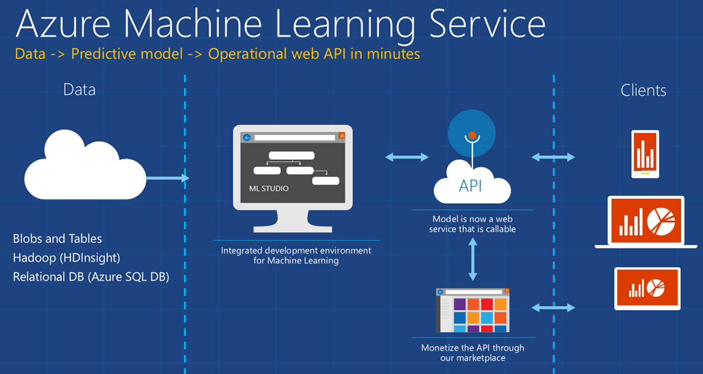

# Gruppenarbeiten 2018
Malte Westendorf, Aykut Özdimir und Klaus Landsdorf

## Thema: *Datenbank für Maschine Learning*

### Historie

#### Dateibasierte Datenhaltung

weit verbreitet - kurze Einleitung als Überleitung zu Datenbanken für ML

#### Datenbanktypen

Auswertung Hausarbeiten 2016/2017

* Key/Value
* Document
* Graph
* OOD
* Multimodel
* RDS / SQL

#### Data Services

* Elasticsearch / Semantic Search

#### State of the Art

Welche Datenbanken werden in ML verwendet bzw. haben sich bisher bewährt?

### Machine Learning und Daten

#### BigData / Data Lake

#### Datasets

##### Trainingsdaten

Auswahl von Subsets, Vorbereitung und Verdichtung, Vorlagen CSV, REST

Labeling Data

#### Validierung

Daten zur Validierung

##### Modelldaten

Vorlagen CSV, REST (API/Endpoint), Artifakte erzeugt aus Traingsdaten

### Machine Learning und Datenbank

#### Trainingsdaten

REST, CSV, SQL und CO KG

#### Modelldaten

Artifakte, REST (API/Endpoint), CSV, SQL und CO KG

<!-- Linksammlung -->
[1]:https://www.slideshare.net/TigerGraph/graph-databases-and-machine-learning-november-2018
[2]:https://www.slideshare.net/IoannisPurdue/machine-learning-meets-databases-at-netflix
[3]:https://ai.google/research/pubs/
[4]:https://cs.stanford.edu/people/chrismre/papers/ml_db_hype.pdf
[5]:https://mldb.ai/
[6]:https://www.vertica.com/product/database-machine-learning/
[7]:https://www.kinetica.com/products/machine-learning/
[8]:https://www.jenunderwood.com/2017/11/13/in-database-machine-learning/
[9]:https://www.applause.com/blog/microsoft-artificial-intelligence-database/
[10]:http://learningsys.org/nips17/assets/papers/paper_22.pdf
[11]:https://www.oracle.com/technetwork/database/database-technologies/r/r-enterprise/oaa-algorithm-cheat-sheet-3871281.pdf
[12]:https://link.springer.com/article/10.1007/s13222-017-0247-8
[13]:https://dzone.com/articles/finding-needles-in-a-haystack-with-graph-databases
[14]:https://www.memsql.com/blog/matching-modern-databases-with-ml-and-ai/
[15]:https://books.google.de/books?id=_Im5BQAAQBAJ&pg=PA292&lpg=PA292&dq=machine+learning+databases&source=bl&ots=WGozIb1fgv&sig=5St1vCduBrL3l8yFjS4PLNA_2js&hl=de&sa=X&ved=2ahUKEwjY7eO8iNTeAhVIDiwKHe38Cek4UBDoATAHegQIAxAB#v=onepage&q=machine%20learning%20databases&f=false
