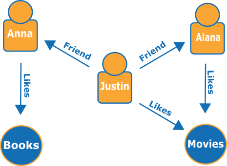

# Graphen-Datenbanken

Graphen-Datenbanken verfolgen einen anderen Ansatz als die bisher vorgestellten NoSQL-Systeme. Während die anderen Datenbanken die eingelagerten Daten ohne Interpretation abspeichern und erst durch die zugreifende Anwendung eine Bedeutung erhalten, werden die Daten in Graphen-Datenbanken direkt in Beziehung gebracht. Hierzu werden einzelne Objekt-Knoten per Kanten miteinander verbunden, sodass entsprechende Beziehungen entstehen. [1] Ein Beispielgraph könnte wie folgt aussehen:




Hierbei gibt es keine strengen Vorgaben für die Typen der Knoten. Der gezeigte Graph enthält nur die Entitäten für Personen und Dinge, die die Personen mögen. Der Graph könnte ebenso Berufe, Bankdaten oder ähnliches enthalten. Auch die verwendeten Beschriftungen der Kanten sind nicht fix. Hieraus ergibt sich eine immense Flexibilität. Die Systeme der Graphen-Datenbanken bieten eigene Abfragesprachen zur gezielten Graphen-Untersuchen, etwa dem kürzesten Pfad zwischen Knoten oder dem übernächsten Nachbarn. Diese Abfragen wären in relationalen Datenbanken nur über komplizierte Joins möglich, bei denen sie ab einem gewissen Punkt an eine technische Grenze geraten. 

Die Kehrseite der Graphen-Datenbanken ist ihre fehlende Standardisierung. [2] Jede Implementierung verwendet einen unterschiedlichen Unterbau mit nur bedingt ähnlichen APIs. Ein verwendetes DBMS lässt sich also bei Bedarf nur mit entsprechendem Aufwand austauschen.


## Foreign Key

Kanten eines Graphen können nicht ohne Knoten existieren. Sie sind mit Foreign Keys aus relationalen Datenbanken vergleichbar. Das Löschen bleibt jedoch weiter möglich, wobei die Kante implizit mit gelöscht wird.


## Daten-Änderungen

Einzelne Knoten und Kanten haben Attribute, die sich wie bereits vorgestellte Key-Value-Datenbanken verhalten. Folglich legen sie das gleiche Verhalten wie diese an den Tag und unterliegen den gleichen Einschränkungen.


## Strukturelle Änderungen

Einzelne Knoten und Kanten haben Attribute, die sich wie bereits vorgestellte Key-Value-Datenbanken verhalten. [3] Folglich legen sie das gleiche Verhalten wie diese an den Tag und unterliegen den gleichen Einschränkungen.


## Skalierung

Graphen-Datenbanken scheinen zum jetzigen Zeitpunkt keine Verteilung (Sharding) zu unterstützen. Selbst Neo4j, das als einer der verbreitetsten Vertreter der Gattung zählt, kann bisher kein richtiges Sharding anbieten. [4] Stattdessen wird, wie auch bei MySQL, auf mehrfache gleichwertige Instanzen zur Lastverteilung gesetzt. [5] Damit steht für Graph-Datenbanken 


## Performance-Vergleich (Fazit)

Im Vergleich zu relationalen Datenbanken ergeben sich folgende, die Performance betreffende Unterschiede:


* Wenn Beziehungen analysiert werden sollen, sind Graphen erheblich schneller und haben auch mit großen Verbindungen keine Probleme
* Graphen-Datenbanken eignen sich sehr gut zum Lesen vieler zusammenhängender Daten
* Dagegen sind sie für großes Schreibaufkommen ungeeignet


------

[< Column Stores](Column_Stores.md) | [Abschluss >](Abschluss.md)

***

```
Quellen
[1]: Amazon AWS; unter https://docs.aws.amazon.com/de_de/neptune/latest/userguide/graph-database.html (abgerufen am 14.01.2019)
[2]: unter https://en.wikipedia.org/wiki/Graph_database (abgerufen am 14.01.2019)
[3]: B., Gleb und L., Vlad; unter https://rubygarage.org/blog/neo4j-database-guide-with-use-cases (abgerufen am 14.01.2019)
[4]: Rathle, Philip; unter https://stackoverflow.com/a/21566766 (abgerufen am 14.01.2019)
[5]: https://neo4j.com/docs/operations-manual/current/clustering/introduction/

Abbildungen
[1]: https://docs.aws.amazon.com/de_de/neptune/latest/userguide/images/social-graph.png
```

