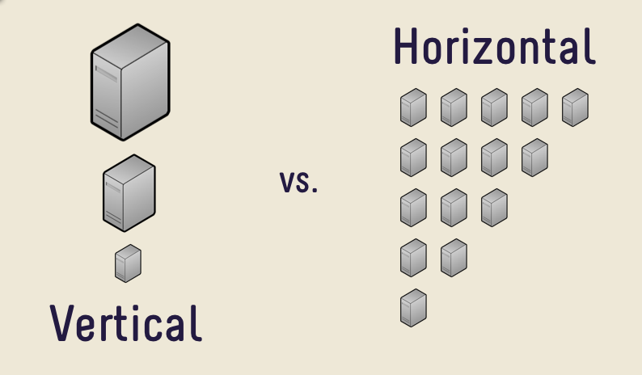

# Relationale Datenbanken

In relationalen Datenbanken werden sämtliche Daten in einzelnen Tabellen gespeichert, die in Beziehung (Relation) zueinander stehen. Bekannte Branchengrößen wie PostgreSQL, MySQL und Oracle sind relationale Datenbank-Systeme.

Die Tabellen der Datenbank haben durch Namen identifizierte Spalten. Jede Tabelle benötigt wenigstens eine Spalte mit jeweils einem Datentyp und die maximale Länge. Die maximale Anzahl an Spalten in einer Tabelle ist durch das verwendete DBMS eingeschränkt. Abhängig vom Datentyp ist die Angabe der Länge optional oder nach oben beschränkt. Da das DBMS den Typ einer Spalte kennt, kann es die Validität des jeweiligen Inhalts sicherstellen. So würde etwa der Versuch, Text in eine Spalte zu schreiben, die als Zahl definiert ist, direkt abgewiesen werden. Außerdem kann bei der Spaltendefinition direkt angegeben werden, ob eine Spalte auch *null*-Werte enthalten darf.


## Foreign Key

Über Indizes und Fremdschlüssel werden die Beziehungen definiert. Hierüber ist es dem DBMS möglich, die Konsistenz der Daten zu überwachen. Fehlen beim Erstellen eines neuen Datensatzes referenzierte Daten, wird das Persistieren der Daten verhindert. Gleichwohl wird das Löschen vorhandener Datensätze unterbunden, wenn dadurch die Integrität der restlichen Daten zerstört wird.


## Daten-Änderungen

Durch die Vorgabe der Datentypen und der jeweiligen Länge weiß das DBMS, welchen Speicherplatz es auf der Festplatte für einen Datensatz (unabhängig vom tatsächlichen Inhalt) reservieren muss. Für die Änderung vorhandener Daten muss durch das DBMS auf dem Laufwerk lediglich der Bereich des entsprechenden Datensatzes ermittelt und überschrieben werden. Sind mehrere Tabellen von einer Änderung betroffen, müssen entsprechend auch mehrere Abschnitte auf der Festplatte modifiziert werden. Der Vorteil besteht hierbei darin, dass je strenger nach der Normalisierung gearbeitet wurde, desto weniger Tabellen bzw. Datensätze müssen tatsächlich verändert werden.


## Strukturelle Änderungen

Die strukturellen Vorgaben einer Tabelle beziehen sich auf alle jeweils enthaltenen Datensätze. Soll etwa der Datentyp einer Spalte verändert werden, erfolgt die Konvertierung (bzw. der Versuch) für alle enthaltenen Datensätze. Ebenso müssen beim Hinzufügen von Constraints sämtliche Referenzen überprüft werden. Es handelt sich bei Migrationen also um entsprechend teure Aufrufe.


## Skalierung

### Allgemeine Erklärung

Im Kontext von Datenbanken werden zwei Arten der (Hardware-)Skalierung unterschieden - die horizontale und vertikale Skalierung. Vertikale Skalierung ("Scale up") beschreibt den Ausbau der Hardware der Maschine, auf der das DBMS läuft. Hierzu zählen die Leistung oder Anzahl an Prozessoren des Hosts, der installierte Arbeits- und der zur Verfügung stehende Festplattenspeicher. Die Kosten für Hardware steigen jedoch stärker als die erworbene Leistung. Außerdem setzt die Existenz der leistungsstärksten, verfügbaren Komponenten eine Obergrenze. [1] Dem gegenüber steht die horizontale Skalierung ("Scale Out"), bei der als Knoten Durchschnittshardware verwendet wird. Das besondere ist hierbei, dass an Stelle eines einzigen Knotens eine Vielzahl von Rechnern als Verbund verwendet wird. Dabei werden die Operationen des DBMS gleichmäßig auf sämtliche Knoten verteilt. Durch optimale Algorithmen lässt sich die Zahl der Knoten quasi beliebig steigern. Die nachfolgende Grafik veranschaulicht beide Skalierungen.




### Relationale Datenbanken

Manche Relationale Datenbanken, etwa MySQL, unterstützen das Replizieren ihrer Daten auf andere Server. Dies dient vor allem der Steigerung der Leseleistung durch das Verteilen auf unterschiedliche Knoten. Die Knoten enthalten dabei die gleichen Daten, weshalb sie manchen Transaktionen hinterher sein können. Deshalb kann dies nur bedingt als horizontale Skalierung angesehen werden. Praktisch lassen sich relationale Datenbanken lediglich vertikal skalieren. Da sich Hardware, wie oben beschrieben, nicht endlos skalieren lässt, ist die Skalierung natürlich nur endlich möglich. [2]


***

[<< Datenbank-Systeme](Datenbank-Systeme.md) | [Document Stores >>](Document_Stores.md)

***

```
Quellen

[1]: Georgiev, Georgie; unter ://www.pc-freak.net/blog/vertical-horizontal-server-services-scaling-vertical-horizontal-hardware-scaling/ (abgerufen am 13.01.2019)
[2]: Mitasch, Christoph; unter https://www.thomas-krenn.com/de/wiki/MySQL_Replikation (abgerufen am 13.01.2019)

Abbildungen
[1]: http://www.pc-freak.net/images/horizontal-vs-vertical-scaling-vertical-and-horizontal-scaling-explained-diagram.png
```

***

